## [2017-2018 Алгоритмы и структуры данных на Python 3, all playlist](https://www.youtube.com/playlist?list=PLRDzFCPr95fK7tr47883DFUbm4GeOjjc0)

- [Youtube channel Тимофей Хирьянов](https://www.youtube.com/c/ТимофейХирьянов)

- Материалы курса находятся на [сайте](http://judge.mipt.ru/mipt_cs_on_python3/)

- https://www.python.org/

- https://pythonworld.ru/

<a id="contents" />Оглавление

- [Лекция №1. Введение, базовый синтаксис Python. Концепция присваивания. Арифметические операции. Цикл while and for. range(). continue and break. ](#lection1)
- [Лекция №2. Алгебра Логики. Законы де Моргана. Тип bool. Конструкция else + if = elif](#lection2)
- [Лекция №3. Системы счисления. Литералы чисел. Разложение числа на цифры. Однопроходные алгоритмы без реализации.](#lection3)
- [Лекция №4. Функции. Декомпозиция задачи. Структурное программирование. Стек. Полиморфизм в Python. Duck typing. Параметры](#lection4)
- [Лекция №5. Массивы. Список. Линейный поиск. Копирование. Сдвиг. Добавление элемента. Удаление элемента. Ссылочная модель. Решето Эратосфена.](#lection5)
- [Лекция №6. Методы append(), pop() и функция len() для списка. Списковые включения. Cортировки. ](#lection6)
- [Лекция №7. Рекурсия. Прямой и обратный ход рекурсии. Факториал. Алгоритм Евклида. Ханойские башни.](#lection7)
- [Лекция №8. Генерация комбинаторных объектов. Рекурсивная генерация всех чисел длины M. Генерация всех перестановок (рекурсивная). Быстрые или Рекуррентные сортировки: Тони Хоара и слиянием (без реализации).](#lection8)
- [Лекция №9. Быстрая сортировка Тони Хоара и Сортировка слиянием (реализация). Слияние двух упорядоченных массивов. Устойчивость сортировок. Проверка упорядоченности массива за O(N).](#lection9)
- [Лекция №10. Вычисление чисел Фибоначчи и проблема перевычислений. Одномерное динамическое программирование на примере чисел Фибоначчи. Задачи о кузнечике (количество траекторий, траектория наименьшей стоимости). Двумерные массивы (списки списков). Оператор is.](#lection10)
- [Лекция №11. Двумерное динамическое программирование. Наибольшая общая подпоследовательность. Наибольшая возрастающая подпоследовательность.](#lection11)
- [Лекция №12. Расстояние Левенштейна. Проверка равенства строк. Наивный поиск подстроки в строке. Алгоритм Кнута-Морриса-Пратта](#lection12)
- [Лекция №13. Стек. Автоматическое тестирование функций модуля (библиотека doctest). Проверка корректности скобочной последовательности. Обратная Польская нотация](#lection13)
- [Лекция №14. Тип list. Изменяемость списка. Тип кортежа tuple как замороженный список. Насколько не изменяем кортеж?. Список кортежей и цикл for с двумя переменными. Тип строк str. Неизменяемость строки. Методы строки find, count, replace. Срезы строк и списков. Присваивание в срез списка. Стандартные функции len, max, min, sum. Методы split и join. Структура данных Куча/Пирамида (Heap)](#lection14)
- [Лекция №16. Асимптотика алгоритмов (потребление ресурсов) . Индуктивные функции. Однопроходные алгоритмы. NP- полные задачи. Тест простоты Ферма. Числа Кармайкла. Алгоритм шифрования RSA](#lection16)
- [Лекция №17. Рекурсия и динамическое программирование. Факториал рекурсивно и динамически. Числа Фибоначчи рекурсивно, рекурсивно с кешированием и динамически. Задача о рюкзаке рекурсивно и динамически](#lection17)
- [Лекция №18. ООП, Классы, Объекты, Именованный кортеж, Связный список](#lection18)
- [Лекция №19. Дерево, Куча (Heap), алгоритм сортировка HeapSort](#lection19)
- [Лекция №20. Хеш-таблица](#lection20)
- [Лекция №21. Множества / set, Словари / dict](#lection21)
- [Лекция №22. Графы](#lection22)
- [Лекция №23.  Варианты хранения Графа в памяти. Web программирование](#lection23)
- [Лекция №24. Обход графа в глубину (DFS). Выделение и подсчёт компонент связности. Проверка графа на двудольность. Выделение компонент сильной связности орграфа алгоритмом Косарайю. Топологическая сортировка через алгоритм Тарьяна. ](#lection24)
- [Лекция №25. Взвешенный граф. Обход графа в ширину.Очередь при обходе в ширину и её асимптотика. Выделение компонент связности (обходом в ширину). Нахождение кратчайшего цикла в невзвешенном графе.](#lection25)
- [Лекция №26. Графы, кратчайший путь, Алгоритм Дейкстры с очередью. Алгоритмы Флойда-Уоршелла. ](#lection26)
- [Лекция №27. Двоичные деревья поиска. Асимптотика основных операций. Балансировка деревьев. Малый левый и правый повороты. Большой левый и правый повороты.](#lection27)
- [Лекция №28. Цикл Эйлера и цикл Гамильтона. Жадный алгоритм Дейкстры. Алгоритм Флойда-Уоршелла](#lection28)

---
[К оглавлению](#contents)
###  <a id="lection1" /> Лекция №1. Введение, базовый синтаксис Python. Концепция присваивания. Арифметические операции. Цикл while and for. range(). continue and break. 
Программирование включает, по степени  важности:

1. Алгоритмы и структуры данных
2. Практика программирования
3. Дизайн ПО (архитектура приложения)
4. Синтаксис языка программирования
5. Прикладные библиотеки
6. Групповая разработка, коммуникация

"Код читается намного больше раз, чем пишется" @Гвидо ван Россум

My version:
```bash
flyboroda@MacBook-Air-Artem ~ % python3
Python 3.8.9 (default, Feb 18 2022, 07:45:33) 
[Clang 13.1.6 (clang-1316.0.21.2)] on darwin
```

```python
x = "Hello, World"
print(x)
print(type(x)) # узнаем какой тип у имени х
x = 1 + 2 + 3
```
Переменных нет, есть имена, `х` это имя, ссылающееся на строковое значение в памяти "Hello, World". Х это именнованная ссылка на значение "Hello, World". Оператор присваивания `=` в Python это ссылка. Есть сборщик мусора который сразу же убирает не именованные или безхозные объекты из памяти. В Питоне х не привязан к конкретной области памяти. Далее х привязывается к новому числовому значению равному 6, и теряет связь с  "Hello, World". 

Питон не архитектурно ориентирован, он более приближен к математической модели.

hypot.py
```python
a = 179
b = 197
c = (a ** 2 + b ** 2) ** 0.5
print (c)
```

Здесь мы используем переменные — объекты, в которых можно сохранять различные (числовые, строковые и прочие) значения. В первой строке переменной a присваивается значение 179, затем переменной `b` присваивается значение 97, затем переменной `c` присваивается значение арифметического выражения, равного длине гипотенузы. После этого значение переменной c выводится на экран.

```bash
flyboroda@MacBook-Air-Artem examples % touch hypot.py
flyboroda@MacBook-Air-Artem examples % open hypot.py
flyboroda@MacBook-Air-Artem examples % python3 hypot.py
266.1766330841233
```

***Типы данных***

Числа записываются последовательностью цифр, также перед числом может стоять знак минус, а строки записываются в одинарных кавычках. 2 и '2' — это разные объекты, первый объект — число, а второй — строка. Операция + для целых чисел и для строк работает по-разному: для чисел это сложение, а для строк — конкатенация.

Кроме целых чисел есть и другой класс чисел: действительные (вещественные числа), представляемые в виде десятичных дробей. Они записываются с использованием десятичной точки, например, 2.0.

Определить тип объекта можно при помощи функции type:

```python
>>> type(2)
<class 'int'>
>>> type('2')
<class 'str'>
>>> type(2.0)
<class 'float'>
```

Обратите внимание — `type` является функцией, аргументы функции указываются в скобках после ее имени.


***Операции с числами***

Вот список основных операций для чисел:

`A + B` — сумма;

`A - B` — разность;

`A * B` — произведение;

`A / B` — частное;

`A ** B` — возведение в степень, двойное умножение, работает не только с целыми числами

Полезно помнить, что квадратный корень из числа `x` — это `x ** 0.5`, а корень степени `n` — это `x ** (1 / n)`.
Например корень из 3 это `3**0.5`

Есть также унарный вариант операции ` - `, то есть операция с одним аргументом. Она возвращает число, противоположное данному. Например: -A.

В выражении может встречаться много операций подряд. Как в этом случае определяется порядок действий? Например, чему будет равно `1+2*3**1+1`? В данном случае ответ будет 8, так как сначала выполняется возведение в степень, затем — умножение, затем — сложение.

```python
a += 1
a = a + 1

a -= 1
a = a - 1

a /= 1
a = a / 1

a // = 1 # с отбрасыванием остатка
a = a // 1

a %= 1 # интересует остаток, по модулю
a = a % 1

a *= 1
a = a * 1
```


Правила определения приоритетов операций такие:

1. Выполняются возведения в степень справа налево, то есть `3**3**3` это 3²⁷ (7625597484987).

2. Выполняются унарные минусы (отрицания) `-x`.

3. Выполняются умножения и деления слева направо. Операции умножения и деления имеют одинаковый приоритет.

```python
# деление с отбрасыванием остатка
x = 16
y = 3
z = x // y
print(z)  # будет 5 и остаток 1 отбрасываем

# если интересует остаток, то
x = 16
y = 3
z = x % y
print(z) # 1
```

```python
x = -12
y = 5
z = x // y
s = x % y
print(z) # - 3
print(s) # 3
```

```python
x = -11
y = 10
z = x // y
s = x % y
print(z) # -2
print(s) # 9
```

4. Выполняются сложения и вычитания слева направо. Операции сложения и вычитания имеют одинаковый приоритет.


***Операции над строками***

`A + B` — ***конкатенация***;

`A * n` — повторение n раз, значение n должно быть целого типа.

***Каскадное (трамвайное) присваивание***

```python
x = y = z = 0
```

***Множественное присваивание (кортеж)***

```python
x, y, z = 1, 2, 3
```

***Обмен значений двух переменных через третью***.
```python
a = 1
b = 2

tmp = a
a = b
b = tmp
```

***Обмен значений двух переменных через две дополнительных***.
```python
a = 1
b = 2

tmp1 = b
tmp2 = a
a = tmp1
b = tmp2
```

Можно применить множественное присвание (ниже), и сократить код. Это ***обмен через временный кортеж с 2 дополнительными переменными*** (кортеж это множественное присваивание x, y = 1, 2, кортеж - пачка имен и присваиваемых значений). Как только выражение вычислится, кортеж исчезнет. Кортеж представляет из себя ссылки на числовые объекты, сами объекты не копируются.

```python
a = 1
b = 2

tmp1, tmp2 = b, a
a, b = tmt1, tmp2

# или еще лучше
a, b = b, a
```

Присваивание в Python, это ***связывание*** имени и объекта.
` a = 5 ` ->  `a += 1` -> `a = 6`, a - имя, число - объект.

В этом примере ниже происходит ***Пересвязывание***, сам объект мы не можем изменить, можем лишь изменить то на что ссылается имя. Сам объект когда он существует, он таким и остается всегда, не меняется. Значение объекта изменить нельзя. Сам объект таким и остается каким он создан, до момента вытирания его сборщиком мусора.
```python
x = 1
x = 2
```

***Ветвление***

Ветвление (или условная инструкция) в Python имеет следующий синтаксис:

```python
if Условие:
    Блок_инструкций_1
else:
    Блок_инструкций_2
```

Блок_инструкций_1 будет выполнен, если Условие истинно. Если Условие ложно, будет выполнен Блок_инструкций_2.

В условной инструкции может отсутствовать слово else и последующий блок. Такая инструкция называется неполным ветвлением. Например, если дано число x и мы хотим заменить его на абсолютную величину x, то это можно сделать следующим образом:

```python
if x < 0:
    x = -x
print(x)
```

В этом примере переменной x будет присвоено значение -x, но только в том случае, когда x<0. А вот инструкция print(x) будет выполнена всегда, независимо от проверяемого условия.

Для выделения блока инструкций, относящихся к инструкции if или else в языке Python используются отступы. Все инструкции, которые относятся к одному блоку, должны иметь равную величину отступа, то есть одинаковое число пробелов в начале строки. Рекомендуется использовать отступ в 4 пробела.

***Вложенные условные инструкции***

Внутри условных инструкций можно использовать любые инструкции языка Python, в том числе и условную инструкцию. ***Вложенное ветвление*** — после одной развилки в ходе исполнения программы появляется другая развилка. При этом вложенные блоки имеют больший размер отступа (например, 8 пробелов).

Пример программы, которая по данным ненулевым числам x и y определяет, в какой из четвертей координатной плоскости находится точка (x,y):

`x = int(input())` - считываем введенное значение с клавиатуры, оно будет строковым, прообразуем в число, и присваиваем его значение имени х

```python
x = int(input())
y = int(input())
if x > 0:
    if y > 0:               # x>0, y>0
        print("Первая четверть")
    else:                   # x>0, y<0
        print("Четвертая четверть")
else:
    if y > 0:               # x<0, y>0
        print("Вторая четверть")
    else:                   # x<0, y<0
        print("Третья четверть")
```

***Комментариями*** в Pythonе является символ ` # `.

***Операторы сравнения***

Как правило, в качестве проверяемого условия используется результат вычисления одного из следующих операторов сравнения:

```python
<	   Меньше — условие верно, если первый операнд меньше второго.
>	   Больше — условие верно, если первый операнд больше второго.
<=	 Меньше или равно — условие верно, если первый операнд меньше или равен второму.
>=	 Больше или равно — условие верно, если первый операнд больше или равен второму.
==	 Равенство. Условие верно, если два операнда равны.
```

Например, условие (x * x < 1000) означает «значение x * x меньше 1000», а условие (2 * x != y) означает «удвоенное значение переменной x не равно значению переменной y».

Операторы сравнения можно объединять в цепочки, например, `a == b == c` или `1 <= x <= 10`.

***Тип данных bool***

Значения логического типа могут принимать одно из двух значений: True (истина) или False (ложь). Если преобразовать логическое True к типу `int`, то получится 1, а преобразование False даст 0. При обратном преобразовании число 0 преобразуется в False, а любое ненулевое число в True. При преобразовании `str` в `bool` пустая строка преобразовывается в False, а любая непустая строка в True.

***Каскадные условные инструкции***

Пример программы, определяющий четверть координатной плоскости, можно переписать используя «каскадную« последовательность операцией `if... elif... else`:

```python
x = int(input())
y = int(input())
if x > 0 and y > 0:
    print("Первая четверть")
elif x > 0 and y < 0:
    print("Четвертая четверть")
    # если x<0, y>0, то
elif y > 0:
    print("Вторая четверть")
    # если x<0, y<0, то
else:
    print("Третья четверть")
```

В такой конструкции условия `if, ..., elif` проверяются по очереди, выполняется блок, соответствующий первому из истинных условий. Если все проверяемые условия ложны, то выполняется блок `else`, если он присутствует.

***Цикл while («пока»)***

Позволяет выполнить одну и ту же последовательность действий, пока проверяемое условие истинно. ***Условие записывается до тела цикла и проверяется до выполнения тела цикла***. Как правило, цикл while используется, когда невозможно определить точное значение количества проходов исполнения цикла.

Синтаксис цикла while в простейшем случае выглядит так:

```python
while Условие:
    Блок_инструкций
```

При выполнении цикла while сначала проверяется условие. Если оно ложно, то выполнение цикла прекращается и управление передается на следующую инструкцию после тела цикла while. Если условие истинно, то выполняется инструкция, после чего условие проверяется снова и снова выполняется инструкция. Так продолжается до тех пор, пока условие будет истинно. Как только условие станет ложно, работа цикла завершится и управление передастся следующей инструкции после цикла.

Например, следующий фрагмент программы напечатает на экран всех целые числа, не превосходящие `n`:

```python
a = 1
while a <= n:
    print(a)
    a += 1
```

Общая схема цикла `while` в данном случае для перебора всех подходящих значений такая:

```python
a = начальное_значение
while а_является_подходящим_числом:
    обработать_a
    перейти_к_следующему_a
```

Выводем все степени двойки, не превосходящие числа n:

```python
a = 1
while a <= n:
    print(a)
    a *= 2
```

***Цикл for*** 

Является синтаксическим сахаром, т.е он удобен и практичен, делает жизнь программиста слаще, но вовсе необязателен.

Нужен чтобы пробегать какой-то диапозон арифметической прогрессии. 

Более краткая альтернатива циклу `while`.

Для последовательного перебора целых чисел из диапазона `[0; n)` можно использовать цикл `for`:

```python
for i in range(10):
   print(i)
```

Этот код по выполняемым действиям полностью соответствуют циклу `while`:

```python
i = 0
while i < 10:
  print(i)
  i += 1
```

***Итерация*** - это однократное выполнение тела цикла.

Можно задавать начальные и конечные значения для переменной цикла, а также шаг (последнее значение):

```python
for i in range(20, 10, -2):
  print(i)
```

Result: 20 18 16 14 12

Универсальный генератор арифметической прогрессии,  ***`range(start, stop, step)`***, значение `stop` не включается, значение на позиции `start` всегда включается, `[start, stop)`

`range(5)` - диапозон, старт будет с 0, шаг 1, до 5
`range(5, 10)` - диапозон от и до
`range(5, 10, 2)` - диапозон от и до, с шагом

```python
for i in range(5):
   print(i)
```
Result: 1, 2, 3, 4, 5

```python
for x in range(5, 0, -1):
  print(x ** 2)
```
Result: 25 16 9 4 1

Цикл `for` имеет работать с двумя переменными:

```python
A = [(1, "A"), (2, "B"), (3, "C")]
for x,y in A:
    print(y,x)
```

или тоже самое только с помощью enumerate которое пронумерует строку

```python
A = enumerate("ABC")
for x,y in A:
    print(y,x)
```

```bash
A 1
B 2
C 3
```

***Аналогичный цикл while***

```python
i = 20
while i > 10:
  print(i)
  i -= 2
```

***break***

Экстренный выход из цикла, перепрыгивание на следующую инструкцию программы минуя else if и тп, аналогия "пожар". Чаще всего используется с проверкой условия ` if что-то там, то break`. 

***continue***
Телепортация сразу на следующую итерацию. С середины тела цикла, могу снова попасть, телепортироваться на следующую новую итерацию.


***Черепаха***

Стандартная библиотека Python содержит модуль `turtle`, предназначенный для обучения программированию. Этот модуль содержит набор функций, позволяющих управлять черепахой. Черепаха умеет выполнять небольшой набор команд, а именно:

Команда	Значение
```python
forward(X)	# Пройти вперёд X пикселей
backward(X)	# Пройти назад X пикселей
left(X)		# Повернуться налево на X градусов
right(X)	# Повернуться направо на X градусов
penup()		# Не оставлять след при движении
pendown()	# Оставлять след при движении
shape(X)	# Изменить значок черепахи (“arrow”, “turtle”, “circle”, “square”, “triangle”, “classic”)
stamp()		# Нарисовать копию черепахи в текущем месте
color()		# Установить цвет
begin_fill()	# Необходимо вызвать перед рисованием фигуры, которую надо закрасить
end_fill()	# Вызвать после окончания рисования фигуры
width()		# Установить толщину линии
goto(x, y)	# Переместить черепашку в точку (x, y)
```

***Практика: Черепаха***

***[IDE repl.it](https://replit.com/)***

***Рисуем букву S***

```python
import turtle

turtle.shape('turtle')
turtle.forward(50)
turtle.left(90)
turtle.forward(50)
turtle.left(90)
turtle.forward(50)
turtle.right(90)
turtle.forward(50)
turtle.right(90)
turtle.forward(50)
```

***Рисуем круг***

```python
import turtle

# Create a turtle
turtle.speed(10)
turtle.width(10)
turtle.color("red")

# Draw a circle starting at (x, y)
radius = 100
turtle.circle(radius)

# Make it all work properly
turtle.done()
```

***Рисуем вложенные квадраты***, один в другой с уменьшением шага

```python
import turtle
 
a = int(input())  # сторона квадрата
turtle.shape('turtle')
while a > 1:
    turtle.pendown()
    for i in range(4):
        turtle.forward(a * 10)
        turtle.right(90)
    turtle.penup()
    turtle.forward(10)
    turtle.right(90)
    turtle.forward(10)
    turtle.left(90)
    a -= 1
input()
```

***Рисуем паука, с заданным количеством лап***

```python
import turtle

a = int(input())  # количество лап паука
turtle.shape('turtle')
for i in range(a):
    turtle.forward(100)
    turtle.backward(100)
    turtle.right(360 / a)
input()
```

***Рисуем спираль***

Нужно подключить модуль `math`

```python
from math import pi, sin, cos
import turtle

turtle.shape('turtle')
for i in range(200):
    t = i / 10 * pi
    dx = t * cos(t)
    dy = t * sin(t)
    turtle.goto(dx, dy)
```

or

```python
import turtle

turtle.shape('turtle')
x = 0.5
for i in range(20):
    for j in range(30):
        turtle.forward(x)
        turtle.left(6)
    x += 0.5
```

***Рисуем квадратную спираль***

```python
import turtle

turtle.shape('turtle')
x = 15
for i in range(20):
    for j in range(30):
        turtle.forward(x)
        turtle.left(90)
        x += 5
```

***Написание функции***

Как было сказано раньше, функции — это своего рода готовые кирпичики, из которых строится программа. До этого момента мы использовали стандартные функции (`print`, `input`, функции модуля `turtle`), теперь настало время написать функцию:

```python
>>> def hello(name):
...     print('Hello, ', name, '!')
...
>>> hello('world')
```
Hello,  world!

Это простейший пример функции, которая принимает в качестве параметра имя, а затем выводит на экран сообщение Hello, <имя>. Как видно из примера, функции в языке Python описываются при помощи ключевого слова `def`:

```python
def Имя_функции(параметр_1, параметр_2, ...):
    Блок_операций
```

Так же, как и в случае циклов и условных операторов, тело функции выделяется при помощи отступов.

Вызов функции осуществляется по имени с указанием параметров:

`hello('world')`

Внутри функции можно использовать те же синтаксические конструкции, что и вне её — циклы, ветвления, можно даже описывать новые функции. Естественно, внутри функции можно работать и с переменными.

Написанная ранее функция имеет особенность — она просто выводит текст на экран и не возвращает никакого результата. Многие функции, напротив, занимаются вычислением какого-либо значения, а затем возвращают его тому, кто эту функцию вызвал. В качестве примера можно рассмотреть функцию для сложения двух чисел:

```python
>>> def sum(a, b):
...     return a + b
...
>>> sum(1, 2)
3
>>> sum(5, -7)
-2
```

Для возврата значения из функции используется оператор return: в качестве параметра указывается значение, которое требуется вернуть.

***Рисуем 10 вложенных правильных многоугольников***. Используйте функцию, рисующую правильный n-угольник.
[Формулы](https://www.fxyz.ru/%D1%84%D0%BE%D1%80%D0%BC%D1%83%D0%BB%D1%8B_%D0%BF%D0%BE_%D0%B3%D0%B5%D0%BE%D0%BC%D0%B5%D1%82%D1%80%D0%B8%D0%B8/%D0%BF%D0%BB%D0%BE%D1%81%D0%BA%D0%B8%D0%B5_%D1%84%D0%B8%D0%B3%D1%83%D1%80%D1%8B/%D0%B2%D0%BF%D0%B8%D1%81%D0%B0%D0%BD%D0%BD%D1%8B%D0%B5_%D0%B8_%D0%BE%D0%BF%D0%B8%D1%81%D0%B0%D0%BD%D0%BD%D1%8B%D0%B5_%D0%BC%D0%BD%D0%BE%D0%B3%D0%BE%D1%83%D0%B3%D0%BE%D0%BB%D1%8C%D0%BD%D0%B8%D0%BA%D0%B8/%D1%80%D0%B0%D0%B4%D0%B8%D1%83%D1%81_%D0%BE%D0%BF%D0%B8%D1%81%D0%B0%D0%BD%D0%BD%D0%BE%D0%B9_%D0%BE%D0%BA%D1%80%D1%83%D0%B6%D0%BD%D0%BE%D1%81%D1%82%D0%B8/%D0%BF%D1%80%D0%B0%D0%B2%D0%B8%D0%BB%D1%8C%D0%BD%D0%BE%D0%B3%D0%BE_%D0%BC%D0%BD%D0%BE%D0%B3%D0%BE%D1%83%D0%B3%D0%BE%D0%BB%D1%8C%D0%BD%D0%B8%D0%BA%D0%B0/) для нахождения радиуса описанной окружности. 

```python
import turtle
import math
turtle.shape('turtle')
n = 3
r = 10 #задаем радиус первой окружности
def more_agles(n, m): #опеределяем функцию, рисующую многоугольник
    q = 360 / n
    while n > 0:
        
        turtle.left(q)
        turtle.forward(m)
        n -= 1
        
while n < 13:
    m = 2 * r * math.sin(math.pi / n) #считаем размер стороны многоугольника по формуле "Площадь правильного многоугольника вписанного в окружность"(a=2Rsin (360/2n))
    x = (180 - 360 / n ) / 2
    turtle.left(x)
    
    more_agles(n,m)
    turtle.right(x)
    turtle.penup()
    turtle.forward(10)# задаем расстояние между окружностями
    
    turtle.pendown()
    n += 1
    r += 10 #раз расстояние между окружностями 10, увеличиваем радиус на 10
```

***Рисуем простой цветок***

```python
import turtle

my_turtle = turtle.Turtle()
for i in range(6):
    my_turtle.circle(50)
    my_turtle.right(60)
```

***Рисуем бабочку***

```python
import turtle

radius = 20
turtle.left(90)

for i in range(5):
  turtle.circle(radius)
  turtle.circle(-radius)
  radius += 10
```

***Рисуем пружину***

```python
import turtle
turtle.shape('turtle')
turtle.speed(3)
turtle.penup()
# отодвинем черепашку назад, чтобы поместилась пружина
turtle.setx(-450)
turtle.pendown()

for _ in range(4):
    # Повернуть черепашку под углом to_angle к вертикали (0 — наверх, 90 — направо);
    turtle.setheading(90)
    turtle.circle(-100, 180)
    turtle.circle(-20, 180)
turtle.circle(-100, 180)
turtle.done()
```

***Рисуем смайлик***

```python
import turtle
lion=turtle.Turtle()
lion.up()
lion.goto(0, -100)  
lion.down()

lion.begin_fill()
lion.fillcolor("yellow")  
lion.circle(100)
lion.end_fill()

lion.up()
lion.goto(-67, -40)
lion.setheading(-60)
lion.width(5)
lion.down()
lion.circle(80, 120)    
lion.fillcolor("black")

for i in range(-35, 105, 70):
    lion.up()
    lion.goto(i, 35)
    lion.setheading(0)
    lion.down()
    lion.begin_fill()
    lion.circle(10)   
    lion.end_fill()
    
lion.hideturtle()
```

***Рисуем звезду***
```python
import turtle
turtle.pensize(5)
turtle.pencolor("red")
turtle.forward(200)
for i in range(4):
    turtle.right(144)
    turtle.fd(200)
turtle.done()
```

***Рисуем 11-ти конечную звезду***

```python
from turtle import *
t = Turtle()
for i in range(11):
# угол - 180-180/11 градусов
    t.right(180-180/11)
    t.fd(200)
```

---
[К оглавлению](#contents)
###  <a id="lection2" /> Лекция №2. Алгебра Логики. Законы де Моргана. Тип bool. Конструкция `else + if = elif
Любая функция - это отображение множества на множество, область определения и множество значений.

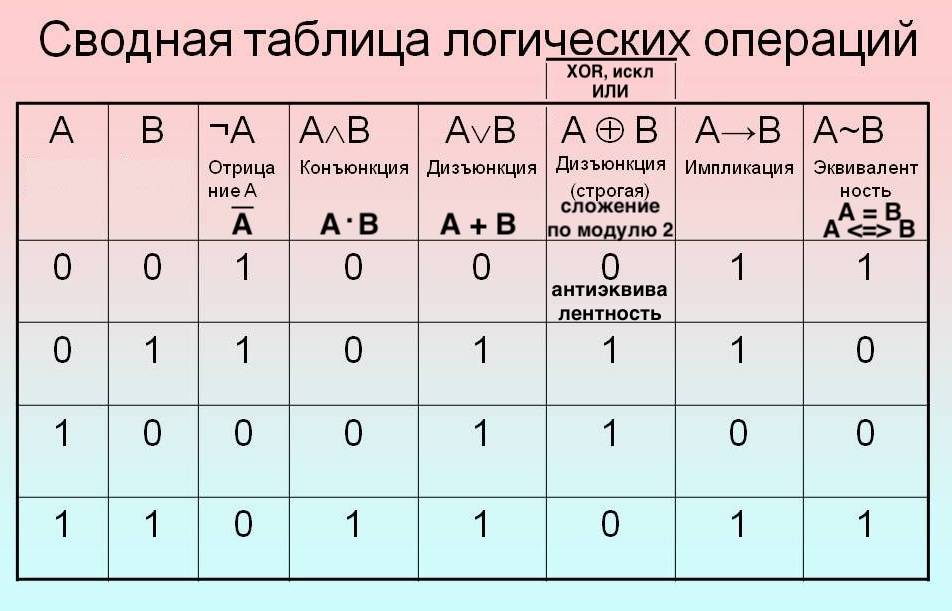

***Законы алгебры логики***


***[Законы де Моргана](https://ru.wikipedia.org/wiki/%D0%97%D0%B0%D0%BA%D0%BE%D0%BD%D1%8B_%D0%B4%D0%B5_%D0%9C%D0%BE%D1%80%D0%B3%D0%B0%D0%BD%D0%B0)*** - логические правила, связывающие пары логических операций при помощи логического отрицания. В краткой форме звучат так:

***Отрицание конъюнкции есть дизъюнкция отрицаний.***

***Отрицание дизъюнкции есть конъюнкция отрицаний.***


`==` - оператор сравнения двух значений

В Питоне если нужно перенести строку с выражением используем скобки (.....), так как он очень внимателен к переносам и требует сдвига, иначе будет ошибка выражения.


***Python: Конструкция `else + if = elif`***

Это способ задать несколько альтернативных условий.

Функция `get_type_of_sentence()` из предыдущего урока различает только вопросительные и обычные предложения. Давайте попробуем добавить поддержку восклицательных предложений:

```python
def get_type_of_sentence(sentence):
    last_char = sentence[-1]

    if last_char == '?':
        sentence_type = 'question'

    if last_char == '!':
        sentence_type = 'exclamation'
    else:
        sentence_type = 'normal'

    return 'Sentence is ' + sentence_type

print(get_type_of_sentence('Who?'))  # => 'Sentence is normal'
print(get_type_of_sentence('No'))    # => 'Sentence is normal'
print(get_type_of_sentence('No!'))   # => 'Sentence is exclamation'
```

Технически функция работает, но вопросительные предложения трактует неверно, да и с точки зрения семантики есть проблемы.

Проверка на наличие восклицательного знака происходит в любом случае, даже если уже был обнаружен вопросительный знак.

Ветка `else` описана именно для второго условия, но не для первого (именно поэтому вопросительное предложение становится "normal").

Для исправления ситуации воспользуемся ещё одной возможностью условной конструкции:

```python
def get_type_of_sentence(sentence):
    last_char = sentence[-1]

    if last_char == '?':
        sentence_type = 'question'
    elif last_char == '!':
        sentence_type = 'exclamation'
    else:
        sentence_type = 'normal'

    return 'Sentence is ' + sentence_type

print(get_type_of_sentence('Who?'))  # => 'Sentence is question'
print(get_type_of_sentence('No'))    # => 'Sentence is normal'
print(get_type_of_sentence('No!'))   # => 'Sentence is exclamation'
```

Теперь все условия выстроены в единую конструкцию. ***`elif` — это «если не выполнено предыдущее условие, но выполнено текущее»***. Получается такая схема:

- если последняя буква `?`, то 'question'

- иначе, если последняя буква `!`, то 'exclamation'

- иначе 'normal'

Выполнится только один из блоков кода, относящихся ко всей конструкции `if`.

Конструкция с несколькими `elif` может также служить отличной заменой конструкции `switch - case`

```python
a = int(input())
if a < -5:
    print('Low')
elif -5 <= a <= 5:
    print('Mid')
else:
    print('High')
```

---
[К оглавлению](#contents)
###  <a id="lection3" /> Лекция №3. Системы счисления. Литералы чисел. Разложение числа на цифры. Однопроходные алгоритмы без реализации.

Бит - двоичный разряд
8 бит = 1 байт


```python
base = 7 # можно любое
x = int(input())
while x > 0 :
  digit = x % base
  print(digit)
  x //= base
```


---
[К оглавлению](#contents)
### <a id="lection4" />Лекция №4. Функции. Декомпозиция задачи. Структурное программирование. Стек. Полиморфизм в Python. Duck typing. Параметры

Идея функций в том, чтобы разделить наш код на независимые друг от друга по смыслу куски и каждому дать имя.

Имя должно отражать содержание того, что делает функция.

```python
def hello():
	print("hello, world")
	
hello()
f = hello # без скобок, и f становится ссылкой на функцию hello
f()
```

```bash
Result:
hello, world
hello, world
```

```python
def hello(name):
	print("hello, ", name)
	
hello("Artem")
f = hello("Artem")
```

```bash
Result:
hello,  Artem
hello,  Artem
```

Можно задать параметр по умолчанию

```python
def hello(name = "world"): 
	print("hello, ", name)
hello("Artem")
f = hello("Artem")
hello()
```

```bash
Result:
hello,  Artem
hello,  Artem
hello,  world
```

```python
def max3(x, y):
  if x > y:
    return x
  return y
	
z = maxTwo(5, 6)
print(z)
```

```python
def max2(x, y):
  if x > y:
    return x
  return y
	
def max3(x, y, z):
  return max2(x, max2(y,z))

number = max3(5,6,7)
print(number)
```

***[Duck typing](https://docs-python.ru/tutorial/osnovnye-vstroennye-tipy-python/utinaja-tipizatsija-duck-typing/)*** - "если это похоже на утку и крякает как утка, то это утка". Утиный полифорфизм, утиная типизация. Любое нечто которое можно сравнивать друг с другом, допустимо для аргументов этой функции

```python
def max2(x, y):
  if x > y:
    return x
  return y
	
def max3(x, y, z):
  return max2(x, max2(y,z))

number = max3(5,6,7)
print(number)
print(max3(5.1, 5.2, 5.3))
print(max3("a", "ab", "abc"))
print(max3("cat", "cot", "cit"))
```

```bash
Result:
7
5.3
abc
cot
```

***Именованные параметры***
```python
def hello_separator(name = "World", separator = "***"):
	print("Hello", name, sep = separator)
hello_separator()
hello_separator(separator = "---")
hello_separator(separator = "+++", name = "John")
```

```bash
Result:
Hello***World
Hello---World
Hello+++John
```

***Структурное программирование***

Проектирование "сверху -> вниз". В последовательности разработки, в ее проектировании, заключается и вся фишка. 

Сначала мы думаем о программе здесь, вот тут, потом вот тут, потом в другом месте, затем конкретизируя глубже уходим в проектирование от верхних функций в нижние, детализируя и уточняя. И большая общая изначальная поставленная задача, естественным образом разбивается на подзадачи. 

От главной функции мы итеративно идем к более метким функциям, как от задачи к подзадачам для достижения цели. Этих мелких функций выполняющих какие-то более мелкие задачи может и не быть еще, но самое важное в том, что мы изначально правильно выстраиваем ход разработки программы, понимаем что нам нужно и какой опционал нам понадобится. Мы придумываем функции и пишем их, они еще не работают, но у нас в замыслах они уже выполняются, т.е делаем набросок проекта. 

Сделаем простую программу, которая работает, версии 1.0. 

Затем улучшим функционал, сделаем наброски функций, рабочие, но без конкретики или сложного функционала, просто наличие и смысл их действия, и так появится рабочая версия 2.0. 

Так итеративно идем от версии к версии. В каждой версии (ее реализации) программа работает. Вначале пути программа расширяется, затем решая более мелкие подзадачи она уменьшается до задуманной цели.

Функции нужно называть так, чтобы имя отражало ее содержание. Что она делает?


***Метод грубой силы (Brute force)***

Есть область определения и множество значений, и алгоритм состоит в том, чтобы по исходным данным найти ответ.

Если метод предполагает перебор всех ответов, то это ***метод грубой силы***

Строковые литералы могут занимать несколько строк.  ***тройные кавычки***: `"""..."""` или `'''...'''`
Это многострочная документ строка. 

```python
print("""
Usage: thingy [OPTIONS]
	same text
	sate text
""")
```

```python
def is_simple_number(x):
  """ Определяет, является ли число простым.
      х - целое положительное число.
      Если простое, то возвращает True,
      а иначе - False
  """
  divisor = 2
  while divisor < x:
    if x % divisor == 0:
      return print("False")
    divisor += 1
  return print("True")
print(is_simple_number(8))
help(is_simple_number) # вызов документа-строки
```

```bash
Result: False

Help on function is_simple_number in module __main__:

is_simple_number(x)
    Определяет, является ли число простым.
    х - целое положительное числ�.
    Если простое, то возвращает True,
    а иначе - False
```

---
[К оглавлению](#contents)
### <a id="lection5" />Лекция №5. Массивы. Список. Линейный поиск. Копирование. Сдвиг. Добавление элемента. Удаление элемента. Ссылочная модель. Решето Эратосфена.

***Массив*** (Тип list). Это контейнер для хранения данных. Есть имя и внутри контейнера содержатся данные (объекты), все они имеют одинаковый тип.

В языке Python список `list` не является массивом. Списки в Python - упорядоченные изменяемые коллекции объектов произвольных типов (почти как массив, но типы могут отличаться).

```python
a = [1, 2, 3, 4]
for i in a:
	print(i, type(i)) # type i int
print(type(a)) # type a list
```

```bash
1 <class 'int'>
2 <class 'int'>
3 <class 'int'>
4 <class 'int'>
<class 'list'>
```

***Модель данных в Pythone***

Есть изменяемые и неизменяемые типы данных(объекты). 

```python
a = [1, 2, 3, 4]
for i in a:
	print(i) # type i int
	i += 1
	print(i)

print(a)
```

```bash
1
2 # i += 1
2
3 # i += 1
3
4 # i += 1
4
5 # i += 1
[1, 2, 3, 4]
```
Временные объекты, пропадают из памяти так как в конце каждой итерации на них больше нет ссылки, и ` i ` снова ссылается на число из массива, потом увеличивается, печатает, и пропадает. `i` в ходе итерации указывает на 2 разных числовых объекта. В этом и заключается ссылочная модель в Python, где есть имена, в данном случаи `i` и есть объекты это числа.

```python
a = [1, 2, 3, 4]
for i in range(4):
	a[i] = a[i] * a[i]
print(a)
```

```bash
Result: [1, 4, 9, 16]
```


***Ссылочная модель, неизменяемость чисел***
```python
x = 1 
y = x # 1

y += 1 # 2, так как любая арифметическая операция создает новое число, новый объект

x = 1 # значение в них не изменится, число неизменяемый тип
y = 1
```

***Создание и использование массивов***
Одномерный массив (список) заданной длины в Python создаётся так:

```python
N = int(input())
A = [0]*N

# Использовать элементы массива можно по индексу:
for i in range(N):
    print(A[i])
```

***Расмышляем о стеке***
```python
A = [0] * 3
top = 0
x = int(input())
while x != 0:
    A[top] = x
    top += 1
    x = int(input())
    print(A)
for k in range(4, -1, -1):
    print(A[k])
```

```bash
Result: 
3
4
[3, 0, 0]
5
[3, 4, 0]
6
[3, 4, 5]
```

***Создадим массив, копирование массивов***
```python
N = int(input())
A = [0] * N # созданим массив элементов числа введенного с клавиатуры, и заполним нулями
B = [0] * N

for k in range(N):
    A[k] = int(input()) # заполним массив числами
print(A)

for k in range(N):
    B[k] = A[k] # скопируем в другой массив каждый элемент
print(B)   

# если мы к примеру сделаем `C = A`, то новый объект не создается, и С является всего лишь ссылкой на массив А

C = A
A[0] = 100
print(C[0]) # 100, ссылается на значение A[0]

# есть в языке возможность сделать дубликат массива с помошью list()
C = list(A)
print("Дубликат списка А -", C)

```

```bash
Result: 
3 # это первая строка N = int(input())
# далее вводим числа массива
4
5
6
[4, 5, 6]
[4, 5, 6]

100

Дубликат списка А - [4, 5, 6]
```

***[pass](https://proglib.io/p/kak-pravilno-nichego-ne-delat-v-python-instrukciya-pass-2020-12-19)*** - оператор-заглушка, равноценный отсутствию операции. В ходе исполнения данного оператора ничего не происходит, поэтому он может использоваться в качестве заглушки в тех местах, где это синтаксически необходимо, например: в инструкциях, где тело является обязательным, таких как `def`, `except` и пр.

Зачастую `pass` используется там, где код пока ещё не появился, но планируется. Кроме этого, иногда, его используют при отладке, разместив на строчке с ним точку остановки.

```python
def array_search(A:list, N:int, x:int):
    """ Осуществляет поиск числа х в массиве А
        от 0 До N-1 индекса включительно.
        Возвращает индекс элемента х в массиве А.
        Или -1, если такого нет.
        Если в массиве несколько одинаковых 
        элементов, равных х, то вернуть индекс 
        первого по счёту.
    """
pass

def test_array_search():
    A1 = [1, 2, 3, 4, 5]
    m = array_search(A1, 5, 8)
    if m == -1:
        print("#test1 - ok")
    else:
        print("#test1 - fail")
    
    A2 = [-1, -2, -3, -4, -5]
    m = array_search(A2, 5, -3)
    if m == 2:
        print("#test2 - ok")
    else:
        print("#test2 - fail")
        
    A3 = [10, 20, 30, 10, 10]
    m = array_search(A3, 5, 10)
    if m == 0:
        print("#test3 - ok")
    else:
        print("#test3 - fail") 

test_array_search()
```

```bash
Result: 
#test1 - fail
#test2 - fail
#test3 - fail
```


```python
def array_search(A:list, N:int, x:int):
    """ Осуществляет поиск числа х в массиве А
        от 0 До N-1 индекса включительно.
        Возвращает индекс элемента х в массиве А.
        Или -1, если такого нет.
        Если в массиве несколько одинаковых 
        элементов, равных х, то вернуть индекс 
        первого по счёту.
    """
    for k in range(N):
	    if A[k] == x :
            return k
    return -1

def test_array_search():
    A1 = [1, 2, 3, 4, 5]
    m = array_search(A1, 5, 8)
    if m == -1:
		print("#test1 - ok")
    else:
        print("#test1 - fail")
    
    A2 = [-1, -2, -3, -4, -5]
    m = array_search(A2, 5, -3)
    if m == 2:
        print("#test2 - ok")
    else:
        print("#test2 - fail")
        
    A3 = [10, 20, 30, 10, 10]
    m = array_search(A3, 5, 10)
    if m == 0:
        print("#test3 - ok")
    else:
        print("#test3 - fail") 

test_array_search()
```

```bash
Result: 
#test1 - ok
#test2 - ok
#test3 - ok
```

***Копирование массива в обратном порядке*** (задом-наперёд, накрест)

Реверс массива - копируем элементы в обратном порядке относительно исходного массива. Было [0, 1, 2, 3] -> [3, 2, 1, 0].

В Си ***[копирование массива, реверс и циклический сдвиг](https://github.com/artemiosdev/C_Kernighan_and_Ritchie#paragraph20)***

`B[k] = A[N -1 - k]`

```python
def invert_array(a: list, n: int):
    """Обращение массива (поворот задом-наперёд)
        в рамках индексов от 0 до N-1
    """
    # n//2 важное условие, иначе работа будет идти
    # по кругу еще раз и результат будет прежний, 
    # т.е мы перевернем массив и еще раз перевернем,
    # и будет тот же результат
    
    for k in range(n // 2):
        a[k], a[n - 1 - k] = a[n - 1 - k], a[k]

def test_invert_array():
    a1 = [1, 2, 3, 4, 5]
    print(a1)
    invert_array(a1, 5)
    print(a1)
    if a1 == [5, 4, 3, 2, 1]:
        print("#test1 - ok")
    else:
        print("#test1 - fail")

    a2 = [0, 0, 0, 0, 0, 0, 0, 10]
    print(a2)
    invert_array(a2, 8)
    print(a2)
    if a2 == [10, 0, 0, 0, 0, 0, 0, 0]:
        print("#test2 - ok")
    else:
        print("#test2 - fail")

test_invert_array()
```

```bash
Result: 
[1, 2, 3, 4, 5]
[5, 4, 3, 2, 1]
#test1 - ok
[0, 0, 0, 0, 0, 0, 0, 10]
[10, 0, 0, 0, 0, 0, 0, 0]
#test2 - ok
```

***Циклический сдвиг в массиве*** - операция преобразования элементов массива.


`array[len(array)-1]` - последний элемент массива

Влево
```python
array = [0, 1, 2, 3, 4]
tmp = array[0]
for k in range(len(array)-1):
    array[k] = array[k + 1]
array[len(array)-1] = tmp
print(array)
```

```bash
Result: [1, 2, 3, 4, 0]
```

Вправо
```python
array = [0, 1, 2, 3, 4]
tmp = array[len(array)-1]
for k in range(len(array)-2, -1, -1):
    array[k + 1] = array[k]
array[0] = tmp
print(array)
```

```bash
Result: [4, 0, 1, 2, 3]
```

***Решето Эратосфена [пример в Си](https://github.com/artemiosdev/C_Kernighan_and_Ritchie#paragraph19)***

Алгоритм нахождения всех простых чисел до некоторого целого числа `n`. Как и во многих случаях, здесь название алгоритма говорит о принципе его работы, то есть решето подразумевает ***фильтрацию***, в данном случае фильтрацию всех чисел за исключением простых. По мере прохождения списка нужные числа остаются, а ненужные (они называются составными) исключаются. [Вики](https://ru.wikipedia.org/wiki/%D0%A0%D0%B5%D1%88%D0%B5%D1%82%D0%BE_%D0%AD%D1%80%D0%B0%D1%82%D0%BE%D1%81%D1%84%D0%B5%D0%BD%D0%B0) 


Пример кода:

```python
n = int(input())
a = [True] * n
a[0] = a[1] = False
for k in range(2, n):
    if a[k]:
        for m in range(2 * k, n, k):
            a[m] = False
            
for k in range(n):
    print(k, '-', "простое" if a[k] else "составное")
```

```bash
Result: 15
0 - составное
1 - составное
2 - простое
3 - простое
4 - составное
5 - простое
6 - составное
7 - простое
8 - составное
9 - составное
10 - составное
11 - простое
12 - составное
13 - простое
14 - составное
```

***[Реализации алгоритмов/Решето Эратосфена](https://ru.wikibooks.org/wiki/%D0%A0%D0%B5%D0%B0%D0%BB%D0%B8%D0%B7%D0%B0%D1%86%D0%B8%D0%B8_%D0%B0%D0%BB%D0%B3%D0%BE%D1%80%D0%B8%D1%82%D0%BC%D0%BE%D0%B2/%D0%A0%D0%B5%D1%88%D0%B5%D1%82%D0%BE_%D0%AD%D1%80%D0%B0%D1%82%D0%BE%D1%81%D1%84%D0%B5%D0%BD%D0%B0)***

---
[К оглавлению](#contents)
### <a id="lection6" />Лекция №6. Методы append(), pop() и функция len() для списка. Списковые включения. Cортировки.

У массива с фиксированным размером нам нужно самостоятельно отслеживать его уровень заполнения.
Для отслеживания заполнимости массива нам нужна переменная `n` для отслеживания хранящихся элементов.

Списки `list` в Python - упорядоченные изменяемые коллекции ***объектов*** произвольных типов (почти как массив, но типы могут отличаться, они изменяемые и модифицируемые). Также списки поддерживают конкатенацию

```python
>>> list('список')
['с', 'п', 'и', 'с', 'о', 'к']

>>> s = []  # Пустой список
>>> l = ['s', 'p', ['isok'], 2]
>>> s
[]
>>> l
['s', 'p', ['isok'], 2]
```

`list.append(x)` - Добавляет элемент(или список) в конец списка

Если вам нужно добавить элементы списка в другой список (а не в сам список), используйте метод `extend()`.

`len()` возвращает длину (количество элементов) в объекте. Уровень заполненности.

`equence.pop(i)` Метод позволяет получить элемент по индексу ***удаляя*** его из последовательности. Метод `sequence.pop()` возвращает значение элемента с индексом `i`, а также удаляет его из последовательности sequence.

Необязательный аргумент - индекс i по умолчанию равен -1. Так что по умолчанию эта операция производит действие с последним элементом последовательности.

`sequence.pop()` метод вызывает IndexError, когда значение индекса i находится за пределами длины последовательностями `len(sequence)`.

Методами `sequence.pop()` и `sequence.append()` изменяемых последовательностей, можно организовать ***алгоритм стека***.

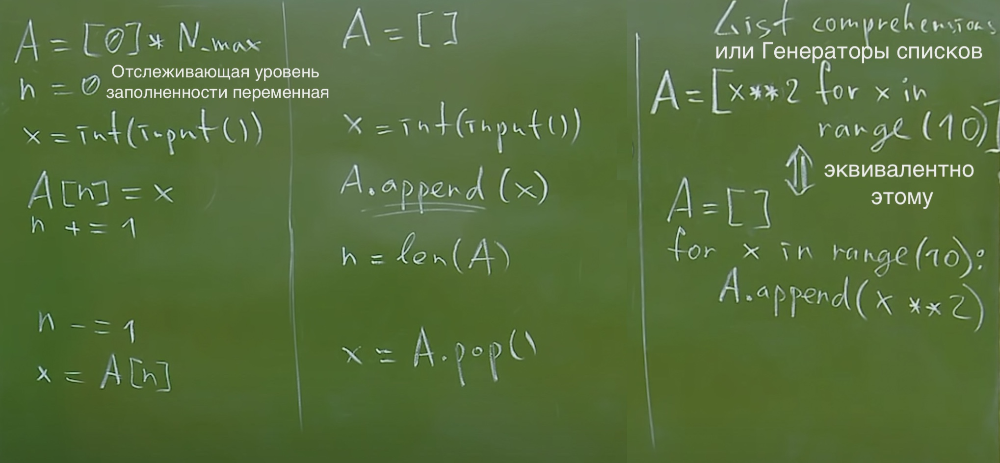

И еще один способ создать список - это Генераторы списков или `List Comprehension`. Способ построить новый список, применяя выражение к каждому элементу последовательности. Генераторы списков очень похожи на цикл `for`. Сам `for` в языке является списочного характера.

`List Comprehension` - более короткий синтаксис, когда вы хотите создать новый список на основе значений существующего списка.

```python
>>> a = []
>>> for i in range(1,15):
...     a.append(i)

>>> a
[1, 2, 3, 4, 5, 6, 7, 8, 9, 10, 11, 12, 13, 14]

>>> a = [i for i in range(1,15)]
>>> a
[1, 2, 3, 4, 5, 6, 7, 8, 9, 10, 11, 12, 13, 14]
```

```python
fruits = ["apple", "banana", "cherry", "kiwi", "mango"]
newlist = []

for x in fruits:
  if "a" in x:
    newlist.append(x)
print(newlist) # ['apple', 'banana', 'mango']

#or
fruits = ["apple", "banana", "cherry", "kiwi", "mango"]
newlist = [x for x in fruits if "a" in x]
print(newlist) #['apple', 'banana', 'mango']
```

```python
A = [1, 2, 3, 4, 5, 6, 7, 8, 9, 10]
B = []
B = [x ** 2 for x in A if x % 2 == 0]
# or тернарный оператор if замениним выражение x ** 2 на конструкцию в скобках
# B = [(0 if x < 0 else x ** 2) for x in A if x % 2 == 0]

print(B) # [4, 16, 36, 64, 100]
```

***Квадратичные сортировки***
Количество операций требующихся на выполнение операции обработки массива это n в квадрате, где n это длина массива. O(n^2)

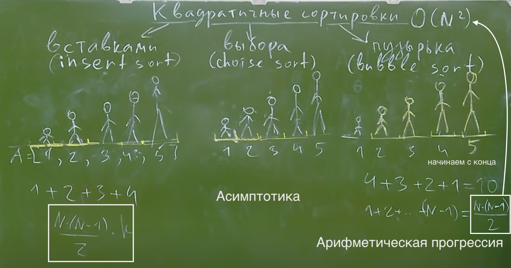

(По неизвестной причине github не подгружает gif, смотри в папке images)

***Вставками (insert sort)***

 


4 прохода для 5 элементов. 
В начальный момент отсортированная последовательность пуста. На каждом шаге алгоритма выбирается один из элементов входных данных и помещается на нужную позицию в уже отсортированной последовательности до тех пор, пока набор входных данных не будет исчерпан. В любой момент времени в отсортированной последовательности элементы удовлетворяют требованиям к выходным данным алгоритма.

***Выбором (choise/selection sort)***
Алгоритм пробегает по всем ещё не упорядоченным элементам, ищет среди них минимальный (сохраняя его значение и индекс) и переставляет в конец выстриваемого списка.

 


***Пузырька (bubble sort)***
Соседние элементы сравниваются и при необходимости меняются местами, в результате "лёгкие" элементы перемещаются к началу списка, а "тяжёлые" - к концу. Операция циклически выполняется для оставшихся элементов.


 

```python
def insert_sort(A):
    """ сортировка списка А вставками """
    N = len(A)
    for top in range(N):
        k = top
        while k > 0 and A[k-1] > A[k]:
            A[k], A[k-1] = A[k-1], A[k]
            k -= 1
            
def choice_sort(A):
    """сортировка списка А выбором """
    N = len(A)
    for pos in range(0, N-1):
        for k in range(pos+1, N):
            if A[k] < A[pos]:
                A[k], A[pos] = A[pos], A[k]

def bubble_sort (A) :
    """сортировкм списка А методом пузырька, начинается с конца"""
    N = len(A)
    for bypass in range(1, N):
        for k in range(0, N-bypass):
            if A[k] > A[k+1]:
                A[k], A[k+1] = A[k+1], A[k]

def test_sort(sort_algorithm):
    print("Тестируем:", sort_algorithm.__doc__)
    print("test case #1: ", end="")
    A = [4, 2, 5, 1, 3]
    A_sorted = [1, 2, 3, 4, 5]
    sort_algorithm(A)
    print("Ok" if A == A_sorted else "Fail")
    
    print("test case #2: ", end="")
    A = list(range(10, 20)) + list(range (0, 10))
    A_sorted = list(range(20))
    sort_algorithm (A)
    print("Ok" if A == A_sorted else "Fail")

    print("test case #3: ", end="")
    A = [4, 2, 4, 2, 1]
    A_sorted = [1, 2, 2, 4, 4]
    sort_algorithm(A)
    print("Ok" if A == A_sorted else "Fail")
    
if __name__ == "__main__":
    test_sort(insert_sort)
    test_sort(choice_sort)
    test_sort(bubble_sort)
```

```bash
Result: 
Тестируем:  сортировка списка А вставками 
test case #1: Ok
test case #2: Ok
test case #3: Ok
Тестируем: сор�ировка списка А выбором 
test case #1: Ok
test case #2: Ok
test case #3: Ok
Тестируем: сортировкм списка А методом пузырька
test case #1: Ok
test case #2: Ok
test case #3: Ok
```

***Сортировка подсчетом (count sort)***
Однопроходный алгоритм. Проходимся по массиву и подсчитываем количество вхождений каждого элемента. После проходим по массиву значений и выводим каждое число столько раз, сколько нужно.
Применение сортировки подсчётом целесообразно лишь тогда, когда массив состоит из целочисленных, положительных чисел. O(n). O(m), где m это количество различных элементов.

(По неизвестной причине github не подгружает gif, смотри в папке images)

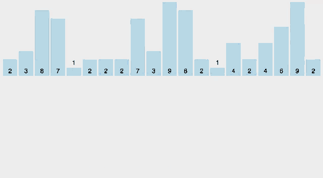

```python
# основа
N = ....
F = [0] * 10
for i in range(N):
	x = int(input())
	F[x] += 1
```

***[Counting Sort in Python](https://stackabuse.com/counting-sort-in-python/)***
```python
def countingSort(inputArray):
    # Find the maximum element in the inputArray
    maxElement= max(inputArray)

    countArrayLength = maxElement+1

    # Initialize the countArray with (max+1) zeros
    countArray = [0] * countArrayLength

    # Step 1 -> Traverse the inputArray and increase 
    # the corresponding count for every element by 1
    for el in inputArray: 
        countArray[el] += 1

    # Step 2 -> For each element in the countArray, 
    # sum up its value with the value of the previous 
    # element, and then store that value 
    # as the value of the current element
    for i in range(1, countArrayLength):
        countArray[i] += countArray[i-1] 

    # Step 3 -> Calculate element position
    # based on the countArray values
    outputArray = [0] * len(inputArray)
    i = len(inputArray) - 1
    while i >= 0:
        currentEl = inputArray[i]
        countArray[currentEl] -= 1
        newPosition = countArray[currentEl]
        outputArray[newPosition] = currentEl
        i -= 1

    return outputArray

inputArray = [2,2,0,6,1,9,9,7]
print("Input array = ", inputArray)

sortedArray = countingSort(inputArray)
print("Counting sort result = ", sortedArray)
```

```bash
Result: 
Input array =  [2, 2, 0, 6, 1, 9, 9, 7]
Counting sort result =  [0, 1, 2, 2, 6, 7, 9, 9]
```

---
[К оглавлению](#contents)
### <a id="lection7" />Лекция №7. Рекурсия. Прямой и обратный ход рекурсии. Факториал. Алгоритм Евклида. Ханойские башни.

***Сказка про репку***
При погружении вглубь рекурсии, подзадача проще чем сама изначальная задача. Главная задача (дед) зовет на помощь подзадачу, до тех пор пока не наступит крайний случай (мышка). От крайнего случая идет обратный ход рекурсии, как с матрешкой идет ее сборка.

При создании рекурсии мы:
1) придумываем рекурентный случай, т.е как мы вообще будем решать нашу задачу уменьшая ее сложность через создание подзадачи меньшего масштаба 
2) крайний случай, иначе бесконечность

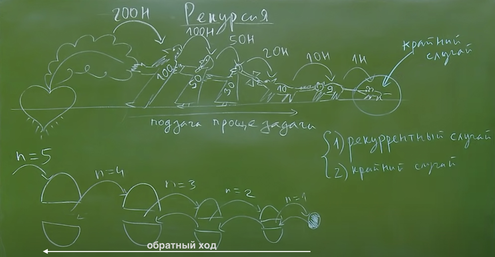

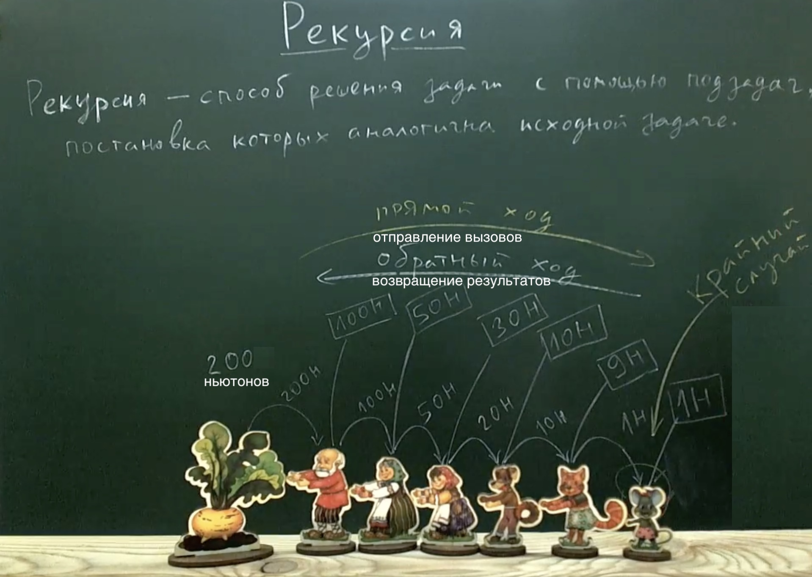 </img>

***Рекурсия*** - способ решения задачи с помощью подзадач, постановка которых аналогична исходной задаче. Важно чтобы подзадача по сложности была меньше чем исходная задача, и приближалась к крайнему случаю, при этом как бы уменьшая масштаб задачи. Задача программиста, чтобы рекурентный случай постепенно упрощал задачу.

Глубина рекурсии - количество вызовов, самовызывов функции, включая первый вызов, который произошел из вне. Репка вызвала деда, мастеру кто-то заказал 5 матрешек.

Количество вложенных рекурсивных вызовов называется ***глубиной рекурсии***. В силу ограниченности вычислительных ресурсов рекурсия в компьютерных программах не бывает бесконечной — программист должен явно следить за тем, чтобы глубина рекурсивных вызовов не превышала заранее известного числа. Если программист об этом не позаботился (или же сделал это некорректно), операционная система (или интерпретатор) аварийно завершит программу по исчерпанию доступых ресурсов.

Решение задачи начинается с конца, с крайнего случая (с мышки). 
В данном примере глубина рекурсии достигла 6 уровней, где 6 уровень крайний.

Есть прямой ход рекурсии когда идут вызовы. И обратный ход рекурсии когда возвращаются результаты.

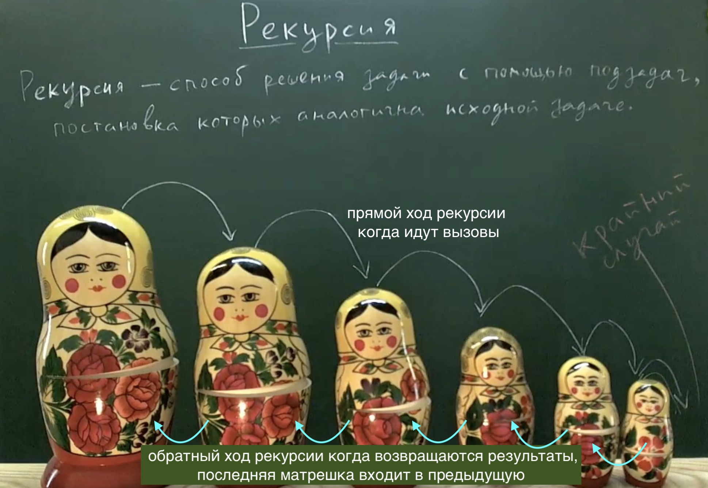 </img>

Аналогия простая, один мастер вызывает другого, чтобы он сделал ему нужную матрешку меньшего размера, до тех пор пока конечный мастер не сделает самую маленькую (мастеров много). Глубина вложенности 7 уровней.

Функция может вызвать себя же, это не мешает стеку хранить адрес туда куда надо, т.е код один, НО локальные параметры хранящиеся на стеке ***разные***, на разных уровнях рекурсии `n` равно разному значению.

Каждый рекурентный виток (мастер который делает матрешку) помнят свои `n` в обратном ходе рекурсии. У каждого вызова одной и тоже функции свой набор имен, у вызова функции свое пространство имен, при каждом ее рекурентном вызове. 

Функция может быть мертвой, лежит в файле `exe` на жестком диске. А есть ***вызов функции*** - это вычислительный процесс который запущен. 

Поэтому пока функция выполняется, и объекты в ней живые, сборщик мусора их не съест, до окончания и `return`.

```python
def matryoshka(n) :
    if n == 1:
        print("Матрёшечка")
    else:
        print("Верх матрёшки n=", n)
        matryoshka (n-1)
        print("Низ матрёшки n=", n)
        
matryoshka(5)
```

```bash
Result: 
Верх матрёшки n= 5
Верх матрёшки n= 4
Верх матрёшки n= 3
Верх матрёшки n= 2
Матрёшечка
Низ мaтрёшки n= 2
Низ матрёшки n= 3
Низ матрёшки n= 4
Низ матрёшки n= 5
```

В языке есть конструкция разворачивания кортежа, списка параметров и тп, в аргумент функции, например у нас есть заготовленный кортеж с значениями A = (1, 2, 3, 4, 5) и тп, я могу написать их все, но чтобы сделать это кратко я могу их все размернуть в нужное место используя `*A`.

оператор распаковки (`*`)

```python
def foo(v1,v2,v3): 
pass

foo(t[0],t[1],t[2])

foo(*t)
# Обратите внимание, что это работает, если t является list, tuple или даже генератором

#Существует аналогичный способ передать аргументы функциям с ключевыми словами, используя оператор ** для сопоставления объектов (обычно словарей):

def foo(key=None,foo=None):
    pass #...

foo(**{key:1,foo:2})
```

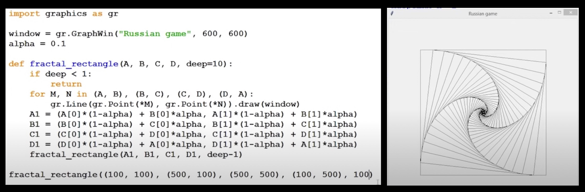 </img>

***[Факториал](https://ru.wikipedia.org/wiki/%D0%A4%D0%B0%D0%BA%D1%82%D0%BE%D1%80%D0%B8%D0%B0%D0%BB)***

Это функция, определённая на множестве неотрицательных целых чисел. Факториал натурального числа `n` определяется как произведение всех натуральных чисел от 1 до `n` включительно
5! = 1 * 2 * 3 * 4 * 5 = 120

`n! = (n - 1)! * n`

`assert` - оператор проверки, проверяет логическое утверждение, и если находит false, то прерывает выполнение программы, генерует ошибки если вызовут функцию с неправильным параметром, используется для отладки кода. Это своего рода проверка, которая исследует функциональность вашего кода.

Работает как логическое выражение, проверяя, является ли заданное условие истинным или ложным. Если условие истинно, то ничего не происходит и выполняется следующая строка кода. Если же условие ложно, оператор assert останавливает выполнение программы и выдает ошибку. 

Этот оператор принимает условие и необязательное сообщение, которое выводится, если условие assert ложно. В этом случае инструкция assert выводит AssertionError. 

При выполнении операции деления следует учитывать, что на ноль делить нельзя. Если делитель будет равен нулю, программа вызовет ошибку `ZeroDivisionError`. Чтобы проверить, не равен ли делитель нулю, можно вставить оператор `assert`. 

```python
num1 = 10
num2 = 0
assert num2 != 0, "The divisor is zero"
```

В `assert` мы указали условие, что `num2` (делитель) не должен быть равен нулю. Данное условие не выполняется, потому что значение `num2` равно нулю. Интерпретатор Python выдает ошибку `AssertionError` вместе с добавленным нами сообщением «The divisor is zero» («Делитель равен нулю»).

```python
def factorial (n:int):
    assert n > 0, "Факториал неопределенный"
    if n == 1:
        return 1
    return factorial(n-1) * n
    
print(factorial(5)) # 120
```

Эту программу можно переписать и без рекурсивных вызовов:

```python
def fac(n):
    f = 1
    x = 2
    while x <= n:
         f *= x
         x += 1

    return f
print(fac(5))
```

Отличие этих двух программ кроется в подходе к их построению. Первая написана в декларативном стиле, то есть для вычисления факториала используются его свойства, а именно `n! = n*(n-1)!` и `0!=1`. Второй же подход использует императивный стиль: мы явно описываем, что представляет из себя факториал: `n! = 1*2*…*n`. В большинстве случаев один и тот же алгорит может быть легко записан, как в рекурсивной форме, так и в нерекурсивной, но существует ряд задач, для которых построение нерекурсивного алгоритма представляется весьма трудозатратным.

Примеры рекурсивных алгоритмов

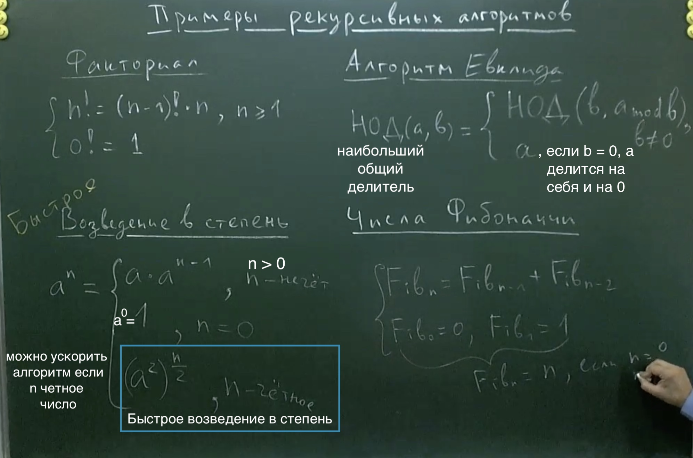 </img>

***[Алгоритм Евклида](https://ru.wikipedia.org/wiki/%D0%90%D0%BB%D0%B3%D0%BE%D1%80%D0%B8%D1%82%D0%BC_%D0%95%D0%B2%D0%BA%D0%BB%D0%B8%D0%B4%D0%B0)*** - эффективный метод вычисления наибольшего общего делителя (НОД).

НОД(a, b) - наибольший общий делитель чисел пишется "greatest common divisor"

Существует несколько вариантов алгоритма, ниже записанный в псевдокоде рекурсивный вариант:

```python
функция нод(a, b)
    если b = 0
       возврат a
    иначе
       возврат нод(b, a mod b)
```

Иллюстрация выполнения алгоритма Евклида для вычисления  НОД чисел 1599 и 650:

Шаг 1.	1599 = 650*2 + 299

Шаг 2.	650 = 299*2 + 52

Шаг 3.	299 = 52*5 + 39

Шаг 4.	52 = 39*1 + 13

Шаг 5.	39 = 13*3 + 0

gif в папке images

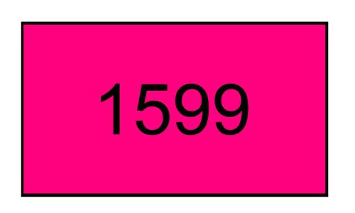 </img>

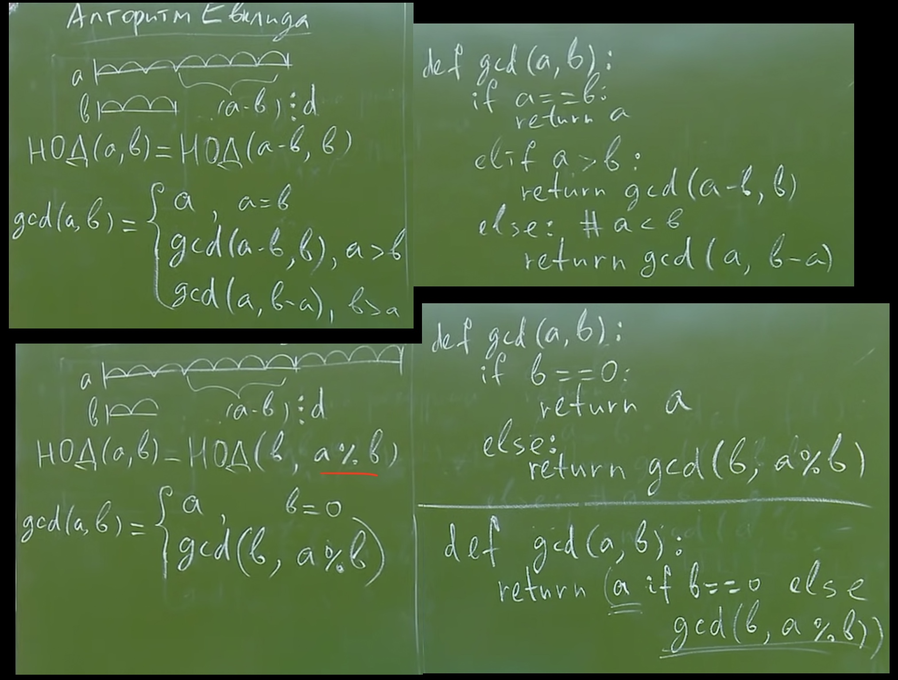 </img>

```python
def gcd (a:int, b:int):
    if a == b:
        return a
    elif a > b:
        return gcd(a-b, b)
    elif a < b:
        return gcd(a, b-a)
    
print(gcd(7,14)) # 7
print(gcd(7,13)) # 1
```
or

```python
def gcd (a:int, b:int):
    if b == 0:
        return a
    else:
        return gcd(b, a%b)
```
or

```python
def gcd (a:int, b:int):
    return a if b == 0 else gcd(b, a%b)
```

***Быстрое возведение в степень***

Рассматриваем только для целых положительных чисел, a не равно нулю, и n отрицательное.

 </img>

```python
def pow(a:float, n:int):
    if n == 0:
        return 1
    return pow(a, n-1) * a
    
print(pow(5, 4)) # 625
```

```python
def pow(a:float, n:int):
    if n == 0:
        return 1
        
    # для нечетной степени
    elif n%2 == 1:
        return pow(a, n-1) * a
    
    # для четной степени
    return pow(a**2, n//2)
    
print(pow(5, 10)) # 9765625
```

***Ханойские башни***

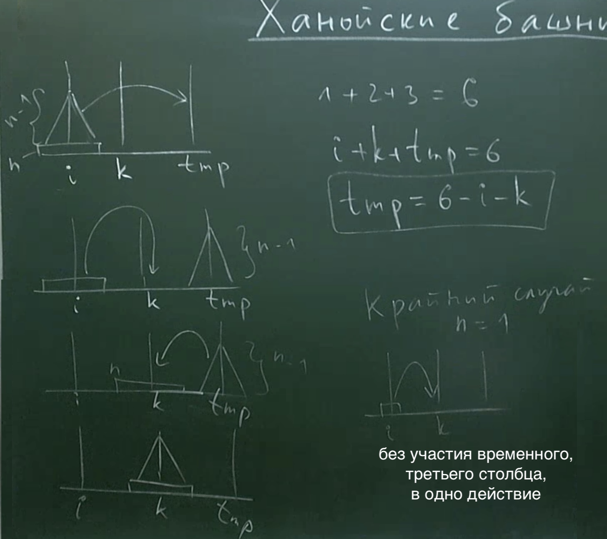 </img>

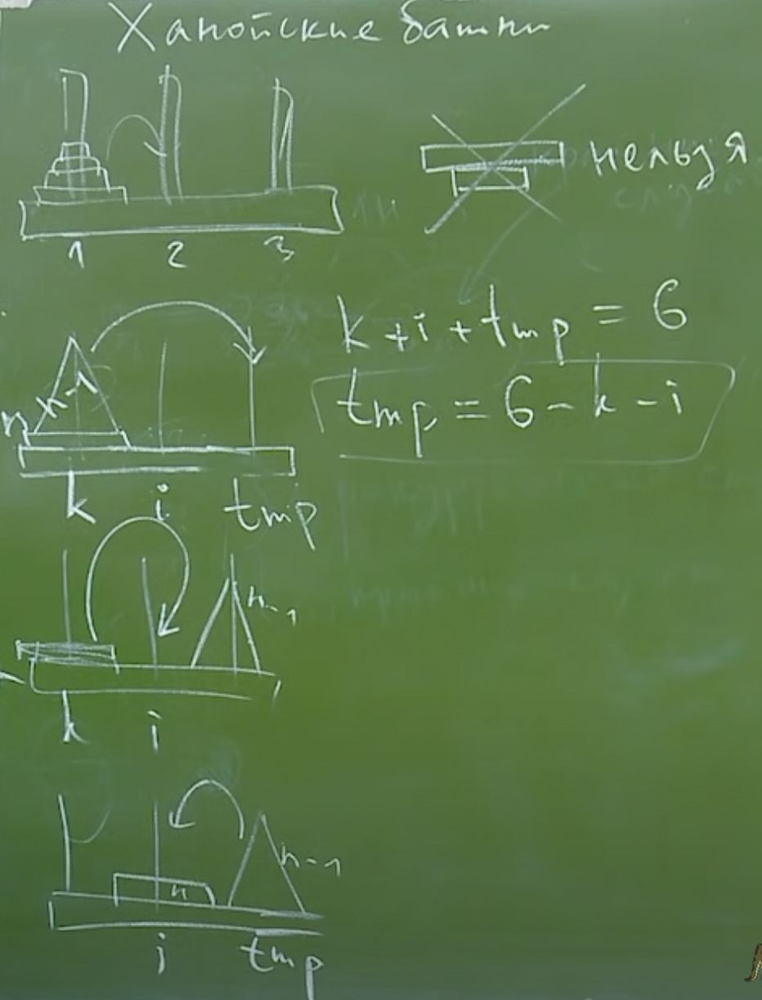 </img>

`n` - высота, `i` - столбец с которого нужно переложить `k` - столбец на который нужно переложить, `tmp` - временное хранище, запасной столбец

```python
def hanoi(n, i, k):
    if (n == 1):
        print("Move disk 1 from pin", i, "to", k);
    else:
        tmp = 6 - i - k;
        hanoi(n-1, i, tmp);
        print("Move disk", n, "from pin", i, "to", k);
        hanoi(n-1, tmp, k);
        
print(hanoi(3, 1, 2))
```

```bash
Result:
Move disk 1 from pin 1 to 2
Move disk 2 from pin 1 to 3
Move disk 1 from pin 2 to 3
Move disk 3 from pin 1 to 2
Move disk 1 from pin 3 to 1
Move disk 2 from pin 3 to 2
Move disk 1 from pin 1 to 2
```

---
[К оглавлению](#contents)
### <a id="lection8" />Лекция №8. Генерация комбинаторных объектов. Рекурсивная генерация всех чисел длины M. Генерация всех перестановок (рекурсивная). Быстрые или Рекуррентные сортировки: Тони Хоара и слиянием (без реализации).

***Генерация комбинаторных объектов. Рекурсивная генерация всех чисел длины***

Логика перебора чисел, рекурентно. 

 </img>

Простой пример, логики программы, для двоичной системы счисления:

```python
def gen_bin(M, prefix=""):
    if M == 0:
        print(prefix)
        return
    gen_bin(M-1, prefix+"0")
    gen_bin(M-1, prefix+"1")
    
    # или в цикле
    # for digit in "0", "1":
    #     gen_bin(M-1, prefix+digit)
    
gen_bin(3)
```

```bash
Result:
000
001
010
011
100
101
110
111
```

Для произвольной системы счисления:

```python
def generate_number(N:int, M:int, prefix=None):
    """ Генерирует все числа (с лидирующими незначащими нулями)
        в N-ричной системе счисления (N <= 10) длины М
    """
    prefix = prefix or []
    if M == 0:
        print(prefix)
        return
    for digit in range(N):
        prefix.append(digit)
        generate_number(N, M-1, prefix)
        prefix.pop()
        
# для двоичных чисел длины 3
generate_number(2, 3)

# для троичных чисел длины 3
# generate_number(3, 3)
```

```bash
Result:
[0, 0, 0]
[0, 0, 1]
[0, 1, 0]
[0, 1, 1]
[1, 0, 0]
[1, 0, 1]
[1, 1, 0]
[1, 1, 1]
```

***Генерация всех перестановок***

```python
def find(number, A):
    """ ищет number в А и возвращает True, если такой есть
        False, если такого нет
    """
    flag = False
    for x in A:
        if number == x:
            flag = True
            break
    return flag

def generate_permutations(N:int, M:int=-1, prefix=None):
    """ Generating all permutations of N numbers in M positions,
        with prefix prefix
    """
    if M == -1:
        M = N  # по умолчанию, N чисел в N позициях
        
    prefix = prefix or []
    if M == 0:
        print(prefix)
        # можно использовать оператор * , чтобы встроить
        # все параметры
        # print(*prefix)
        return
    for number in range(1, N+1):
        if find(number, prefix): #FIXME
            continue
        prefix.append(number)
        generate_permutations(N, M-1, prefix)
        prefix.pop()

generate_permutations(3)
```

```bash
Result:
[1, 2, 3]
[1, 3, 2]
[2, 1, 3]
[2, 3, 1]
[3, 1, 2]
[3, 2, 1]
```

```bash
При использовании оператора `*` , чтобы встроить
все параметры в `print(*prefix)`
Result:
1 2 3
1 3 2
2 1 3
2 3 1
3 1 2
3 2 1
```

***Быстрые или Рекуррентные сортировки: Тони Хоара и слиянием (без реализации).***

Сортировка Тони Хоара на неторорых выборках массивов сортирует плохо. Сортировка слияние сортирует всегда хорошо, в остальном они чаще всего одинаковые по скорости.

 </img>

---

***Фрактал*** (лат. fractus — дроблёный, сломанный, разбитый) — множество, обладающее свойством самоподобия (объект, в точности или приближённо совпадающий с частью себя самого, то есть целое имеет ту же форму, что и одна или более частей).

Хорошим примером для иллюстрации рекурсивных алгоритмов являются задачи рисования [фракталов](https://ru.wikipedia.org/wiki/%D0%A4%D1%80%D0%B0%D0%BA%D1%82%D0%B0%D0%BB). Фрактальные кривые, обладающие бесконечным самоподобием, не являются [спрямляемыми](https://ru.wikipedia.org/wiki/%D0%94%D0%BB%D0%B8%D0%BD%D0%B0_%D0%BA%D1%80%D0%B8%D0%B2%D0%BE%D0%B9): хоть их и можно изобразить на плоскости конечной площади, эти кривые имeют бесконечную длину. 

Длина кривой (или длина дуги кривой) — числовая характеристика протяжённости этой кривой. Исторически вычисление длины кривой называлось спрямлением кривой (от лат. rectificatio, спрямление). 

Соответственно, программно их невозможно нарисовать полностью: всегда будет возможность нарисовать кривую детальнее. Поэтому, фрактальные кривые рисуют в некотором приближении, заранее фиксируя максимально допустимую глубину рекурсии.

Пример программы, использующей рекурсивные вызовы функции, чтобы нарисовать ветку:

```python
import turtle

def draw(l, n):
    if n == 0:
        turtle.left(180)
        return

    x = l / (n + 1)
    for i in range(n):
        turtle.forward(x)
        turtle.left(45)
        draw(0.5 * x * (n - i - 1), n - i - 1)
        turtle.left(90)
        draw(0.5 * x * (n - i - 1), n - i - 1)
        turtle.right(135)

    turtle.forward(x)
    turtle.left(180)
    turtle.forward(l)

draw(400, 5)
```

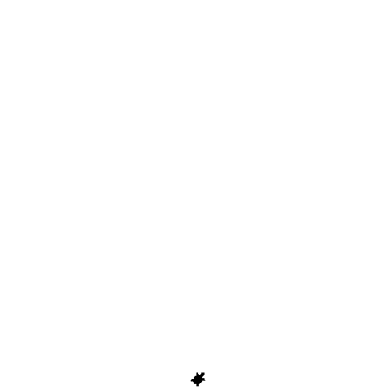 </img>

***[Кривая Коха](https://ru.wikipedia.org/wiki/%D0%9A%D1%80%D0%B8%D0%B2%D0%B0%D1%8F_%D0%9A%D0%BE%D1%85%D0%B0)*** — фрактальная кривая, описанная в 1904 году шведским математиком Хельге фон Кохом.

Кривую Коха. Процесс её построения выглядит следующим образом: берём единичный отрезок, разделяем на три равные части и заменяем средний интервал равносторонним треугольником без этого сегмента. В результате образуется ломаная, состоящая из четырёх звеньев длины 1/3. На следующем шаге повторяем операцию для каждого из четырёх получившихся звеньев и т. д… Предельная кривая и есть кривая Коха.

Пример работы алгоритма при разной глубине рекурсии:

 </img>

Три копии кривой Коха, построенные (остриями наружу) на сторонах правильного треугольника, образуют замкнутую кривую бесконечной длины, называемую снежинкой Коха

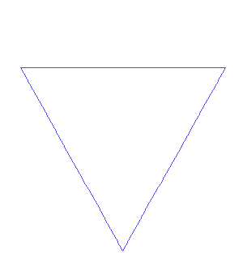 </img>

Пример работы алгоритма при разной глубине рекурсии:

 </img>

***[Кривая Минковского](https://ru.wikipedia.org/wiki/%D0%9A%D1%80%D0%B8%D0%B2%D0%B0%D1%8F_%D0%9C%D0%B8%D0%BD%D0%BA%D0%BE%D0%B2%D1%81%D0%BA%D0%BE%D0%B3%D0%BE)*** нулевого порядка - горизонтальный отрезок. Затем на каждом шаге каждый из отрезков заменяется на ломанную, состоящую из 8 звеньев.

Пример работы алгоритма при разной глубине рекурсии:

 </img>

 </img>

```python
from turtle import *

def start(x: float):
    """This function clears window and make turtle go to start"""
    clear()
    penup()
    x = x if x < 0 else -x
    goto(x, 0)
    pendown()
 
def curve_minkowski(length: float, iterations: int):
    """This function draw Minkowski's curve"""
 
    if iterations == 0:
        forward(length * 4)
    else:
        curve_minkowski(length/4, iterations - 1)
        left(90)
        curve_minkowski(length/4, iterations - 1)
        right(90)
        curve_minkowski(length/4, iterations - 1)
        right(90)
        curve_minkowski(length/4, iterations - 1)
        curve_minkowski(length/4, iterations - 1)
        left(90)
        curve_minkowski(length/4, iterations - 1)
        left(90)
        curve_minkowski(length/4, iterations - 1)
        right(90)
        curve_minkowski(length/4, iterations - 1)
LENGTH = 100       # длина линии
ITERATION = 3      # номер итерации
start(LENGTH * 2)
curve_minkowski(LENGTH, ITERATION)
exitonclick()    # функция чтобы программа не завершалась сразу
```

***[Кривая Леви](https://ru.wikipedia.org/wiki/%D0%9A%D1%80%D0%B8%D0%B2%D0%B0%D1%8F_%D0%9B%D0%B5%D0%B2%D0%B8)***. Она получается, если взять половину квадрата вида /\, а затем каждую сторону заменить таким же фрагментом и так далее.

Пример работы алгоритма при разной глубине рекурсии:

 </img>

```python
import turtle

turtle.hideturtle()
turtle.tracer(0)
turtle.penup()
turtle.setposition(-100, 0)
turtle.pendown()

axiom, tempAx, logic, iterations = 'F', '', {'F': '-F++F-'}, 15

for i in range(iterations):
    for j in axiom:
        tempAx += logic[j] if j in logic else j
    axiom, tempAx = tempAx, ''

for k in axiom:
    if k == '+':
        turtle.right(45)
    elif k == '-':
        turtle.left(45)
    else:
        turtle.forward(1)

turtle.update()
turtle.mainloop()
```

***[Кривая дракона](https://ru.wikipedia.org/wiki/%D0%9A%D1%80%D0%B8%D0%B2%D0%B0%D1%8F_%D0%B4%D1%80%D0%B0%D0%BA%D0%BE%D0%BD%D0%B0)*** нулевого порядка - горизонтальный отрезок. Разделим отрезок пополам и построим на нем прямой угол, получив кривую дракона первого порядка.

На сторонах прямого угла снова построим прямые углы. При этом вершина первого угла находится справа от начальной точки A, а направления, в которых строятся вершины остальных углов, чередуются.

 </img>

 </img>

***[Канторово множество](https://ru.wikipedia.org/wiki/%D0%9A%D0%B0%D0%BD%D1%82%D0%BE%D1%80%D0%BE%D0%B2%D0%BE_%D0%BC%D0%BD%D0%BE%D0%B6%D0%B5%D1%81%D1%82%D0%B2%D0%BE)*** нулевого порядка - горизонтальный отрезок. Удалив среднюю треть получим множество первого порядка. Повторяя данную процедуру получим остальные множества.

 </img>

---
[К оглавлению](#contents)
### <a id="lection9" />Лекция №9. Быстрая сортировка Тони Хоара и Сортировка слиянием (реализация). Слияние двух упорядоченных массивов. Устойчивость сортировок. Проверка упорядоченности массива за O(N).

***Сортировка слиянием (реализация)***

Алгоритм слияние отсортированных массивов в один.

***Сортировка называется устойчивой***, если она не меняет порядок равных элементов. Сортируемая характеристика может быть не единственной. Реальные объекты могут быть разными.

 </img>

Более простая и понятная реализация с 2 массивами на вход для сливания.

```python
def merge (A:list, B:list):
    C = [0] * (len(A) + len(B))
    i = k = n = 0
    while i < len(A) and k < len(B):
        if A[i] <= B[k]:
            C[n] = A[i]
            i += 1
            n += 1
        else:
            C[n] = B[k]
            k += 1
            n += 1
    while i < len(A):
        C[n] = A[i]
        i += 1
        n += 1
    while k < len(B):
        C[n] = B[k]
        k += 1
        n += 1
    return C

A = [1, 3, 5, 4, 10]
B = [3, 2, 9, 2, 9]
print(merge(A, B))
```

```bash
Result:
[1, 3, 3, 2, 5, 4, 9, 2, 9, 10]
```

Но есть и другая реализация, где принимаем на вход один массив, и благодаря индексам, уже сливаем, индексами указано где левая, и где правая часть для сливания (как выше мы использовали для этого 2 отдельных массива)

***Сама реализация рекурентной сортировки слиянием***

 </img>

`def merge` описана выше 

```python
def merge_sort(A):
    if len(A) <= 1:
        return
    middle = len(A)//2
    left_part = [A[i] for i in range(0, middle)]
    right_part = [A[i] for i in range(middle, len(A))]
    merge_sort(left_part)
    merge_sort(right_part)
    C = merge(left_part, right_part)
    for i in range(len(A)):
        A[i] = C[i]
    return A 
    
D = [1, 3, 2, 14, 5, 10, 9, 13, 4, 6]
print(merge_sort(D))
```

```bash
Result:
[1, 2, 3, 4, 5, 6, 9, 10, 13, 14]
```

***Сортировка Тони Хоара (быстрая сортировка/quick sort)***

Новые объекты в Питоне появляются единственным способом, это вычислением самого оlбъекта. Помним об ссылочной модели в языке. 

 </img>

```python
def hoar_sort(A):
    if len(A) <= 1:
        return
    
    # барьерный элемент, допускаем что это число случайное
    # и на его основе будет делать массив на три части
    barrier = A[0]
    left = []
    middle = []
    right = []
    
    for x in A:
        if x < barrier:
            left.append(x)
        elif x == barrier:
            middle.append(x)
        else:
            right.append(x)
            
    hoar_sort(left)
    hoar_sort(right)
    
    k = 0
    for x in left + middle + right:
        A[k] = x
        k += 1
    return A
        
D = [1, 3, 2, 14, 5, 10, 9, 13, 4, 6]
print(hoar_sort(D))
```

```bash
Result:
[1, 2, 3, 4, 5, 6, 9, 10, 13, 14]
```

***Проверка упорядоченности массива за O(N)***

ascending - возрастание

 </img>

```python
def check_sorted(A, ascending = True):
    """ Проверка отсортированности массива за O(len(A) """
    flag = True
    s = 2 * int(ascending) - 1
    
    for i in range(0, len(A) - 1):
        if s * A[i] > s * A[i + 1]:
            flag = False
            break
    return flag
    
D = [1, 3, 2, 14, 5 ]
F = [1, 2, 3, 4 , 5 ]
print(check_sorted(D)) # false
print(check_sorted(F)) # true
```

***Бинарный поиск в массиве***

```bash
[1, 1, 2, 2, 3, 3, 3, 4, 4, 4, 5, 5, 5, 5, 7, 7, 7]
left_bound and right_bound

middle = (left_bound + right_bound) // 2

# аналогия с порванным телефонным справочников в курсе CS50

```

***Реализиция бинарного поиска в массиве***

Скорость работы очень быстрая. **O(log2 N)**
Разбор в начале 10 лекции. Массив должен быть отсортирован.

```python
def left_bound(A, key):
    left = -1
    right = len(A)
    while right - left > 1:
        middle = (right + left) // 2
        if A[middle] < key:
            left = middle
        else:
            right = middle
    return left

def right_bound(A, key):
    left = -1
    right = len(A)
    while right - left > 1:
        middle = (right + left) // 2
        if A[middle] <= key:
            left = middle
        else:
            right = middle
    return right

D = [1, 1, 2, 2, 3, 3, 3, 4, 4, 4, 5, 5, 5, 5, 7, 7, 7]
print(left_bound(D, 3))
print(right_bound(D, 2))
```

```bash
Result:
3
4
```

---
[К оглавлению](#contents)

### <a id="lection10" />Лекция №10. Вычисление чисел Фибоначчи и проблема перевычислений. Одномерное динамическое программирование на примере чисел Фибоначчи. Задачи о кузнечике (количество траекторий, траектория наименьшей стоимости). Двумерные массивы (списки списков). Оператор is.

***Динамическое программирование***

***[Числа Фибоначчи](https://ru.wikipedia.org/wiki/%D0%A7%D0%B8%D1%81%D0%BB%D0%B0_%D0%A4%D0%B8%D0%B1%D0%BE%D0%BD%D0%B0%D1%87%D1%87%D0%B8)*** — элементы числовой последовательности 0, 1,   1, 2, 3, 5, 8, 13, 21, 34, 55, 89, 144, 233, 377, 610, 987, 1597, 2584, 4181, 6765, 10946, 17711, …  в которой первые два числа равны 0 и 1, а каждое последующее число равно сумме двух предыдущих чисел

 </img>

"Как раз это и называется динамическим программированием - рекурсия вывернутая наоборот"

```python
def fib(n):
    if n <= 1:
        return n
    return fib(n-1) + fib(n-2)
print(fib(10)) # 55
```

C помощью цикла for без рекурсии

```python
def fib(n):
    fib = [0, 1] + [0] * (n-1)
    for i in range(2, n+1):
        fib[i] = fib[i-1] + fib[i-2]
    return fib[n]
    
print(fib(5)) # 5 
```

***Задача о кузнечике (количество траекторий)***

Рассмотрим следующую задачу. На числовой прямой сидит кузнечик, который может прыгать вправо на одну или на две единицы. Первоначально кузнечик находится в точке с координатой 1. Определить количество различных маршрутов кузнечика, приводящих его в точку с координатой `n`.

Обозначим количество маршрутов кузнечика, ведущих в точку с координатой `n`, как `K[n]`. Прежде всего заметим, что существует ровно один маршрут из точки 1 в точку 1 — он не содержит ни одного прыжка. В точку 2 можно прыгнуть единственным способом — из точки 1.

Как вычислить `K[n]`? В точку кузнечик может попасть двумя способами — из точки при помощи прыжка длиной 2 и из точки прыжком длины 1. То есть число способов попасть в точку `n` равно сумме числа способов попасть в точку `(n-1)` и `(n-2)`, что позволяет выписать рекуррентное соотношение: `K[n] = K[n-1] + K[n-2]`.

Можно заметить, что данная задача по сути свелась к числам Фибоначчи

 </img>

```python
def traj_num(N):
    K = [0, 1] + [0] * N
    for i in range(2, N+1):
        K[i] = K[i-2] + K[i-1]
    return K[N]
```

***С запрещенными клеткам  для прыжка***

 </img>

```python
def count_trajectories(N, allowed:list):
    K = [0, 1, int(allowed[2])] + [0] * (N-3)
    for i in range(3, N+1):
        if allowed[i]:
            K[i] = K[i-1] + K[i-2] + K[i -3]
    return K[N]
```

***Траектория наименьшей стоимости***

Пусть кузнечик прыгает на одну или две точки вперед, а за прыжок в каждую точку необходимо заплатить определенную стоимость, различную для различных точек. Стоимость прыжка в точку `i` задается значением `price[i]` списка `price`. Необходимо найти минимальную стоимость маршрута кузнечика из точки 0 в точку `n`.

На этот раз нам необходимо модифицировать определение целевой функции. Пусть `C[n]` — минимальная стоимость пути из 1 в `n`.

Выведем рекуррентное соотношение для этой функции.Чтобы попасть в точку `n` мы должны попасть в неё последним прыжком из `(n-1)` или `(n-2)`. Минимальные стоимости этих маршрутов будут равны `С[n-1]` и `С[n-2]` соответственно, к ним придется добавить значение `price[n]` за прыжок в клетку `n`. Но из двух клеток мы можем выбрать любую.

Нужно выбрать тот маршрут, который имеет наименьшую стоимость: `C[n] = min(C[n-1], C[n-2]) + price[n]`

Вычислить значение целевой функции также лучше при помощи динамического программирования, а не рекурсии.

 </img>

```python
def count_min_cost(N, price:list):
    C = [float("-inf"), price[1], price[1] + price[2]] + [0] * (N-2)
    for i in range(3, N+1):
        C[i] = price[i] + min(C[i-1], C[i-2])
    return C[N]
```

***Восстановление наиболее выгодной траектории***

Итак, мы нашли список `С`, где будет записана минимальная стоимость маршрута для всех точек от 1 до `n`.

Но помимо нахождения наименьшей стоимости маршрута, разумеется, хотелось бы найти и сам маршрут минимальной стоимости. Такая задача называется задачей «восстановления ответа».

Для восстановления ответа будем для каждой точки запоминать номер точки `prev[i]`, из которой кузнечик попал в точку `i`, если он будет передвигаться по пути минимальной стоимости. То есть `prev[i]` — это точка, предшествующая точке с номером `i` на пути минимальной стоимости (также говорят, что `Prev` — это массив предшественников). Как определить `prev[i]`? Если `C[i-1] < C[i-2]`, то кузнечик попал в точку `i` из точки `(i-1)`, поэтому `prev[i] = i - 1`, иначе `prev[i] = i - 2`.

Для восстановления пути необходимо начать с точки `n` и переходить от каждой точки к ее предшественнику, пока путь не дойдет до начальной точки с номером 0. Номера всех вершин будем добавлять в список `path`. В конце в список `path` добавляется начальная вершина номер 1, которая не была обработана в основном цикле, а затем весь список `path` разворачивается в обратном порядке (т. к. вершины добавляются в обратном порядке, от конечной к начальной).

***Двумерные массивы (списки списков).***

- Линеаризация массива

- Список списков

 </img>

```python
A = [[0] * M for i in range(N)]
```

***Двумерное динамическое программирование***

Игра с ферзём.
Рассмотрим игру «Ферзя в угол» для двух игроков. В левом верхнем углу доски размером `N*M` находится ферзь, который может двигаться только вправо-вниз. Игроки по очереди двигают ферзя, то есть за один ход игрок может переместить ферзя либо по вертикали вниз, либо по горизонтали вправо, либо во диагонали вправо-вниз. Выигрывает игрок, который поставит ферзя в правый нижний угол. Необходимо определить, какой из игроков может выиграть в этой игре независимо от ходов другого игрока (имеет выигрышную стратегию).

Будем заполнять доску знаками «+» и «-». Знак «+» будет означать, что данная клетка является выигрышной для ходящего с неё игрока (то есть если ферзь стоит в этой клетке, то игрок, который делает ход, может всегда выиграть), а знак «-» означает, что он проигрывает. Клетки последней строки, последнего столбца и диагонали, ведущей из правого нижнего угла необходимо отметить, как «+», так как если ферзь стоит в этой клетке, то ходящий игрок может выиграть одним ходом.

Но в правом нижнем углу необходимо поставить знак «-» — если ферзь стоит в углу, то тот игрок, которых должен делать ход, уже проиграл.

 </img>

Теперь рассмотрим две клетки, из которых можно пойти только в те клетки, в которых записан знак «+». В этих клетках нужно записать знак «-» — если ферзь стоит в этих клетках, то какой бы ход не сделал ходящий игрок, ферзь окажется в клетке, в которой стоит знак «+», то есть выигрывает ходящий игрок. Значит, тот, кто сейчас ходит — всегда проигрывает.

Но теперь в те клетки, из которых можно попасть в клетку, в которой стоит знак «-» за один ход, необходимо записать знак «+» — если ферзь стоит в этой клетке, то игрок, который делает ход, может выиграть, если передвинет ферзя в клетку, в которой стоит знак «-»:

 </img>

Дальше таблица заполняется аналогично. В клетке ставиться знак «+», если есть ход, который ведет в клетку, в которой стоит знак «--». В клетке ставится знак «-», если все ходы из этой клетки ведут в клетки, в которых записан знак «+».

Продолжая таким образом, можно определить выигрывающего игрока для любой начальной клетки.

 </img>

Оператор `is` используется, чтобы определить равны ли объекты/имена в ссылочной модели.

Оператор `is` сравнивает идентичность двух объектов, в то время как оператор `==` сравнивает значения двух объектов. Существует разница в значении между равными и идентичными. 

Оператор `==` используется, когда ***значения двух операндов равны***, тогда условие становится истинным.

Оператор `is` оценивает значение true, если переменные с обеих сторон оператора указывают ***на один и тот же объект*** и false в противном случае.

Рассмотрим следующий пример:

```python
list_1 = ['a', 'b', 'c']
list_2 = list_1
list_3 = list(list_1)
print(list_1) # ['a', 'b', 'c']
print(list_2) # ['a', 'b', 'c']
print(list_3) # ['a', 'b', 'c']
 
print(list_1 == list_2) # True
print(list_1 == list_3) # True

print(list_1 is list_2) # True
print(list_1 is list_3) # False
```

Здесь вы можете видеть `(list_1 is list_3)` False, потому что `list_1` и `list_3` указывают на два разных объекта, хотя их содержимое может быть одинаковым. Итак, `is` вернет True, если две переменные указывают на один и тот же объект и `==`, если объекты, на которые ссылаются переменные, равны.

---
[К оглавлению](#contents)
### <a id="lection11" />Лекция №11. Двумерное динамическое программирование. Наибольшая общая подпоследовательность. Наибольшая возрастающая подпоследовательность.

***Динамическое программирование*** — решение сложной задачи разбиением её на более простые подзадачи, при этом каждая подзадача решается только один раз.

Динамическое программирование очень похоже на рекурсию, при этом:

- динамическое программирование сверху — это по сути рекурсия с кешированием;

- динамическое программирование снизу — это переформулирование задачи в виде индуктивной последовательности подзадач, от крайнего случая к более сложным.

***Одномерное динамическое программирование***

***Классическая задача — числа Фибоначчи***

Последовательность Фибоначчи `Fn` задается формулами: `F1 = 1, F2 = 1, Fn = Fn – 1 + Fn – 2` при `n > 1`. Необходимо найти `Fn` по номеру `n`.

Один из способов решения, который может показаться логичным и эффективным, — решение с помощью рекурсии:

```python
def fib(n):
    if n <= 1:
        return n
    else:
        return fib(n-1) + fib(n-2)
```

Используя такую функцию, мы будем решать задачу «с конца» — будем шаг за шагом уменьшать `n`, пока не дойдем до известных значений.

Но как можно заметить, такая, казалось бы, простая программа уже при `n = 40` работает заметно долго. Это связано с тем, что одни и те же промежуточные данные вычисляются по несколько раз — число операций нарастает с той же скоростью, с какой растут числа Фибоначчи — экспоненциально.

Один из выходов из данной ситуации — сохранение уже найденных промежуточных результатов с целью их повторного использования (***кеширование***):

```python
F = [-1]*MAX_POSSIBLE_N

def fib(n):
    if n <= 1:
        return n
    if F[n] == -1:
       F[n] = fib(n-1) + fib(n-2)
    return F[n]
```

Приведенное решение корректно и эффективно. Но можно поступить ещё проще:

```python
def fib(n):
    F = [-1]*(n+1)
    F[0] = 0
    F[1] = 1
    for i in range(2, n+1):
        F[i] = F[i - 1] + F[i - 2]
    return F[n]
```

Такое решение можно назвать решением «с начала» — мы первым делом заполняем известные значения, затем находим первое неизвестное значение, потом следующее и т.д., пока не дойдем до нужного.

Именно такое решение и является классическим для динамического программирования: мы сначала решили все подзадачи (нашли все `F[i]` для `i < n`), затем, зная решения подзадач, нашли ответ.

***Задача про шахматного короля***

Двумерный массив, это массив массивов, список строк, и в нем по факту нет столбцов, поэтому используем терминалогию: 1) номер строки (N), 2) положение элемента в строке (M)

В динамическом программировании очень важно определить последовательность вычислений, чтобы при этой последовательности, я каждый раз, при следующем вычислении опирался на ранее вычесленное выражение. 

Числа на шахматной доске, треугольник Паскаля перевернутый на 45 градусов 

Динамическое программирование намного быстрее рекурсии потратит 36 итераций, а рекурсия справилась бы с этой шахматной доской за 252 итерации\вызова!!!

Параллейное программирование нужно для быстрого 
вычисления огромных промышленных размеров данных.

 </img>

***Наибольшая общая подпоследовательность***

Подпоследовательность - некий список С, который содержит  элементы А в исходном порядке, но возможно не все.

F -  длина наибольшей возможной подпоследовательности, частей А и В

`A[0:i]` - часть A, первые i элементы

`B[0:j]` - часть B, первые j элементы

 </img>

 </img>

```python
def lcs(A,B):
    F = [[0] * (len(B) + 1) for i in range (len(A) + 1)]
    for i in range(1, len(A) + 1):
        for j in range(1, len(B) + 1):
            if A[i-1] == B[j-1]:
                F[i][j] = 1 + F[i-1][j-1]
            else:
                F[i][j] = max(F[i-1][j], F[i][j-1])
    return F[-1][-1]
```

***Наибольшая возрастающая подпоследовательность (НВП)***

Ищем длину НВП

 </img>

 </img>

```python
def gis(A):
    F = [0] * (len(A) + 1)
    for i in range(1, len(A) + 1):
        max = 0
        for j in range(0, i):
            if A[i] > A[j] and F[j] > max:
                max = F[j]
        F[i] = max + 1
    return F[len(A)]
```

or

Возможная опечатка в алгоритме выше. В случае если, как под видео поменять индексы (индексы A(i), A(j) должны быть A(i-1) и A(j-1)) - алгоритм отработает, но A[j] будет идет с конца (первая инициализация A[-1]). Целевую функцию можно переопределись следующим образом

```python
def gis(a):
    f = [0]*(len(a))
    f[0] = 1
    for i in range(1, len(a)):
        maximum = 0
        for k in range(i):
            if a[i] > a[k] and f[k] > maximum:
                maximum = f[k]
        f[i] = maximum + 1
    return f[-1]
```

---
[К оглавлению](#contents)
### <a id="lection12" />Лекция №12. Расстояние Левенштейна. Проверка равенства строк. Наивный поиск подстроки в строке.  Z-функция. Алгоритм Кнута-Морриса-Пратта

***Редакционное расстояние между строками (Левенштейна)***

Используем динамическое программирование

`А i` будет по вертикали с `N` 

`В j` будет по горизонтали с `M`

+1 так как нужны нулевые элементы

 </img>

 </img>

**Асимптотика алгоритма `O (M * N)`**

```python
def levenstein(A,B):
    # создаем строки, и крайние случаи
    # проходить будем слева направо строка за строкой
    F = [[(i + j) if i*j == 0 else 0 for j in range(len(B) + 1)] for i in range(len(A) + 1) ]
    
    for i in range(1, len(A) + 1):
        for j in range(1, len(B) + 1):
            if A[i-1] == B[j-1]:
                F[i][j] = F[i-1][j-1]
            else:
                F[i][j] = 1 + min(F[i-1][j], F[i][j-1], F[i-1][j-1])
    return F[len(A)][len(B)]

A = "колокол"
B = "молоко"
print(levenstein(A,B)) # 2

D = "кол"
C = "кот"
print(levenstein(D,C)) # 1
```

***Проверка равенства строк***

Простой подход -> если длины строк не равны, значит и сами строки разные. Далее поэлементное сравнение. Асимптотика `O(N)`

```python
def equal(A,B):
    if len(A) != len(B):
        return False
    for i in range(len(A)):
        if A[i] != B[i]:
            return False
    return True

D = "кол"
C = "кол"
print(equal(D,C)) # true

I = "кол"
F = "кот"
print(equal(I,F)) # false
```

***Наивный поиск подстроки в строке***

**Асимптотика `O(N * M)`**

```python
def equal(A,B):
    if len(A) != len(B):
        return False
    for i in range(len(A)):
        if A[i] != B[i]:
            return False
    return True

def search_substring(s, sub):
    for i in range(0, len(s) - len(sub)):
        if equal(s[i:i+len(sub)], sub):
            print("Подстрока начинается с позиции:", i)

s = "catdogcat"
sub = "dog"
search_substring(s, sub)
```

```bash
Result:
Подстрока начинается с позиции: 3
```

***Префиксная функция П строки***

 </img>

 </img>

**Суффикс** это окончание строки. 

Собственный суффикс - это суффикс, который не совпадает со всей строкой. Суффикс не равный строке. 

Подробнее о [Префикс-функция](https://www.youtube.com/watch?v=xAYmgdB-8Fg&ab_channel=OleksandrTsymbaliuk)

***[Z-функция](https://e-maxx.ru/algo/z_function)***

Здесь и далее строки индексируются с нуля, т.е. первый символ строки имеет номер 0. Также, здесь и далее `s[i…j]` обозначает подстроку строки `s` от i-го символа до j-го включительно.

Пусть дана строка `s` длины `n`. Тогда `Z(s)` - это массив длины `n`, i-ый элемент которого равен наибольшему числу символов, начиная с позиции i, совпадающих с первыми символами строки `s`.

Иными словами, `z[i]` — это длина наибольшего общего префикса строки `s` и её i-го суффикса.

Первый элемент Z-функции, `z[0]`, обычно считают неопределённым. В данной статье мы будем считать, что он равен нулю (хотя ни в алгоритме, ни в приведённой реализации это ничего не меняет).

Далее будет привиден алгоритм вычисления Z-функции за время `O(n)`, а также различные применения этого алгоритма.

Приведём для примера подсчитанную Z-функцию для нескольких строк:

"aaaaa":

```python
z[0] = 0,
z[1] = 4,
z[2] = 3,
z[3] = 2,
z[4] = 1.
```
"aaabaab":

```python
z[0] = 0,
z[1] = 2,
z[2] = 1,
z[3] = 0,
z[4] = 2,
z[5] = 1,
z[6] = 0.
```

"abacaba":

```python
z[0] = 0,
z[1] = 0,
z[2] = 1,
z[3] = 0,
z[4] = 3,
z[5] = 0,
z[6] = 1.
```

***Тривиальный алгоритм***

Формальное определение можно представить в виде следующей элементарной реализации за `O(n^2)`:

```python
def z_func(s, n):
    z = [0] * n
    for i in range(1, n - 1):
        while i + z[i] < n and s[z[i]] == s[i + z[i]]:
            z[i] += 1
    return z
```

Мы просто для каждой позиции i перебираем ответ для неё `z[i]`, начиная с нуля, и до тех пор, пока мы не обнаружим несовпадение или не дойдём до конца строки.

Разумеется, эта реализация слишком неэффективна, перейдём теперь к построению эффективного алгоритма.

***Эффективный алгоритм вычисления Z-функции***

Чтобы получить эффективный алгоритм, будем вычислять значения `z[i]` по очереди — от `i=1` до `n−1`, и при этом постараемся при вычислении очередного значения `z[i]` максимально использовать уже вычисленные значения.

Назовём для краткости подстроку, совпадающую с префиксом строки `s`, ***отрезком совпадения***. Например, значение искомой Z-функции `z[i]` — это длина длиннейшего отрезок совпадения, начинающийся в позиции `i` (и заканчиваться он будет в позиции `i+z[i]−1`).

Для этого будем поддерживать ***координаты `[l;r]` самого правого отрезка совпадения***, т.е. из всех обнаруженных отрезков будем хранить тот, который оканчивается правее всего. В некотором смысле, индекс `r` — это такая граница, до которой наша строка уже была просканирована алгоритмом, а всё остальное — пока ещё не известно.

Тогда если текущий индекс, для которого мы хотим посчитать очередное значение Z-функции, — это `i`, мы имеем один из двух вариантов:

* `i>r` т.е. текущая позиция лежит за пределами того, что мы уже успели обработать.

Тогда будем искать `z[i]` тривиальным алгоритмом, т.е. просто пробуя значения `z[i]=0`, `z[i]=1`, и т.д. Заметим, что в итоге, если `z[i]` окажется `>0`, то мы будем обязаны обновить координаты самого правого отрезка `[l;r]` — т.к. `i+z[i]−1` гарантированно окажется больше `r`.

* `i≤r` — т.е. текущая позиция лежит внутри отрезка совпадения `[l;r]`.

Тогда мы можем использовать уже подсчитанные предыдущие значения Z-функции, чтобы проинициализировать значение `z[i]` не нулём, а каким-то возможно бoльшим числом.

Для этого заметим, что подстроки `s[l…r]` и `s[0…r−l]` совпадают. Это означает, что в качестве начального приближения для `z[i]` можно взять соответствующее ему значение из отрезка `s[0…r−l]`, а именно, значение `z[i−l]`.

Однако значение `z[i−l]` могло оказаться слишком большим: таким, что при применении его к позиции `i` оно "вылезет" за пределы границы `r`. Этого допустить нельзя, т.к. про символы правее `r` мы ничего не знаем, и они могут отличаться от требуемых.

Приведём пример такой ситуации, на примере строки "aaaabaa".

Когда мы дойдём до последней позиции `(i=6)`, текущим самым правым отрезком будет `[5;6]`. Позиции 6 с учётом этого отрезка будет соответствовать позиция `6−5=1`, ответ в которой равен `z[1]=3`. Очевидно, что таким значением инициализировать `z[6]` нельзя, оно совершенно некорректно. Максимум, каким значением мы могли проинициализировать — это 1, поскольку это наибольшее значение, которое не вылезает за пределы отрезка `[l;r]`.

Таким образом, в качестве начального приближения для `z[i]` безопасно брать только такое выражение:

`z0[i]=min(r−i+1,z[i−l]).`

Проинициализировав `z[i]` таким значением `z0[i]`, мы снова дальше действуем тривиальным алгоритмом — потому что после границы r, вообще говоря, могло обнаружиться продолжение отрезка совпадение, предугадать которое одними лишь предыдущими значениями Z-функции мы не можем.

Таким образом, весь алгоритм представляет из себя два случая, которые фактически различаются только начальным значением `z[i]`: в первом случае оно полагается равным нулю, а во втором — определяется по предыдущим значениям по указанной формуле. После этого обе ветки алгоритма сводятся к выполнению тривиального алгоритма, стартующего сразу с указанного начального значения.

Алгоритм получился весьма простым. Несмотря на то, что при каждом `i` в нём так или иначе выполняется тривиальный алгоритм — мы достигли существенного прогресса, получив алгоритм, работающий за линейное время (действительно, на каждый символ мы "посмотрим", т.е. сравним его с каким-либо предыдущим всего один раз).

```python
def z_func(s):
  z = [0] * len(s)
  left, right = 0, 0
  for i in range(1, len(s)):
    z[i] = max(0, min(z[i - left], right - i))
    while i + z[i] < len(s) and s[z[i]] == s[i + z[i]]:
      z[i] += 1
    if i + z[i] > right:
      left, right = i, i + z[i]
  return z

print(z_func("abcdabscabcdabiad"))

# иная реализация
def zfun(s):
    out = []
    if not s: return out
    i, slen = 1, len(s)
    out.append(slen)
    while i < slen:
        left, right = 0, i
        while right < slen and s[left] == s[right]:
            left += 1
            right += 1
        out.append(left)
        i += 1
    return out
print(zfun("abcdabscabcdabiad"))
```

```bash
Result:
[0, 0, 0, 0, 2, 0, 0, 0, 6, 0, 0, 0, 2, 0, 0, 1, 0]
[17, 0, 0, 0, 2, 0, 0, 0, 6, 0, 0, 0, 2, 0, 0, 1, 0]
```

***Префикс-функция. Алгоритм Кнута-Морриса-Пратта (КМП)***

 </img>

***[Материал позаимствован с сайта](https://e-maxx.ru/algo/prefix_function)***

***Префикс-функция. Определение***

Пусть дана строка `s` длины `n`. Тогда `π(s)` - это массив длины `n`, `i`-ый элемент которого `(π[i])` определяется следующим образом: это длина наибольшего собственного суффикса подстроки `s[0…i]`, совпадающего с её префиксом (собственный суффикс — значит не совпадающий со всей строкой). В частности, значение `π[0]` полагается равным нулю.

Примечение: вообще говоря, в теории множеств собственным считается не пустое подмножество, не совпaдающее с самим множеством. В данной статье, для простоты суффикс и префикс нулевой длины также считаются собственными.

Математически определение префикс-функции можно записать следующим образом:

 </img>

Например, для строки "abcabcd" префикс-функция равна: `[0,0,0,1,2,3,0]`, что означает:

```bash
у строки "a" нет нетривиального префикса, совпадающего с суффиксом;
у строки "ab" нет нетривиального префикса, совпадающего с суффиксом;
у строки "abc" нет нетривиального префикса, совпадающего с суффиксом;
у строки "abca" префикс длины 1 совпадает с суффиксом;
у строки "abcab" префикс длины 2 совпадает с суффиксом;
у строки "abcabc" префикс длины 3 совпадает с суффиксом;
у строки "abcabcd" нет нетривиального префикса, совпадающего с суффиксом.
```

Другой пример — для строки "aabaaab" она равна: `[0,1,0,1,2,2,3]`.

***Тривиальный алгоритм***

Непосредственно следуя определению, можно написать такой алгоритм вычисления префикс-функции:

```python
def prefix_func(s, n):
    pi = [0] * n
    for i in range(n - 1):
        for k in range(1, i + 1):
            equal = True
            for j in range(k):
                if s[j] != s[i - k  + 1 + j]:
                    equal = False
                    break
            if equal:
                pi[i] = k
    return pi
```

Как нетрудно заметить, работать он будет за `O(n^3)`, что слишком медленно.

***Эффективный алгоритм***

 </img>

 </img>

***Поиск подстроки в строке. Алгоритм Кнута-Морриса-Пратта***

Эта задача является классическим применением префикс-функции (и, собственно, она и была открыта в связи с этим).

Дан текст `t` и строка `s`, требуется найти и вывести позиции всех вхождений строки `s` в текст `t`.

Обозначим для удобства через `n` длину строки `s`, а через `m` — длину текста `t`.

Образуем строку `s + # + t`, где символ `#` — это разделитель, который не должен нигде более встречаться. Посчитаем для этой строки префикс-функцию. Теперь рассмотрим её значения, кроме первых `n+1` (которые, как видно, относятся к строке `s` и разделителю). По определению, значение `π[i]` показывает наидлиннейшую длину подстроки, оканчивающейся в позиции `i` и совпадающего с префиксом. Но в нашем случае это `π[i]` — фактически длина наибольшего блока совпадения со строкой `s` и оканчивающегося в позиции `i`. Больше, чем `n`, эта длина быть не может, за счёт разделителя. А вот равенство `π[i]=n` (там, где оно достигается), означает, что в позиции `i` оканчивается искомое вхождение строки `s` (только не надо забывать, что все позиции отсчитываются в склеенной строке `s + # + t`).

Таким образом, если в какой-то позиции `i` оказалось `π[i]=n`, то в позиции `i−(n+1)−n+1=i−2n` строки `t` начинается очередное вхождение строки `s` в строку `t`.

Как уже упоминалось при описании алгоритма вычисления префикс-функции, если известно, что значения префикс-функции не будут превышать некоторой величины, то достаточно хранить не всю строку и префикс-функцию, а только её начало. В нашем случае это означает, что нужно хранить в памяти лишь строку `s + #` и значение префикс-функции на ней, а потом уже считывать по одному символу строку `t` и пересчитывать текущее значение префикс-функции.

Итак, алгоритм Кнута-Морриса-Пратта решает эту задачу за `O(n+m)` времени и `O(n)` памяти.

---
[К оглавлению](#contents)

### <a id="lection13" />Лекция №13. Стек. Автоматическое тестирование функций модуля (библиотека doctest). Проверка корректности скобочной последовательности. Обратная и прямая Польская нотация. Стековый калькулятор. Алгоритм сортировочной станции Дейкстры

***[Стек или очередь LIFO](https://ru.wikipedia.org/wiki/LIFO)***

last in, first out, «последним пришёл — первым ушёл»

Модуль описывающий структуру данных - стек

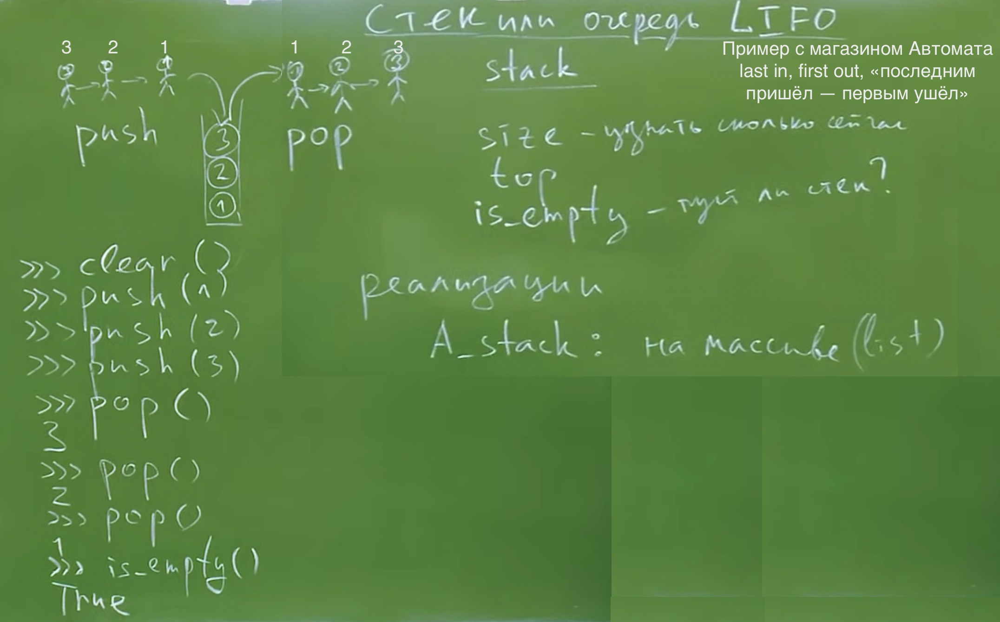 </img>

```python
"""
Модуль, описывающий структуру данных - стек
>>> clear()
>>> is_empty()
True
>>> push(1)
>>> push(2)
>>> push(3)
>>> is_empty()
False
>>> pop()
3
>>> pop()
2
>>> pop()
1
>>> is_empty()
True
"""

_stack = []

def push(x):
    """
    Добавляет элемент х в конец стека
    >>> size = len(_stack)
    >>> push(5)
    >>> len(_stack) - size
    1
    >>> _stack[-1]
    5
    """
    _stack.append(x)
    
def pop():
    x = _stack.pop()
    return x
    
def clear():
    _stack.clear()
    
def is_empty():
    return len(_stack) == 0
    
# запускает описанную выше реализацию в ковычках
# встроенное тестирование в языке
# благодаря verbose=True мы включаем отображение всех тестов
# иначе молчаливое, т.е отображает только когда есть ошибки
if __name__ == "__main__":
    import doctest
    doctest.testmod(verbose=True)
```

```bash
Result:
Trying:
    clear()
Expecting nothing
ok
Trying:
    is_empty()
Expecting:
    True
ok
Trying:
    push(1)
Expecting nothing
ok
Trying:
    push(2)
Expecting nothing
ok
Trying:
    push(3)
Expecting nothing
ok
Trying:
    is_empty()
Expecting:
    False
ok
Trying:
    pop()
Expecting:
    3
ok
Trying:
    pop()
Expecting:
    2
ok
Trying:
    pop()
Expecting:
    1
ok
Trying:
    is_empty()
Expecting:
    True
ok
Trying:
    size = len(_stack)
Expecting nothing
ok
Trying:
    push(5)
Expecting nothing
ok
Trying:
    len(_stack) - size
Expecting:
    1
ok
Trying:
    _stack[-1]
Expecting:
    5
ok
3 items had no tests:
    __main__.clear
    __main__.is_empty
    __main__.pop
2 items passed all tests:
  10 tests in __main__
   4 tests in __main__.push
14 tests in 5 items.
14 passed and 0 failed.
Test passed.
```

***Проверка корректности скобочной последовательности.***

 </img>

```python
A_stack = []

def is_braces_sequence_correct(s:str):
    """
    Проверяет корректность скобочной последовательности
    из круглых и квадратных скобок () []
    
    >>> is_braces_sequence_correct("(([()]))")
    True
    >>> is_braces_sequence_correct("([)]")
    False
    >>> is_braces_sequence_correct("(")
    False
    >>> is_braces_sequence_correct("]")
    False
    """
    for brace in s:
        if brace not in "()[]":
            continue
        if brace in "([":
            A_stack.push(brace)
        else:
            assert brace in ")]", "Ожидалась закрывающая скобка: " + str(brace)
            if A_stack.is_empty():
                return False
            left = A_stack.pop()
            assert left in "([", "Ожидалась открывающая скобка: " + str(brace)
            if left == "(":
                right = ")"
            elif left == "[":
                right = "]"
            if right != brace:
                return False
    
    return A_stack.is_empty()

if __name__ == "__main__":
    import doctest
    doctest.testmod(verbose=True)
```

***Обратная  и прямая Польская нотация(ОПН)***

***Арифметические выражения. Инфиксная, постфиксная и префиксная нотации***

Рассмотрим арифметическое выражение

`(2−3)∗(12−10)+4/2`

Его значение легко вычисляется и это 0. Это привычная для нас форма записи арифметических выражений, в которой если операция бинарная (т.е. требует 2 аргументов, например, сложение, деление), то один аргумент пишется перед знаком операции, а другой - после неё. Такая форма записи называется ***инфиксной***.

***Нотация*** (способ записи), в которой операнды пишутся перед знаком операции - называется ***постфиксной*** или ***обратной польской***.

Нотация в которой операнды пишутся после знака операции - ***прямой польской*** или ***префиксной***.

Например, уже рассмотренное выражение в ***обратной польской*** записи будет выглядеть как

`23−1210−∗42/+`

После пары 2 и 3 стоит знак вычитания. После пары 12 и 10 - тоже. Далее стоит знак перемножения, потому что результаты этих двух операций надо умножить. Далее стоят 4 и 2 и после них знак деления. А после - знак сложения, показывающий, что результат предыдущего нужно сложить с результатом деления 4 на 2.

а в ***прямой польской*** как

`+∗−23−1210/42`

Аналогичным образом, только теперь знак операции стоит перед операндами (или их описаниями в виде выражений в той же форме записи).

 </img>

Его конечные вершины, листья (из которых стрелки никуда не идут) - это операнды, а промежуточные (из которых идут стрелки)- операции. Прямая польская запись (префиксная) получается, если читать это дерево сверху вниз. Обратная (постфиксная) - если читать снизу вверх.

 </img>

```python
import math
import operator

ops = {'+': operator.add,
       '-': operator.sub,
       '*': operator.mul,
       '/': operator.truediv,
       '^': operator.pow,
       'sin': math.sin,
       'tan': math.tan,
       'cos': math.cos,
       'pi': math.pi}

def is_number(s):
    try:
        float(s)
        return True
    except ValueError:
        pass

def calculate(equation):
    stack = []
    result = 0
    for token in equation:
        if is_number(token):
            stack.insert(0, token)
        else:
            if len(stack) < 2:
                print('Error: insufficient values in expression')
                break
            else:
                print('stack: %s' % stack)
                if len(token) == 1:
                    n1 = float(stack.pop(1))
                    n2 = float(stack.pop(0))
                    result = ops[token](n1, n2)
                    stack.insert(0, str(result))
                else:
                    n1 = float(stack.pop(0))
                    result = ops[token](math.radians(n1))
                    stack.insert(0, str(result))
    return result

def main():
    running = True
    while running:
        equation = input('enter the equation: ').split(' ')
        answer = calculate(equation)
        print('RESULT: %f' % answer)
        again = input('\nEnter another? ')[0].upper()
        if again != 'Y':
            running = False

if __name__ == '__main__':
    main()
```

```bash
Result:
enter the equation: 2 3 +
stack: ['3', '2']
RESULT: 5.000000

Enter another? Y
enter the equation: 2 5 7 * +
stack: ['7', '5', '2']
stack: ['35.0', '2']
RESULT: 37.000000

Enter another? 
```

***Стековый калькулятор*** - это устройство (реальное или виртуальное), которрое вычисляет значения арифметических выражений , записанный в постфиксной форме. Стековым он называется по понятным причинам: если нам встречается число - мы должны поместить его в стек; если знак операции - мы должны достать из стека столько чиссел, сколько необходимо для выполнения данной операции. Именно так и работает т.н. математический сопроцессор (например, в INtel8086+AMD64) - часть ЦП, отвечающая за операции над числами с плавающей запятой.

***Сортировочная станция Дейкстры***

Как нетрудно видеть: выражения в обратной польской записи удобны для чтения компьютером , но неудобны для чтения и составления людьми. Поэтому хотелось бы доверить труд составления постфиксной формы выражений по их привычной инфиксной форме компьютеру. Это можно сделать с помощью так называемого алгоритма сортировочной станции, "Shunting Yard algorithm", придуман Э. Дейкстрой в 1961 году, для трансляторов языка [Algol60](https://ir.cwi.nl/pub/9251).

***Алгоритм сортировочной станции*** — способ разбора математических выражений, представленных в инфиксной нотации. Может быть использован для получения вывода в виде обратной польской нотации или в виде абстрактного синтаксического дерева. Алгоритм предложен Эдсгером Дейкстрой и назван им «алгоритм сортировочной станции», поскольку напоминает действие железнодорожной сортировочной станции.

Так же, как и вычисление значений выражений в обратной польской записи, алгоритм работает при помощи стека. Инфиксная запись математических выражений чаще всего используется людьми, её примеры: `2+4` и `3+6*(3-2)`. Для преобразования в обратную польскую нотацию используется 2 строки: входная и выходная, и стек для хранения операторов, еще не добавленных в выходную очередь. При преобразовании алгоритм считывает 1 символ и производит действия, зависящие от данного символа.

В следующем примере, разбирается преобразование выражения

`a+b∗c−d`

Есть сортировочная станция с 3 путями: 2 подъездных и 1 тупик. С правого подъездного пути едут выражения: в каждом "вагоне" или операнд или знак операции. Операнды свободно проезжают в левый путь (образуя очередь), а операторы заезжают в тупик.

 </img> 

Если приоритет входящего оператора ниже приоритета того, что навершине стека (на входе в тупик), то из стека достаётся оператор с большим приоритетом (на шаге `g` это умножение). То же самое происходит, если приооритет приходящего оператора равен приоритету такового на вершине стека, но тот, что на вершине - ассоциативен. В данном случае после отъезда умножения остаётся сложение, приоритет которого равен приоритету вычитания, но сложение в отличие от вычитания ассоциативно:

`(a+b)+с=a+(b+c)(a−b)−c!=a−(b−c)=a−b+c`

***[Эдсгер Вибе Дейкстра](https://ru.wikipedia.org/wiki/%D0%94%D0%B5%D0%B9%D0%BA%D1%81%D1%82%D1%80%D0%B0,_%D0%AD%D0%B4%D1%81%D0%B3%D0%B5%D1%80_%D0%92%D0%B8%D0%B1%D0%B5)***

***[Алгоритм сортировочной станции](https://ru.wikipedia.org/wiki/%D0%90%D0%BB%D0%B3%D0%BE%D1%80%D0%B8%D1%82%D0%BC_%D1%81%D0%BE%D1%80%D1%82%D0%B8%D1%80%D0%BE%D0%B2%D0%BE%D1%87%D0%BD%D0%BE%D0%B9_%D1%81%D1%82%D0%B0%D0%BD%D1%86%D0%B8%D0%B8) or [eng version](https://en.wikipedia.org/wiki/Shunting_yard_algorithm)***

***[Реализации](https://ru.wikibooks.org/wiki/%D0%A0%D0%B5%D0%B0%D0%BB%D0%B8%D0%B7%D0%B0%D1%86%D0%B8%D0%B8_%D0%B0%D0%BB%D0%B3%D0%BE%D1%80%D0%B8%D1%82%D0%BC%D0%BE%D0%B2/%D0%90%D0%BB%D0%B3%D0%BE%D1%80%D0%B8%D1%82%D0%BC_%D1%81%D0%BE%D1%80%D1%82%D0%B8%D1%80%D0%BE%D0%B2%D0%BE%D1%87%D0%BD%D0%BE%D0%B9_%D1%81%D1%82%D0%B0%D0%BD%D1%86%D0%B8%D0%B8)***

***Текстовый вариант алгоритма***

```bash
-Пока не все токены обработаны:
	*Прочитать токен.
	*Если токен — число, то добавить его в очередь вывода.
	*Если токен — функция, то поместить его в стек.
	*Если токен — разделитель аргументов функции (например запятая):
		*Пока токен на вершине стека не открывающая скобка: 
			*Переложить оператор из стека в выходную очередь.
			*Если стек закончился до того, как был встречен токен открывающая скобка,
			то в выражении пропущен разделитель аргументов функции (запятая), 
			либо пропущена открывающая скобка.
	*Если токен — оператор op1, то:
		*Пока присутствует на вершине стека токен оператор op2, чей приоритет выше 
		или равен приоритету op1, и при равенстве
		приоритетов op1 является левоассоциативным:
			*Переложить op2 из стека в выходную очередь;
		*Положить op1 в стек.
	*Если токен — открывающая скобка, то положить его в стек.
	*Если токен — закрывающая скобка:
		*Пока токен на вершине стека не открывающая скобка
			*Переложить оператор из стека в выходную очередь.
			*Если стек закончился до того, как был встречен токен
			открывающая скобка, то в выражении пропущена скобка.
		*Выкинуть открывающую скобку из стека, но не добавлять в очередь вывода.
		*Если токен на вершине стека — функция, переложить её в выходную очередь.
-Если больше не осталось токенов на входе:
	*Пока есть токены операторы в стеке:
		*Если токен оператор на вершине стека — открывающая скобка,
		то в выражении пропущена скобка.
		*Переложить оператор из стека в выходную очередь.
-Конец.
```
Каждый токен-число, функция или оператор выводится только один раз, а также каждый токен-функция, оператор или круглая скобка будет добавлен и удален из стека по одному разу. Постоянное количество операций на токен, линейная сложность алгоритма `O(n)`.


---
[К оглавлению](#contents)
### <a id="lection14" />Лекция №14. Тип list. Изменяемость списка. Тип кортежа tuple как замороженный список. Насколько не изменяем кортеж?. Список кортежей и цикл for с двумя переменными. Тип строк str. Неизменяемость строки. Методы строки find, count, replace. Срезы строк и списков. Присваивание в срез списка. Стандартные функции len, max, min, sum. Методы split и join. Структура данных Куча/Пирамида (Heap)

***Тип list***

***Список*** - это список ссылок на произвольные (неоднотипные) объекты. Изменяемый.

Как таковых переменных нет в Питоне, есть ***объекты*** и ***имена***. Объекты живут до тех пор, пока где-нибудь на них хранится еще ссылка. Например в каком-нибудь имени. Как только ссылка на объект пропадает, сборщик мусора съедает объект. Ссылка на объект может хранить в списке еще.

***Тип кортежа tuple как замороженный список. Насколько не изменяем кортеж?. Список кортежей и цикл for с двумя переменными.***

***Кортеж*** - это замороженный список, тоже может хранить разнотипные объекты. Не изменяемый тип. 

Объект не может изменить свой тип, в процессе своей жизни. В Питоне все является объектом. Все типы в Питоне это классы, даже функция это объект класса. 

Лучше кортежи погружать в списки. 
Можно кортежем переменных бежать по списку при переборе в цикле for. Даже без скобок у кортежа подразумевается сам кортеж, так как объекты через запятую. 

 </img> 

***Тип строк str***

Можно закомментировать код с помощью # и двойных кавычек 3 шт """...""". Но так делать не есть хорошо.

Можно разделять большие числа знаком `_`, к примеру номер банковской карты. 

Символ ***экранирования*** `\` 

Строка является неизменяемым типом. Созданная единожды такой и является. Строку изменить нельзя. Нельзя присваивать в строчку новые значения. Питон кодирует строку в UTF-8  и символы в строке могут занимать разное количество байт (китайские или корейские слова и тп).  

 </img>

***Срезы строк и списков.*** 

Символ - это строка состоящая из одного символа, и у него строковый тип. 

Срез так же как и функция `range` имеет `s = [start (начало): stop(не достигаемый индекс, невключаемый): step(шаг)]`

Срез строки это строка.

***Присваивание в срез списка.***

срезы для строк, прекрасно работают и для списков
`s = [:]` можно создать новый список на основе существующего списка

При взятии среза сам список не меняется. 

Срез списка это новый список.

Питон умеет посимвольно сравнивать списки и строки на оператор `==` , `>`, `<`(лексикогрофически, и по длине)

 </img>

У среза с 2 параметрами ошибок не будет, даже если он не попадает в диапозон и там нет чисел, получим просто пустой срез. 

 </img>
 </img>

***Куча/Пирамида (Heap)***

 </img>

---
[К оглавлению](#contents)
### <a id="lection16" />Лекция №16. Асимптотика алгоритмов (потребление ресурсов) . Индуктивные функции. Однопроходные алгоритмы. NP - полные задачи. Тест простоты Ферма. Числа Кармайкла. Алгоритм шифрования RSA

***Классификация алгоритмов, входные данные, значение на выходе***

 </img>

***Индуктивные функции. Однопроходные алгоритмы***

Индуктивное умозаключение — это процесс логического вывода на основе перехода от частного положения к общему.

Полная индукция — метод доказательства, при котором утверждение доказывается для конечного числа частных случаев, исчерпывающих все возможности.

Неполная индукция — наблюдения за отдельными частными случаями наводит на гипотезу, которая нуждается в доказательстве.

Математическая индукция — метод доказательства для последовательности натуральных чисел либо объектов, однозначно занумерованных натуральными числами.

F - большая и будет индуктивной функцией, она обеспечивает индукцию, т.е мы вычисляем маленькую последовательность и на ее основе (индуктивной функции) уже вычисляем другую последовательность. Среднеарифметическое нельзя вычислить по старому + новое зачение, таким образом, но есть другие варианты применения.

 </img>

Асимптотика алгоритма -> потребление алгоритмом ресурсов

1 Вопрос: вычислима ли функция?

2 Вопрос. Сколько потребляет ресурсов алгоритм?

Количество операций N пропорционально T  времени работы.
Время работы  = время выполнения 1 операции * на кол-во операций

Наихудший вариант и Среднестатистический вариант по графику ниже, могут вести себя очень по-разному, именно они и интересуют нас.

N по графику это масштаб задачи, Nоп - кол-во операции (для сортировок это количество входных чисел).

Масштаб задачи с годами растет, компьютеры становятся быстрее, и нужно это иметь ввиду при разработке програмного обеспеченья. Именно поэтому важно оценивать асимптотику работы алгоритма, с расчетом на будущее

Количество операций реально зависит от входных данных

O(n) — линейная сложность
Такой сложностью обладает, например, алгоритм поиска наибольшего элемента в не отсортированном массиве. Нам придётся пройтись по всем n элементам массива, чтобы понять, какой из них максимальный.

O(log n) — логарифмическая сложность
Простейший пример — бинарный поиск. Если массив отсортирован, мы можем проверить, есть ли в нём какое-то конкретное значение, методом деления пополам. Проверим средний элемент, если он больше искомого, то отбросим вторую половину массива — там его точно нет. Если же меньше, то наоборот — отбросим начальную половину. И так будем продолжать делить пополам, в итоге проверим log n элементов.

O(n^2) — квадратичная сложность
Такую сложность имеет, например, алгоритм сортировки вставками. В канонической реализации он представляет из себя два вложенных цикла: один, чтобы проходить по всему массиву, а второй, чтобы находить место очередному элементу в уже отсортированной части. Таким образом, количество операций будет зависеть от размера массива как n * n, т. е. n^2.

 </img>

 </img>

[О асимптотике нагляднo](https://www.bigocheatsheet.com/)

***Асимптотический анализ***

Когда мы говорим об измерении сложности алгоритмов, мы подразумеваем анализ времени, которое потребуется для обработки очень большого набора данных. Такой анализ называют асимптотическим. Сколько времени потребуется на обработку массива из десяти элементов? Тысячи? Десяти миллионов? Если алгоритм обрабатывает тысячу элементов за пять миллисекунд, что случится, если мы передадим в него миллион? Будет ли он выполняться пять минут или пять лет? 

Порядок роста описывает то, как сложность алгоритма растет с увеличением размера входных данных. Чаще всего он представлен в виде O-нотации (от нем. «Ordnung» — порядок) : `O(f(x))`, где `f(x)` — формула, выражающая сложность алгоритма. В формуле может присутствовать переменная `n`, представляющая размер входных данных. Ниже приводится список наиболее часто встречающихся порядков роста, но он ни в коем случае не полный.

***Константный*** — `O(1)`

Порядок роста `O(1)` означает, что вычислительная сложность алгоритма не зависит от размера входных данных. Следует помнить, однако, что единица в формуле не значит, что алгоритм выполняется за одну операцию или требует очень мало времени. Он может потребовать и микросекунду, и год. Важно то, что это время не зависит от входных данных.

```java
public int GetCount(int[] items)
{
    return items.Length;
}
```

***Линейный*** — `O(n)`

Порядок роста `O(n)` означает, что сложность алгоритма линейно растет с увеличением входного массива. Если линейный алгоритм обрабатывает один элемент пять миллисекунд, то мы можем ожидать, что тысячу элементов он обработает за пять секунд.

Такие алгоритмы легко узнать по наличию цикла по каждому элементу входного массива.

```java
public long GetSum(int[] items)
{
    long sum = 0;
    foreach (int i in items)
    {
        sum += i;
    }

    return sum;
}
```

***Логарифмический*** — `O( log n)`
Порядок роста `O( log n)` означает, что время выполнения алгоритма растет логарифмически с увеличением размера входного массива. (анализе алгоритмов по умолчанию используется логарифм по основанию 2). Большинство алгоритмов, работающих по принципу «деления пополам», имеют логарифмическую сложность. Метод Contains бинарного дерева поиска (binary search tree) также имеет порядок роста `O(log n)`.

***Линеарифметический*** — `O(n·log n)`
Линеарифметический (или линейно-логарифмический) алгоритм имеет порядок роста `O(n·log n)`. Некоторые алгоритмы типа «разделяй и властвуй» попадают в эту категорию, + сортировка слиянием и быстрая сортировка.

***Квадратичный*** — `O(n^2)`
Время работы алгоритма с порядком роста `O(n^2)` зависит от квадрата размера входного массива. Несмотря на то, что такой ситуации иногда не избежать, квадратичная сложность — повод пересмотреть используемые алгоритмы или структуры данных. Проблема в том, что они плохо масштабируются. Например, если массив из тысячи элементов потребует 1 000 000 операций, массив из миллиона элементов потребует 1 000 000 000 000 операций. Если одна операция требует миллисекунду для выполнения, квадратичный алгоритм будет обрабатывать миллион элементов 32 года. Даже если он будет в сто раз быстрее, работа займет 84 дня.

Пример алгоритма с квадратичной сложностью, когда будем изучать пузырьковую сортировку.

***Наилучший, средний и наихудший случаи***
Что мы имеем в виду, когда говорим, что порядок роста сложности алгоритма — `O(n)`

Обычно имеется в виду наихудший случай, за исключением тех случаев, когда наихудший и средний сильно отличаются. К примеру, мы увидим примеры алгоритмов, которые в среднем имеют порядок роста `O(1)`, но периодически могут становиться `O(n)` (например, ArrayList.add). В этом случае мы будем указывать, что алгоритм работает в среднем за константное время, и объяснять случаи, когда сложность возрастает.

Самое важное здесь то, что `O(n)` означает, что алгоритм потребует не более `n` шагов.

***Что мы измеряем?***
При измерении сложности алгоритмов и структур данных мы обычно говорим о двух вещах: количество операций, требуемых для завершения работы (вычислительная сложность), и объем ресурсов, в частности, памяти, который необходим алгоритму (пространственная сложность).

Алгоритм, который выполняется в десять раз быстрее, но использует в десять раз больше места, может вполне подходить для серверной машины с большим объемом памяти. Но на встроенных системах, где количество памяти ограничено, такой алгоритм использовать нельзя.

Операции, количество которых мы будем измерять, включают в себя:

- сравнения («больше», «меньше», «равно»);
- присваивания;
- выделение памяти.

То, какие операции мы учитываем, обычно ясно из контекста.

К примеру, при описании алгоритма поиска элемента в структуре данных мы почти наверняка имеем в виду операции сравнения. Поиск — это преимущественно процесс чтения, так что нет смысла делать присваивания или выделение памяти.

Когда мы говорим о сортировке, мы можем учитывать как сравнения, так и выделения и присваивания. В таких случаях мы будем явно указывать, какие операции мы рассматриваем.

 </img>

 </img>

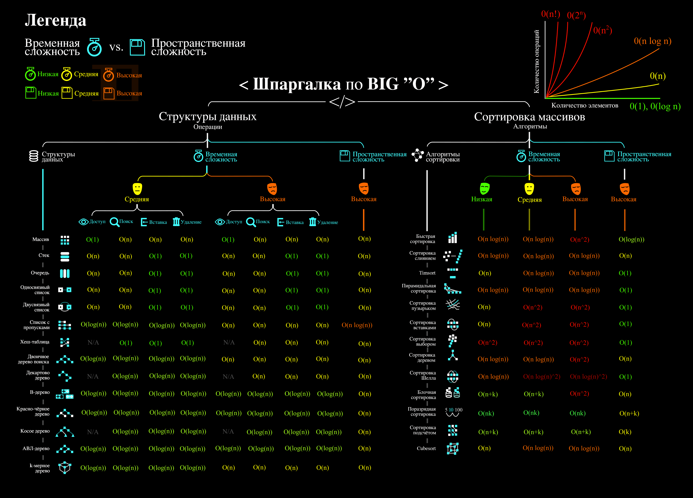 </img>

***NP*** - полные задачи, не имеющие решения.

***Тест простоты Ферма***

Для любого простого числа `P` и для любого натурального числа `a`, при этом `P` не является делителем `a`, `a` не кратно  `P` т.е не содержит `P` среди своих делителей. `a` в степени `P-1` равно 1 по модулю mod `P`.

число (`a` в степени `P-1`) % `P` (взятие остатка) = 1

Чтобы опеределить простое ли число (огромные числа в тысячи знаков), проверяем тестом Ферма, если подтверждается, то доказываем разбором на множители этого числа (так как вероятность высока, что число простое, но не 100%)

 </img>

***Числа Кармайкла*** - последовательность чисел, которые не являются простыми, они составные, НО удовлетворяют теореме простоты числа Ферма. 

***Алгоритм шифрования RSA*** - основан на этой теореме, как и вся цифровая безопасность сейчас. Разложение на множители огромных чисел в тысячи знаков. 

***Список (list)***. Вспомним операции работы со списками.

 </img>

 </img>

У разработчиков типа данных `list` Python было много вариантов каким сделать его во время реализации. Каждый выбор повлиял на то, как быстро список мог выполнять операции. Одно из решений было сделать список оптимальным для частых операций.

***Индексирование и присваивание***

Две частые операции - индексирование и присваивание на позицию индекса. В списках Python значения присваиваются и извлекаются из определенных известных мест памяти. Независимо от того, насколько велик список, индексный поиск и присвоение занимают постоянное количество времени и, таким образом их трудоемкость `O(1)`.

***Pop, Shift, Delete***

Извлечение элемента `(pop)` из списка Python по умолчанию выполняется с конца, но, передавая индекс, вы можете получить элемент из определенной позиции. Когда pop вызывается с конца, операция имеет сложность `O(1)` , а вызов pop из любого места - `O(n)`. Откуда такая разница?

Когда элемент берется из середины списка Python, все остальные элементы в списке сдвигаются на одну позицию ближе к началу. Это суровая плата за возможность брать индекс за `O(1)`, что является более частой операцией.

По тем же причинам вставка в индекс - `O(N)`; каждый последующий элемент должен быть сдвинут на одну позицию ближе к концу, чтобы разместить новый элемент. Неудивительно, что удаление ведет себя таким же образом.

***Итерирование***

Итерирование выполняется за `O(N)`, потому что для итерации по N элементам требуется N шагов. Это также объясняет, почему оператор in, max, min в Python является `O(N)` : чтобы определить, находится ли элемент в списке, мы должны перебирать каждый элемент.

***Срезы***

Чтобы получить доступ к фрагменту `[a: b]` списка, мы должны перебрать каждый элемент между индексами `a` и `b`. Таким образом, доступ к срезу - `O(k)`, где `k` - размер среза. Удаление среза `O(N)` по той же причине, что удаление одного элемента - `O(N)`: N последующих элементов должны быть смещены в сторону начала списка.

***Умножение на int***

Чтобы понять умножение списка на целое `k`, вспомним, что конкатенация выполняется за `O(M)`, где `M` - длина добавленного списка. Из этого следует, что умножение списка равно `O(N k)`, так как умножение k-размера списка `N` раз потребует времени `k (N-1)`.

***Разворот списка*** - это `O(N)`, так как мы должны переместить каждый элемент.

***Множество (set)***

Множество в языке Python — это структура данных, эквивалентная множествам в математике. Элементы могут быть различных типов. Порядок элементов не определён.

Действия, которые можно выполнять с множеством:

- добавлять и удалять элементы,
- проверять принадлежность элемента множеству,
- перебирать его элементы,
- выполнять операции над множествами (объединение, пересечение, разность).

Операция “проверить принадлежность элемента” выполняется в множестве намного быстрее, чем в списке.

Элементами множества может быть любой ***неизменяемый тип данных: числа, строки, кортежи***.

Изменяемые типы данных не могут быть элементами множества, в частности, нельзя сделать элементом множества список (вместо этого используйте неизменяемый кортеж) или другое множество. Требование неизменяемости элементов множества накладывается особенностями представления множества в памяти компьютера

***Задание множеств***

Множество задается перечислением в фигурных скобках. Например:

```python
A = {1, 2, 3}
```

Исключением явлеется пустое множество:

```python
A = set()       # A -- множество
D = {}          # D -- не пустое множество, а пустой словарь!
```

Если функции `set` передать в качестве параметра список, строку или кортеж, то она вернет множество, составленное из элементов списка, строки, кортежа. Например:

```python
>>> A = set('qwerty')
>>> print(A)
{'e', 'q', 'r', 't', 'w', 'y'}
```

Каждый элемент может входить в множество только один раз.

```python
>>> A = {1, 2, 3}
>>> B = {3, 2, 3, 1}
>>> print(A == B) # A и B — равные множества.
True
>>> set('Hello')
{'H', 'e', 'l', 'o'}
```

***Работа с элементами множеств***

 </img>

Как мы видим, по времени стандартные оперцаии с одним элементом множества выполняются за `O(1)`.

Поведение `discard` и `remove` различается тогда, когда удаляемый элемент отсутствует в множестве: `discard` не делает ничего, а метод remove генерирует исключение `KeyError`. Метод `pop` также генерирует исключение `KeyError`, если множество пусто.

При помощи цикла `for` можно перебрать все элементы множества:

```python
Primes = {2, 3, 5, 7, 11}
for num im Primes:
    print(num)
```

Из множества можно сделать список при помощи функции `list`:

```python
>>> A = {1, 2, 3, 4, 5}
>>> B = list(A)
[1, 2, 3, 4, 5]
```

***Операции с множествами, обычные для математики***

 </img>

***Словарь (ассоциативный массив, dict)***

В массиве или в списке индекс - это целое число. Традиционной является следующая ситуация:

```python
>>> Days = ['Sunday', 'Monday', 'Tuesday', 'Wednessday', 'Thursday', 'Friday', 'Saturday']
>>> Days[0]
'Sunday'
>>> Days[1]
'Monday'
```

А как реализовать обратное соответствие?

```python
>>> Days['Sunday']
0
>>> Days['Monday']
1
```

При помощи списка или массива это сделать невозможно, нужно использовать ассоциативный массив или словарь.

В словаре индекс может быть любого неизменяемого типа! Индексы, как и сами хранимые значения, задаются явно:

```python
Days = {
    'Sunday': 0,
    'Monday': 1,
    'Tuesday': 2,
    'Wednessday': 3,
    'Thursday': 4,
    'Friday': 5,
    'Saturday': 6
}
>>> Days['Sunday']
0
>>> Days['Monday']
1
>>> Days['Yesterday']
Traceback (most recent call last):
File "<stdin>", line 1, in <module>
KeyError: 'Yesterday'
```

При попытке обратиться к несуществующему элементу ассоциативного массива мы получаем исключение `KeyError`.

Особенностью ассоциативного массива является его динамичность: в него можно добавлять новые элементы с произвольными ключами и удалять уже существующие элементы.

```python
>>> Days['Yesterday'] = -1
>>> print(Days['Yesterday'])
-1
```

При этом размер используемой памяти пропорционален размеру ассоциативного массива. Доступ к элементам ассоциативного массива выполняется хоть и медленнее, чем к обычным массивам, но в целом довольно быстро.

Значения ключей уникальны, двух одинаковых ключей в словаре быть не может. А вот значения могут быть одинаковыми.

```python
>>> Days['Tomorrow'] = -1
>>> Days['Yesterday'] == Days['Tomorrow']
True
```

Ключом может быть произвольный неизменяемый тип данных: целые и действительные числа, строки, кортежи. Ключом в словаре не может быть множество, но может быть элемент типа `frozenset`: специальный тип данных, являющийся аналогом типа set, который нельзя изменять после создания. Значением элемента словаря может быть любой тип данных, в том числе и изменяемый.

***Создание словаря***
Пустой словарь можно создать при помощи функции `dict()` или пустой пары фигурных скобок `{}` (вот почему фигурные скобки нельзя использовать для создания пустого множества).

Для создания словаря с некоторым набором начальных значений можно использовать следующие конструкции:

```python
Capitals = {'Russia': 'Moscow', 'Ukraine': 'Kiev', 'USA': 'Washington'}
Capitals = dict(Russia = 'Moscow', Ukraine = 'Kiev', USA = 'Washington')
Capitals = dict([("Russia", "Moscow"), ("Ukraine", "Kiev"), ("USA", "Washington")])
Capitals = dict(zip(["Russia", "Ukraine", "USA"], ["Moscow", "Kiev", "Washington"]))
```

Также можно использовать генерацию словаря через `Dict comprehensions`:

```python
Cities = ["Moscow", "Kiev", "Washington"]
States = ["Russia", "Ukraine", "USA"]
CapitalsOfState = {state: city for city, state in zip(Cities, States)}
```

Это особенно полезно, когда нужно "вывернуть" словарь наизнанку:

```python
StateByCapital = {CapitalsOfState[state]: state for state in CapitalsOfState}
```

***Операции с элементами словарей***

 </img>

***Перебор элементов словаря по ключу***

```python
for key in A:
    print(key, A[key])
```

***Представления элементов словаря***

Представления во многом похожи на списки, но они остаются связанными со своим исходным словарём и изменяются, если менять значения элементов словаря.

Метод `keys` возвращает представление ключей всех элементов.
Метод `values` возвращает представление всех значений.
Метод `items` возвращает представление всех пар (кортежей) из ключей и значений.

```python
>>> A = dict(a='a', b='b', c='c')
>>> k = A.keys()
>>> v = A.values()
>>> k, v
(dict_keys(['c', 'b', 'a']), dict_values(['c', 'b', 'a']))
>>> A['d'] = 'a'
>>> k, v
(dict_keys(['d', 'c', 'b', 'a']), dict_values(['a', 'c', 'b', 'a']))
```

Учтите что итерироваться по представлениям изменяя словарь нельзя

```python
>>> for key in A.keys():
...     del A[key]
...
Traceback (most recent call last):
  File "<stdin>", line 1, in <module>
RuntimeError: dictionary changed size during iteration
```

Можно, если в начале скопировать представление в список

```python
>>> for key in list(A.keys()):
...     del A[key]
...
>>> A
{}
```

***Пример использования словаря***

```python
# Создадим пустой словать Capitals
Capitals = dict()

# Заполним его несколькими значениями
Capitals['Russia'] = 'Moscow'
Capitals['Ukraine'] = 'Kiev'
Capitals['USA'] = 'Washington'

# Считаем название страны
print('В какой стране вы живете?')
country = input()

# Проверим, есть ли такая страна в словаре Capitals
if country in Capitals:
    # Если есть - выведем ее столицу
    print('Столица вашей страны', Capitals[country])
else:
    # Запросим название столицы и добавим его в словарь
    print('Как называется столица вашей страны?')
    city = input()
    Capitals[country] = city
```

***Трудоемкость стандартных операций***

Второй основной тип данных Python - это словарь. Как вы помните, словарь отличается от списка возможностью доступа к элементам по ключу, а не позиции. На данный момент наиболее важной характеристикой является то, что получение и присваивание элемента в словаре являются операциями за `O(1)`.

Мы не будем пытаться пока дать интуитивное объяснение этому, но будьте уверены, что позже мы обсудим реализации словарей. Пока просто помните, что словари были созданы специально для того, чтобы как можно быстрее получить и установить значения по ключу.

Другая важная операция словаря - проверка наличия ключа в словаре. Операция contains также работает за `O(1)` (в случае со списками это занимало `O(N)`), потому что проверка для данного ключа подразумевает простое получение элемента по ключу, которое делается за `O(1)`.

***Когда нужно использовать словари***

Словари нужно использовать в следующих случаях:

- Подсчет числа каких-то объектов. В этом случае нужно завести словарь, в котором ключами являются объекты, а значениями — их количество.

- Хранение каких-либо данных, связанных с объектом. Ключи — объекты, значения — связанные с ними данные. Например, если нужно по названию месяца определить его порядковый номер, то это можно сделать при помощи словаря `Num['January'] = 1; Num['February'] = 2; ...`

- Установка соответствия между объектами (например, “родитель—потомок”). Ключ — объект, значение — соответствующий ему объект.

- Если нужен обычный массив, но при этом масимальное значение индекса элемента очень велико, но при этом будут использоваться не все возможные индексы (так называемый “разреженный массив”), то можно использовать ассоциативный массив для экономии памяти.

---
[К оглавлению](#contents)
### <a id="lection17" />Лекция №17. Рекурсия и динамическое программирование. Факториал рекурсивно и динамически. Числа Фибоначчи рекурсивно, рекурсивно с кешированием и динамически. Задача о рюкзаке рекурсивно и динамически

***Рекурсия*** - это способ решения задачи через вызов подзадач, аналогичных исходной задачи, но меньших по масштабу 

***Крайний случай*** - это способ решения самой простой задачи, которая не требует вызова решения подзадачи. 

***Рекурсия с кешированием*** - это вариант динамического программирования, в котором используется рекурсия

Более подробно факториал как и тема рекурсии была рассмотрена в ***[Лекция №7](#lection7)***

Сложность и скорость вычисления растет пропорционально числу `n`

```python
def factorial (n:int):
    assert n > 0, "Факториал неопределенный"
    if n == 1:
        return 1
    return factorial(n-1) * n
    
print(factorial(5)) # 120
```

Рекурсия требует оформления в функцию, в отличии от динамического программирования

Динамическое программирование состоит в том, что мы расширяем наши знания о значениях функции 

```python
# factorial
n = 5
f = [1] * (n + 1)
# or f = [1] + [None] * n

for i in range(1, n+1):
	f[i] = f[i-1] * i
print(f[n]) # 120
```

 </img>

Рекурентное вычисление числа Фибоначчи занимает время сравнимое с самим числом Фибоначчи. На больших числах будет большое ожидание вычисления, и алгоримт неэффективен. Динамический же вычисляет очень быстро.

```python
def fib(n):
    assert n >= 0
    if n <= 1:
  	    return n
    return fib(n-1) + fib(n-2)
print(fib(10)) # 55
```

```python
def fib(n):
    assert n >= 0
    fib = [0, 1] + [0] * (n-1)
    # или можно записать иначе
    # fib = [None] * (n+1)
    # fib[:2] = [0,1]
    
    for k in range(2, n+1):
        fib[k] = fib[k-1] + fib[k-2]
    return fib[n]
print(fib(5)) # 5 
```
 </img>

***Рекурсия с кешированием*** - рекурсия с динамическим программированием, т.е с возможностью запоминать те значения функции которые уже вычислены. Асимптотика будет линейной, и естественно данный алгоритм будет быстрее чистой рекурсии, но все равно будет проигрывать динамическому программированию

 </img>

 </img>

```python
# число максимальных рекурсий в языке
F = [None] * 10000  

def fib(n:int) -> int:
    assert ( n >= 0 and n < 10000)
    if F[n] is not None:
        return F[n]
    elif n <= 1:
        F[n] = n
        return F[n]
    else:
        F[n] = fib(n-1) + fib(n-2)
        return F[n]
print(fib(10)) # 55
```

или чуть короче
```python
# число максимальных рекурсий в языке
F = [None] * 10000  

def fib(n:int) -> int:
    assert ( n >= 0 and n < 10000)
    if F[n] is None:
        if n <= 1:
            F[n] = n
        else:
            F[n] = fib(n-1) + fib(n-2)
    return F[n]
print(fib(10)) # 55
```

***Задача о рюкзаке*** (NP - полная задача)

И на данный момент не имеет другого решения кроме полнопереборного.

Асимптотика:

полный перебор - O(2^n)

жадный алгоритм - брать самое ценное сразу, асимптотика зависит от кол-ва предметов, в худшем случаи будет квадратичной O(n^2)

 </img>

Дискретная задача о рюкзаке. Применим динамическое программирование.

M - максимально возможная масса
N - количество элементов
k - емкость рюкзака 

```python
F = [[0] * (N + 1) for i in range(M + 1)]
for i in range (1, N + 1):
    for k in range(1, M + 1):
        if m[i] <= k: 
            F[k][i] = max(F[k][i], v[i] + F[k-m[i]][i-1])
        else:
            F[k][i] = F[k][i-1]
return F[M][N] # ответ
```
 </img>

 </img>

---
[К оглавлению](#contents)
### <a id="lection18" />Лекция №18. ООП, Классы, Объекты, Именованный кортеж, Связный список

ООП парадигма нужна для построения больших маштабируемых программ. 

***Классы и Объекты***

Класс это тип объекта, а объект это конкретный экземпляр этого типа.

***Атрибут*** - это некое свойство класса

Новый объект - это новый экземпляр класса (создаем новый объект `marusya = Goat()`)

Также создается с этим объектом новое пространство имен, и мы может добавить к нему индивидуальное свойтсво-атрибут характерное только для него.

Внутри класса мы можем описать классовые атрибуты которые едины на весь класс, и классовые методы.

Классовые атрибуты обязательно должны использоваться как константы. `legs_number = 4` это объект класса на все экземпляры, его менять не рекомендуется (тогда будет создан еще один новый объект будет путаница и ошибки восприятия), если будет изменяемый тип, например список [...], и мы в атрибутах одного экземпляра поменяем что-то, то это поменяется по всех экземплярах. И на этот объект ссылается каждый экземпляр. Именно поэтому эти атрибуты должны быть некими константами и неизменяемыми типами. 

В питоне `_ _ имя _ _` - это специализированная зарезервированная функция самого языка

`_ _init_ _` - конструктор

Главная функция конструктура - это инициализация атрибутов конкретного экземпляра класса. Без конструктора невозможно создать экземпляр с атрибутами. Именно к конструкторе мы создаем ***новые*** атрибуты. 

Любая функция погруженная внутрь класса называется ***методом класса***, и будет общей для всех экземпляров класса.

`self` - ссылка на текущий конкретный экземпляр

`_ _str_ _` - метод который приведет объект к строке, будут распечатаны свойства

```python
class Goat: 
    legs_number = 4
    def __init__(self, height, weight):
        self.height = height
        self.weight = weight
    
    def __str__(self):
        s = "weight = {}, height = {}".format(self.height, self.weight)
        return s
```

 </img>

Объекты (созданные экземпляры) являются изменяемыми. 

Связывание -> `x = notka`, `x.height += 5` изменения будут в оригинальном объекте `notka` так как х ссылка на него. 

 </img>

```python
class Goat: 
    legs_number = 4
    def __init__(self, height, weight):
        self.height = height
        self.weight = weight
    
    def __str__(self):
        s = "weight = {}, height = {}".format(self.height, self.weight)
        return s

marusya = Goat(60, 40)
notka = Goat(62, 45)

for x in range marusya,notka:
    print(x)
    
notka.weight += 1
x = notka
notka.height += 10
```

```python
# можно сделать пустой класс, и его экземпляры можно создавать
class Empty:
	pass
```

***Именованный кортеж (taple)***

В скобках лежат неизменяемые значения.

К примеру у нас есть точка в 3 плоскостях, как нам было бы удобно с ней работать, и как удобно достовать значение координат.

Создадим тип. Не класс, это слишком запаристо. 

Есть такая штука как ***[Модуль collections](https://pythonworld.ru/moduli/modul-collections.html)*** - предоставляет специализированные типы данных, на основе словарей, кортежей, множеств, списков

```python
A = (1, 0, 3)
r = math.sqrt(A[0] ** 2 + A[1] ** 2 + A[2] ** 2) 
# но это очень неудобно и непонятно

# используем modul collections
from collections import namedtuple
Point = namedtuple("Point", "x y z")
A = Point(1, 0, 3)
print(A.x)

A.y *= 2 # так нельзя, кортеж неизменяемый
# чтобы был изменяемый делаем свой класс, объект 
# и любую др функциональность 
```

***Связный список***

Есть такой тип `NoneType` имеющий одно значение ничего (none).

```python
a = [1]
a.append([2])
a[1].append([3, None])
p = a
while p is not None:
    print(p[0])
    p = p[1]
```

 </img>

В этом односвязном связанном списке доступ к `a[i]` выполняется за `O(n)`, что очень медненно, к примеру имеем список в 1 млн ))

 </img>

Создадим класс односвязанного списка 

 </img>

```python
class LinkedList:
    def __init__(self):
        self._begin = None
    def insert(self, x):
        self._begin = [x, self._begin]
    def pop(self):
        assert self._begin is not None, "List empty"
        x = self._begin[0]
        self._begin = self._begin[1]
        return x
a = LinkedList()
a.insert(5)
a.insert(10)
print(a.pop()) # 10
print(a.pop()) # 5
```

---
[К оглавлению](#contents)

### <a id="lection19" />Лекция №19. Дерево, Куча (Heap), алгоритм сортировка HeapSort

***Куча*** - это двоичное дерево у которого есть три свойства: 

1) в каждой вершине дерева значение не больше чем в его потомках (нижние потомки/ветви, если же это свойство при добавлении не соблюдается, то меняем числа местами, код ниже)

2) глубина всех листьем не отличается больше чем на единицу (***листья*** - это вершины неимеющие потомков, ***глубина*** - кратчайший путь от вершины до корня), 

3) последний слой всегда заполняется слева направо. На вершине дерева всегда будет самый минимум. 

 </img>

 </img>

```
# Асимптотика выполнения операций с кучей
sift_up - O(log n)
sift_down - O(log n) (если 1 свойсто кучи нарушается, меняет местами числа)
min - O(1)
extract_min - O(log n)
insert - O(log n)
```

***Cортировка кучей (heapsort). Пирамидальная сортировка***

Мы можем записать массив значений в кучу, и если брать каждый раз минимум в новый массив, пока не закончится дерево значений кучи, то по свойству кучи, он будет как бы отсортирован по возрастанию, так как каждый взятый минимум с вершины будет меньше всех остальных чисел. 

Мы берем массив и превращаем его в кучу, и потом кучу преобразуем в отсортированный массив, путем взятия каждый раз минимума

Напишем 2 функции, первая будет преобразовывать массив в кучу:

```python
def heapify(arr):
    heap = Heap()
    for item in arr:
        heap.insert(item)
    return heap 
    
# чем больше куча, то быстрее работает вначале, затем медленнее он будет работать при погружении,
# асимптотика будет O(1), затем O(log n), затем O(n log n),  итоговая -> O(n log n)
```

а вторая получает отсортированный массив из кучи:

```python
def get_sorted_arr(heap):
    arr = []
    while heap.size:
        arr.append(heap.extract.min())
    return arr
# чем больше куча тем медленнее он будет работать в начале, затем по мере уменьшения кучи быстрее,
# асимптотика, вначале O(n log n), затем O( log n), затем O(1), итоговая -> O(n log n)
```

В куче количество элементов, которые имеют хотя бы одного потомка `(N//2)`. `def heapify_fast`. Преобразование массива в кучу, только если одновременно не вытаскиваются элементы

В куче колличество элементов имеющих хотя бы одного потомка равно `(N//2)` c округлением вниз, к примеру 9 элементов, имеют 4 вершины

```python
# асимптотика O(n)
def heapify_fast(arr):
    heap = Heap()
    heap.values = arr[:]
    heap.size = len(arr)
    for i in reversed(range(n//2)):
        heap.sift_down(i)
    return heap
```


***Введение в ООП на Python***

При ***процедурном программировании*** программа разбивается на части в соответствии с алгоритмом: каждая функция является составной частью алгоритма. При ***объектно-ориентированном программировании*** программа строится как совокупность взаимодействующих объектов. 

Что же такое объект? С точки зрения объектно-ориентированного подхода, ***объект*** - это нечто, обладающее состоянием и поведением. По сути, состояние - это данные, соответствующие объекту, например рост, вес и громкость гавканья собаки. Поведением называется набор операций, которые можно производить с объектом. Например, в случае с собакой: покормить, погладить, погулять. ***Методами*** называют операции, которые можно выполнять над объектом  (по крайней мере в контексте языка Python).

Часто приходится работать с объектами одной природы. Например, если у нас несколько собак, то у них у всех одинаковые наборы данных (хотя значения могут различаться) и одинаковые методы. 

Для определения такой "общей природы" вводятся классы. ***Класс***, по сути, есть шаблон объектов - базовое состояние и общее поведение для всех объектов этого класса. Объекты одного класса называют ***экземплярами*** этого класса. Также, класс является типом данных для объектов.

В языке Python для определения класса используется оператор `class`. Рассмотрим следующий пример:

```python
class Dog:
    def say_gaw(self): # имя self для первого аргумента метода это общепринятое, но не обязательное правило
        print('Gaw-gaw')

my_dog = Dog()
another_dog = Dog()
my_dog.say_gaw()      # вызовется функция Dog.say_gaw с параметром self = my_dog
another_dog.say_gaw()
```

Здесь мы описали класс `Dog`, который задает один метод. При описании методов класса ***первый аргумент*** есть ссылка на экземпляр, для которого этот метод вызывается. Далее, мы создали пару собак и позвали для каждой метод `say_gaw`. Для создания объектов используется имя класса со скобками. Методы вызываются через точку после имени объекта. Заметьте, что первый аргумент метода - `self` - при вызове указывать не нужно, т.к. им становится сам объект (тот для которого зовем метод, его имя перед точкой).

Для хранения данных в объектах используются ***атрибуты***. Это те самые "свойства" объекта - рост, вес и т.п. Атрибуты могут иметь любой тип данных. Так же как и с обычными переменными в Python, объявлять атрибуты неким специальным образом не нужно, ***они появляются автоматически, при первом присваивании***, следующим образом:

```python
class Dog:
    def say_gaw(self):
        if self.angry:
            print('GAW-GAW')
        else:
            print('Gaw-gaw')

    def ping(self):
        self.angry = True

    def feed(self, food_count):
        if food_count > 10:
            self.angry = False

my_dog = Dog()
my_dog.feed(20)
my_dog.say_gaw()      # напечатает Gaw-gaw
my_dog.ping()
my_dog.say_gaw()      # напечатает GAW-GAW
```

Часто для атрибутов хочется иметь некоторое начальное значение. В предыдущем примере есть проблема - если собака попытается гавкнуть до того как ее пнули или покормили, она навернется с ошибкой `"AttributeError: 'Dog' object has no attribute 'angry'"`. Для решения этой проблемы используется метод со специальным именем - `__init__`, который ***вызывается автоматически при создании объекта***:

```python
class Dog:
    def __init__(self):
        self.angry = False

    def say_gaw(self):
        if self.angry:
            print('GAW-GAW')
        else:
            print('Gaw-gaw')

my_dog = Dog()
my_dog.say_gaw()      # ошибки нет, напечатает Gaw-gaw
```

Метод `__init__` называется ***конструктором***. Собственно, конструктор зовется при выполнении конструкции вида `ИмяКласса()`, в нашем случае - `Dog()`. Аргументом `self` для конструктора становится вновь созданный объект. Конструктор, также как и обычные методы, может иметь дополнительные аргументы кроме `self`. Эти аргументы передаются при создании объекта, следующим образом:

```python
class Dog:
    def __init__(self, angry, count):
        self.angry = angry
        self.count = count

    def say_gaw(self):
        if self.angry:
            print('GAW-' * self.count)
        else:
            print('gaw-' * self.count)

my_dog = Dog(True, 3)
my_dog.say_gaw()      # ошибки нет, напечатает GAW-GAW-GAW-
```

Класс в Python также является объектом. Объект этот создается с помощью ключевого слова `class`, как в примерах выше. Таким образом, в предыдущем примере вызов `my_dog.say_gaw()` эквивалентен вызову `Dog.say_gaw(my_dog)`. Разобраться, какой объект какому классу принадлежит помогут встроенные функции `type` и `isinstance`:

```python
>>> class A:
...     pass
...
>>> a = A()
>>> type(a)
<class '__main__.A'>
>>> type(A)
<class 'type'>
>>> type(type)
<class 'type'>
>>> type(1)
<class 'int'>
>>> type(int)
<class 'type'>
>>>
>>> isinstance(1, int)
True
>>> isinstance(1, A)
False
>>> isinstance(a, A)
True
>>> isinstance(type, type)
True
>>> isinstance(A, type)
True
```
Примечание: здесь был объявлен, в тестовых целях, пустой класс A - в нем нет никаких методов.

Нужно заметить также, что методы, которые класс определяет, не будут методами для него (как для объекта), а будут просто атрибутами типа `function`. Действительно, при вызове `Dog.say_gaw(my_dog)` никакой дополнительный `self` уже не передается, функция запускается в том виде, в котором мы ее написали. Это также можно показать следующим образом:

```python
>>> class A:
...     def f(self):
...         print('hello')
...
>>>
>>> type(A.f)
<class 'function'>
>>> a = A()
>>> type(a.f)
<class 'method'>
```

То есть, `A.f` - это функция, а `a.f` - метод. Метод здесь это объект, который содержит в себе ссылку на объект, за которым этот метод закреплен (в нашем случае это объект `a`) и ссылку на функцию, которую надо вызывать. Соответственно при вызове метод зовет эту функцию, передавая ссылку на свой объект как первый аргумент и прокидывая остальные аргументы.

```python
>>> m = a.f
>>> m is A.f
False
>>> m.__func__ is A.f
True
>>> m.__self__ is a
True
>>> m.__func__(m.__self__)
hello
>>> m()
hello
>>> a.f()
hello
>>> A.f(a)
hello
```

***Стандартные методы***

Кроме `__init__` есть и другие стандартные методы, которые можно определить в описании класса.

Метод `__str__` возвращает строку, являющуюся описанием объекта в том виде, в котором его удобно будет воспринимать человеку. Здесь не нужно выводить имя конструктора, можно, например, просто вернуть строку с содержимым всех полей:

```python
class Dog
    def __str__(self):
        return self.name + ' ' + str(self.score)
```

Метод `__str__` будет вызываться, когда вызывается функция `str` от данного объекта, например, `str(Vasya)`. То есть создавая метод `__str__` вы даете указание Питону, как преобразовывать данный объект к типу `str`.

Поскольку функция `print` использует именно функцию `str` для вывода объекта на экран, то определение метода `__str__` позволит выводить объекты на экран удобным способом: при помощи `print`.

***Переопределение стандартных операций***

Реализуем класс `Vector`, используемый для представления радиус-векторов на координатной плоскости, и определим в нем поля-координаты: `x` и `y`. Также очень хотелось бы определить для векторов операцию `+`, чтобы их можно было складывать столь же удобно, как и числа или строки. Например, чтобы можно было записать так:

```python
a = Vector(1, 2)
b = Vector(3, 4)
c = a + b
```

Для этого необходимо перегрузить операцию `+`: определить функцию, которая будет использоваться, если операция `+` будет вызвана для объекта класса `Vector`. Для этого нужно определить метод `__add__` класса `Vector`, у которого два параметра: неявная ссылка `self` на экземпляр класса, для которого она будет вызвана (это левый операнд операции `+`) и явная ссылка `other` на правый операнд:

```python
class Vector:
    def __init__(self, x = 0, y = 0):
        self.x = x
        self.y = y
    def __add__(self, other):
        return Vector(self.x + other.x, self.y + other.y)
```

Теперь при вызове оператора `a + b` Питон вызовет метод `a.__add__(b)`, то есть вызовет указанный метод, где `self = a, other = b`.

Аналогично можно определить и оставшиеся операции. Полезной для переопределения является операция `<`. Она должна возвращать логическое значение `True`, если левый операнд меньше правого или `False` в противном случае (также в том случае, если объекты равны). Для переопределения этого операнда нужно определить метод `__lt__ (less than)`:

```python
class Vector:
    def __lt__(self, other):
        return self.x < other.x or self.x == other.x and self.y < other.y
```

В этом примере оператор вернет `True`, если у левого операнда поле `x` меньше, чем у правого операнда, а также если поля `x` у них равны, а поле `y` меньше у левого операнда.

После определения оператора `<`, появляется возможность упорядочивать объекты, используя этот оператор. Теперь можно сортировать списки объектов при помощи метода `sort()` или функции `sorted`, при этом будет использоваться именно определенный оператор сравнения `<`.

---
[К оглавлению](#contents)
### <a id="lection20" />Лекция №20. Хеш-таблица

Массив расширить нельзя, так как имеем заданный размер в памяти, и условно говоря, по "краям массива", за границами установленными массивом, в памяти находятся другие данные. Поиск за `O(1)`. Проверить наличие элемента в таблице `O(n)`.

Список (связанный) можно расширить, так как узлы списка хранятся в произвольном порядке в памяти и сдвиг происходит от предыдущего элемента. 

***Хеш-таблица*** берет сильные стороны обеих, быстроту массива и удобность, расширяемость списка

Достоинства: 

- Занимает относительно мало места
- Быстрота поиска

Недостатки:

- Не сохраняется порядок
- Не эффективны при малом количестве элементов
- В одну ячейку могут попасть много элементов (проблема коллизий)

***Применение хеш-функций:***

- Хранение и поиск данных
- Компьютерная графика
- Компьютерные суммы (проверка целостности данных, по контрольным суммам при сверке файлов)
- Информационная безопасность

***Решение проблемы коллизий***

Метод цепочек (закрытая адресация):

- Элементы оформлены в список
- Поиск элемента в списке
- Произвольный размер таблицы

Открытая адресация:

- Фиксированный размер таблицы
- Вставка элемента в ближайшую свободную таблицу
- Сложное удаление элемента
- Порядок просмотра элементов последовательность проб

***Хеширование*** - это преобразование массива входных данных произвольной длины в битовую строку фиксированной длины, выполняемое определенным алгоритмом. 

***Хеш-функция*** - функция, реализующая алгоритм шифрования

***Хеш*** - результат выполнения хеширования

***Идеальная хеш-функция*** - которая отображает каждый ключ из набора `S` во множество целых чисел без коллизий.

```python
def calc_hash(data):
    k = 3571
    s = 0
    i = 1
    data += 84832941

    while data > 0:
        s += data % 2 * k ** i
        i += 1
        data //= 2

    return s % 2 ** 32


class LinkList:
    def __init__(self):
        self.head = None
        self.tail = None


    def add(self, element):
        if not self.search(element):
            node = [element, None]
            if self.head is None:
                self.head = node
            else:
                self.tail[1] = node
            self.tail = node


    def search(self, element):
        curr = self.head

        while curr is not None:
            if curr[0] == element:
                return True
            curr = curr[1]

        return False


class HashTable:
    def __init__(self):
        self.table = [LinkList() for _ in range(256)]

    def add(self, element):
        hsh = calc_hash(element)
        self.table[hsh].add(element)

    def search(self, element):
        hsh = calc_hash(element)
        return self.table[hsh].search(element)
```


***[CS50 на русском. 0. Дополнительные видео. 3. Хеш-таблица](https://www.youtube.com/watch?v=9g3xte3Lf_M&ab_channel=OnlineUniver)***

У хеш-таблицы прекрасная асимптотика, на добавление insertion, на удаление deletion, на поиск lookup все ***`О(1)`***. 
Хеш-таблица состоит из 2 частей. Первая это ***хеш-функция*** которая возвращает неотрицательное целое число - хеш код. Вторая часть это ***массив*** который вмещает данные для хранения того типа который мы разместили в нашей структуре данных. 

Мы берем данные и запускаем через хеш-функцию они обрабатываются и нам выдается определенное число. И при помощи этого числа мы сохраняем данные в определенном месте в массиве.

***Коллизия*** - когда 2 типа данных проходят через хеш-функцию и получают один и тот же хеш код, и два элемента будут иметь одно и тоже место расположения. Чтобы избежать этого можно применить метод ***Linear probing*** где к хеш-коду прибавляют + 1 или + 2 или + 3. Если все строки будут заняты другими значениями и мы не найдем пустой для размещения нашего значения, будет бесконечный цикл. Применем другой метод ***Chaining*** - цепочки, где каждый элемент массива может содержать данные, тип данных элемента массива это будет связанный список, и каждый элемент массива указывал бы на начало связанного списка


---
[К оглавлению](#contents)
### <a id="lection21" />Лекция №21. Множества / set, Словари / dict

У хеш-таблицы прекрасная асимптотика, на добавление, на удаление, на поиск все ***`О(1)`***. 

В закрытой хеш-таблице есть некий `N max`, и больше чем его значение нельзя хранить в таблице, ограничение по объему. ***Закрытая хеш-таблица*** по сути, массив с правилом расклада элементов, и перекладыванием если ячейка уже занята. В каждой ячейке массив, в которой реально хранится значение, нельзя в одной ячейке хранить несколько элементов, по одному индексу всегда лежит один элемент. А если занят индекс, то перекладываем в следующий индекс который не его родной, и по этой причине в закрытой хеш-таблице есть сложности с удалением 

В открытой хеш-таблице в каждой ячейке ссылка на односвязный список 

***В хеш-таблице данные хранятся неупорядоченно***

***Коллекции в Python 3***

- ***Tuple Кортеж*** `x,y = y,x` or `x,y = f(x,y)`
- ***"Список" List*** имеет под капотом динамический массив ссылок. `a.append(x)`, `a[i]` за  `O(1)`. (В языке C++ как раз таки list это полноценный двухсвязный список).
- ***Множество Set*** - хеш-таблица, работает за `O(1)`, `hash(x)`
- ***Словарь Dict*** - хеш-таблица, работает за `O(1)`, `hash(x)`

В  ***set / dict*** могут храниться разные типы элементов , они не строго типизированы, НО все добавляемые элементы должны быть хешируемыми.

***SET***

```python
A = {1,"2",3} # может содержать элементы разных типов

A = set() # пустое множествтво, A = {} - так нельзя,
# {} - зарезервированы под словари

A = set("qwerty") # множество можно сделать 
# из любого итерируемого объекта
```

В множестве один элемент присутствует только ***ОДИН РАЗ***

Работа с множеством

```python
x in A

x not in A 
# или тоже самое
not x in A

A.add(x) # добавить элемент

# удаление
A.discard(x) # если х нет то ошибки не будет
A.remove(x) # если х нет то будет ошибка KeyError
x = A.pop() # удаляет какой-то элемент и возвращает его
```

***Операции над множеством***

```python
# ИЛИ, объединение множеств
c = A|B = A.union(B)

# И, пересечение множеств
c = A&B = A.intersection(B)

# Разность множеств. Из множества А при помощи В выкусили некоторое количество элементов. 
# Все элементы А, кроме тех что являются элементами В.
c = A-B = A.difference(B) 

# Симметрическая разность. Элементы А, которые не являются элементами В, 
# и элементы В которые не являются элементами А.
c = A^B = A.symmetric_difference(B)

A>=B # A является надмножеством В, а В является подмножеством А
A<=B # B является надмножеством A, а A является подмножеством B

A>B # A является надмножеством В, А не равно В
B<A # B является надмножеством A, В не равно А

A==B # сравнение на идентичность

n = len(A) # количество множителей
```

Множество множеств принципиально неупорядочеваемо. 

```python
A = { 1, 2, 3}
B = { 2, 3, 4}

if A>B:
    ... 

elif B>A:
    ... 

elif A == B:
    ...

else:
    # и с точки зрения математики он реально 
    # существует,так как 
    # Множество множеств принципиально неупорядочеваемо 
```

***Словари - dict -  ассоциативные массивы*** - хеш-таблица под капотом, имеют всегда пару ключ-значение.

```python
# пустой словарь
D = {}
D = dict()

# ключ:значение
D = {"one":1, "two":2, "three":3} 
value = D[key]
value = D["one"] # 1
D["four"] = 4
x = D["five"] # KeyError

# сколько элементов в словаря
x = len(D)

# проверка, если ли ключ в словаре
if "five" in D:
    ...
    
if "five" not in D:
    ...
```

В качестве ключей ***(key)*** можно использовать стандартные коллекции, числа, строки, кортежи(tuple) чисел и строк, ***НО*** никогда нельзя использовать изменяющиеся значения/объекты (списки, множество, словарь). 

Значения ***(value)*** могут быть любыми объектами (хоть словарями или множествами)


```python
# удаление ключа
del A[key] # возможна ошибка KeyError
x = D.pop(key, None) # pop достает элемент по ключу, если ключа не будет то x = None
x = D.pop(key) # в таком записи, если ключа нет в словаре, будет KeyError

# zip - функция которая работает с итерируемыми объектами
D = dick(zip(K,V))
# где K - список ключей, V - список значений

# необязательно подавать последовательности одинаковой длины, 
# но лучше конечно одинаковой. В случае разницы длин 
# результат будет просто иметь наименьшее количество элементов
print(list(zip([1,2,3], [10,20], ['a','b', 'c', 'd'])))
Output: [(1, 10, 'a'), (2, 20, 'b')]
```

```python
# Итерирование словаря, перебор  элементов словаря по ключу

# если мы пользуемся словарем как итерируемым объектом, то он делает вид, что он множество ключей 
for key in D: 
# или вот так 
for key in D.keys():

D = {"one":1, "two":2, "three":3}
for key in D:
    print(key, D[key])
    
Output:
one 1
two 2
three 3

# можно скопировать ключи D в новый объект для себя
A = set(D.key())
```

Частотный анализ словаря по строкам, использование словаря. Задача "Выборы в президенты"

```python
# N - кол-во бюллетеней
n = int(input())
votes = {}
for i in range(n):
    name, value = input().split()
    if name in votes:
        votes[name] += int(value)
    else:
        votes[name] = int(value)
for name, value in sorted(votes.items()):
    print(name, value)

# чтобы обратно получить список пар значений
# items возвращает итерируемый список ключ-значение
A = list(votes.items())
```

Result:
```bash
5
One 10
Two 5
One 9
One 8
Two 1

One 27
Two 6
[('One', 27), ('Two', 6)]
```

Еще варианты решения:

```python
num_votes = {}
for _ in range(int(input())):
    candidate, votes = input().split()
    num_votes[candidate] = num_votes.get(candidate, 0) + int(votes)

for candidate, votes in sorted(num_votes.items()):
    print(candidate, votes)
```

```python
my_dict = {}
n = input()
for i in range(int(n)):
    candidate , votes = input().split()
    my_dict[candidate] = my_dict.get(candidate, 0) + int(votes)

for j, k in sorted(my_dict.items()):
    print(j,k)
```

---
[К оглавлению](#contents)
### <a id="lection22" />Лекция №22. Графы

***Граф*** - G упорядоченная пара множеств (V, E). V - множество вершин, E - множество неупорядоченных пар этих вершин принадлежащих V (у графа не может быть ребро у которого нет вершин, не принадлежащих этому графу. Ребро без вершин в граф включать нельзя.) А вершина без ребра может существовать (изолированная вершина). Считается, что (V, E) конечные множества. 

***Число вершин в графе |V|***- порядок графа, его мощность. 
***Число ребер |E|***- размером графа, его мощность.

У каждого ребра есть 2 вершины - его концы. Ребро соединяет их. И они ***смежные (соседние)*** вершины.

***Кратные ребра***, 2 ребра и 2 вершины, из каждой вершины выходят эти 2 ребра в другую вершину (рисунок овала). 

***Петля*** - ребро у которого одна и та же вершина является началом и концом. Элементарный цикл.

***Простой граф*** - это тот, что без кратных ребер и петель.

***Степень вершины (deg V)***  - это количество инцидентных ей робер, т.е сколько ребер исходит из нее.

Между вершинами существует или не существует ***соседство***, а между ребрами ***смежность*** (если есть общий конец). А между вершиной и ребром отношение называется - ***Инцидентность***. Значит вершина является концом этого ребра. 

***Висячая вершина (лист)*** - в которую только одна "дорога" и тупик. 

Есть ***лемма в теории графов о рукопожатии***. `***Сумма всех степеней входящих в любой граф*** - ***четная***`. Ассоциация как рукопожатие двоих людей. У петли степень равна 2 раза. Каждый факт рукопожатия это 2 раза. `***Сумма всех степеней = удвоенному количеству ребер***`.

***Вес в графе*** - это число назначаемое ребрам, этот вес не всегда число положительное, может быть и комплексным числом или даже вектором

***Невзвещенные ребра*** - одинаковые ребра по весу, равные, у всех вес 1.

***[Граф](https://ru.wikipedia.org/wiki/%D0%93%D1%80%D0%B0%D1%84_(%D0%BC%D0%B0%D1%82%D0%B5%D0%BC%D0%B0%D1%82%D0%B8%D0%BA%D0%B0))*** — математическая абстракция реальной системы любой природы, объекты которой обладают парными связями. Граф как математический объект есть совокупность двух множеств — множества самих объектов, называемого множеством вершин, и множества их парных связей, называемого множеством рёбер. Элемент множества рёбер есть пара элементов множества вершин.

В качестве простейшего примера из жизни можно привести схему перелётов определённой авиакомпании, которая моделируется графом, где вершинами графа являются города, а рёбрами — рейсы, соединяющие пары городов. Дерево каталогов в компьютере также является графом: диски, папки и файлы являются вершинами, а рёбра показывают вложенность файлов и папок в папки и диски. 

***Подгрaф*** - это граф, в котором V является подмножествомV, а E является подмножеством E.

***Пустой граф*** как и ***пустое множество*** существует. 

У промежуточной вершины в маршруте степень вершины уменьшается на два (х-2).*** У промежуточных вершин степень понижается на четное число***. И только у стартовой и конечной вершины понижение может быть ***нечетным*** (х-1). А если вершина является и началом и концом, то тоже четное понижение. 

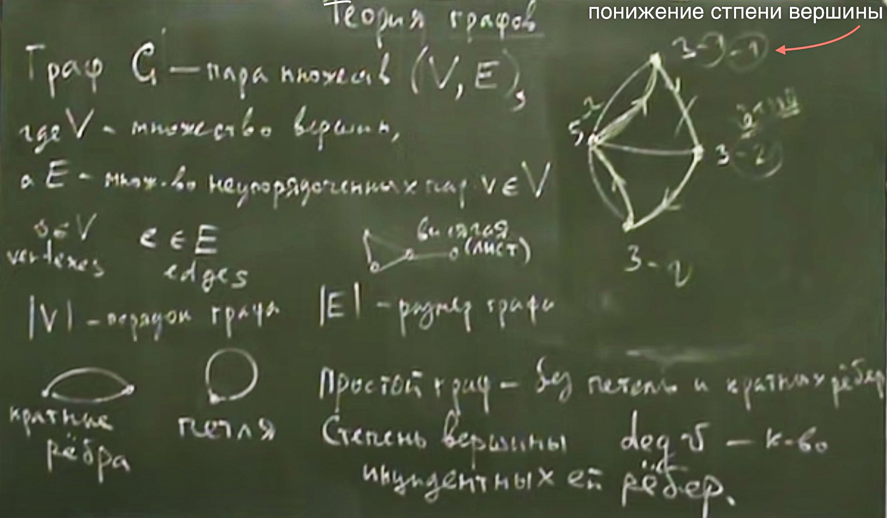 </img>

***Изоморфизм графов*** - это отношение между графами, которые можно называть отношением эквивалентности. Т.е визуально как бы граф не выглядел он может быть изоморфен другому графу по свойству. Поэтому граф можно перерисовать как захочется, главное чтобы свойтсво общности между ними сохранялось. 

***[Изоморфизм](https://ru.wikipedia.org/wiki/%D0%98%D0%B7%D0%BE%D0%BC%D0%BE%D1%80%D1%84%D0%B8%D0%B7%D0%BC)*** (от греч. равный, одинаковый, подобный)  - соотношение между математическими объектами, выражающее общность их строения.

***Графы*** `А` и `В` ***изоморфмы*** если существует биективное взаимно однозначное отображение  `V(a) <—> V(b)`и `E(a) <—> E(b)` (т.е взаимно однозначны, каждой вершине соответствует одна и только одна, ребро к ребру, вершина к вершине.) 

Например, ***два графа называются изоморфными***, если между ними существует изоморфизм: то есть вершинам одного графа можно сопоставить вершины другого графа, так чтобы соединённым вершинам первого графа соответствовали соединённые вершины второго графа и наоборот. Иными словами, два графа изоморфны, если они «одинаковы» (с точностью до переименования вершин).

 </img>

***Изоморфизм графов*** не предполагает никакого взаимного геометрического расположения, форма и отображение визуально могут и чаще всего отличаются, главное чтобы вершины и ребра были изоморфны (равны). С точки зрения изоморфизма графу все равно как он будет изображен. 

***[Биекция](https://ru.wikipedia.org/wiki/%D0%91%D0%B8%D0%B5%D0%BA%D1%86%D0%B8%D1%8F)*** — отображение, которое является одновременно и сюръективным, и инъективным. ***При биективном отображении*** каждому элементу одного множества соответствует ровно один элемент другого множества, при этом определено обратное отображение, которое обладает тем же свойством. Поэтому биективное отображение называют также взаимно однозначным отображением (соответствием).

Если между двумя множествами можно установить взаимно однозначное соответствие (биекцию), то такие множества называются равномощными. С точки зрения теории множеств, равномощные множества неразличимы.

Взаимно однозначное отображение конечного множества на себя называется перестановкой (или подстановкой) элементов этого множества.

***Граф называетс планарным или плоским***, если его можно нарисовать на плоскости без пересечений ребер

 </img>

***Пути и циклы***

***Маршрут*** - это конечная последовательность вершин, в которой каждая вершина кроме последней, соединена со следующей последовательностью вершин ребром. Последовательность вершин и ребер, где каждая вершина соединена со следующей ребром.

`V0 (V0, V1) V1 (V1, V2) V2 (V2, V3)... Vn`
`V0`- начало маршрута, `Vn` - конец маршрута.

***Длина маршрута*** - это количество ребер.

```bash
A-----B
------>
<------
------>
маршрут = A(A,B) B(B,A) A(A,B)
```

***Цепь*** - это маршрут без повторяющихся ребер. 

***Простая цепь*** - это цепь без повторяющихся вершин.

***Путь*** - это ориентированный маршрут

***Простой путь*** - без повторяющихся ребер.

***Элементарный путь*** - ребра и вершины не повторяются. 

***Цикл*** - это замкнутый маршрут, являющийся цепью. Это цепь в которой первая и последняя вершина совподает. 

***Простой цикл*** - это цикл, в котором все вершины, кроме первой и последней, попарно различны. Цикл в котором нет повторяющихся ребер. 

Две вершины называют ***связными*** если есть цепь их соединяющая. Такое отношение между вершинами как связность, является эквивалентностью. Если вершина A связна с B, а B связна C, то A связна C (между ними могут быть и несколько промежуточных ребер и одно, без разницы) `A = B, B = C, A = C`.  Это называется ***классом эквивалентности*** - множество всех вершин которые связы друг с другом. 

***Компонента связности*** - подграф исходного графа,  содержащий все вершины одного из классов эквивалентности по принципу связности и все инцидентные ребра. 

***Связный граф*** - с 1 компонентой связности. Все входящие вершины связаны с другом и между ними есть цепь. 


***Дерево*** - это связный граф, обязательно одна компонента связности, в котором (три разных, но равносильных определения):
1) между любыми `v1, v2` принадлежих `V` есть только одна цепь.
2) в котором нет простых цикл
3) в котором мощность множества вершин равна мощности количества ребер (количеству)  плюс 1. . Или проще количество вершин равно количеству ребер + 1.

У есть листья (висячие вершины). 

***Корневое дерево*** - в котором одна из вершин считается корнем (выделенная вершина). И в тоже время может быть листом или нет. С корнем дерево становится ***Иерархичным деревом***. 

***Высота графа*** - количество ребер до корня. От корня до листа.

Даже граф из одной вершины это дерево. НО пустой граф (без вершин и ребер) деревом не является, по 3) определию выше он не подтверждается. 

***Диаметр дерева*** - минимальная длина пути между двумя вершинами. Диаметр дерева - не превышает удвоенной его высоты. `D(дерева) <= H * 2`

***Астомное дерево*** - подграф связного графа, включающий все его вершины и являющиеся деревом. Это дерево которое дает возможность выкинуть ребра которые могут дать циклы.  `|V| = |E| - 1`

***Взвещенный граф*** - все ребра имеют вес.

***Все ребра*** - некоторое число (вектор чисел, матрица чисел, строка, т.е данные) закрепленное за ребром

***Направленный граф — ориентированный граф*** - граф, рёбрам которого присвоено направление.

---
[К оглавлению](#contents)
### <a id="lection23" />Лекция №23. Варианты хранения Графа в памяти. Основы Web программирование

******

 </img>

1) Для простого графа. 
***Список вершин + Список ребер***

```python
# .---.---.---.
# A   B   C   D

V = {"A", "B", "C", "D"}
E = {("A", "B"), ("B","C"), ("C","D")}
```
`О(n)` линейное при поиске в list (списке)

`О(1)` при поиске в set (множестве) так как по хешу проверяет, и будет поиск элемента быстрее

`O(n)` на перебор соседей вершины `v`

2) ***Матрица смежности***. Двумерную матрицу можно хранить как список списков

Асимптотика. Факт проверки наличия ребра мгновенный `О(1)` (BD, в таблице условной смотрим по индексам это 1и 3 = 0, значит ребра нет). Перебор всех соседей `O(n)` для вершины `v`

```python
# .---.---.---.
# A   B   C   D

V = ["A", "B", "C", "D"]
# Используем Dictionary Comprehension
index = {V[i]: i for i in range(len(V))}

#   A   B   C   D
# A
# B
#	C
#	D

A = [
    [0, 1, 0, 0] 
    [1, 0, 1, 0]  
    [0, 1, 0, 1]  
    [0, 0, 1, 0]
		] 
```

3) ***Списки смежности***. Давайте для каждой вершины хранить список ее соседей. Создадим словарь. Словари и множества являются расширяемыми структурами данных, этим они удобны на добавление.

Факт проверки наличия ребра мгновенный `О(1)` (Находим вершину, и смотрим ее множество соседей. Перебор соседей 

Используем списки смежности для реальных жизненных ситуаций. 

```python
# .---.---.---.
# A   B   C   D

G = {
    "A": {"B"},
    "B": {"A", "C"},
    "C": {"B", "D"},
    "D": {"C"}
    }
for neighborr in G[V]:
    print(neighborr)
```

Есть специальная библиотека для графов в языке это [NetworkX is a Python](https://networkx.org/documentation/stable/tutorial.html), в ней есть готовый объект для хранения графа (под капотом, это словарь множеств с наворотами), а также есть встроенные алгоритмы. 

Давайте считаем получаемые данные, `N` - количество вершин (порядок), `M` - количество ребер (размер). 

***Реализуем Матрицу смежности***

```python
M, N = [int(x) for x in input().split()]
# заготавливаем list
V = []
# заготавливаем dict
index = {}
# заготавливаем матрицу
A = [[0] * N for i in range(N)]

for i in range(N):
    v1, v2 = input().split()
    for v in v1, v2:
        if v not in index:
            V.append(v)
            index[v] = len(V)-1
    v1_i = index[v1] 
    v2_i = index[v2] 
# подразумеваем простой граф
# для ориентированного графа
    A[v1_i][v2_i] = 1
# для неориентированного графа
    A[v2_i][v1_i] = 1
```

***Реализуем Списки смежности***

```python
M, N = [int(x) for x in input().split()]
# заготавливаем dict
G = {}
for i in range(N):
    v1, v2 = input().split()
    for v,u in (v1,v2),(v2,v1):
        if v not in G:
            G[v] = {u}
        else:
            G[v].add(u)
```

Сохраним форму списков смежности, но сделаем более экономной по памяти, и простую структуру. Подходит для фиксированных, константных графов. 

***Компактное хранение списков смежности для неизменяемого графа***

Откажемся от хранения имен ребер, только индексы и от нуля.

`offset` - начало списка смежности `i`-й вершины

```python
# смежные вершины
0: 1
1: 0, 2, 3
2: 1, 3
3: 1, 2, 4
4: 3

edges = [1, 0, 2, 3, 1, 3, 1, 2, 4, 3]
offset = [0, 1, 4, 6, 9, 10]
# список смежности лежит:
edges[offset[i]: offset[i+1]] 
```

 </img>

---

### Основы Web программирование

Нам потребуются библиотеки `Falsk` и `Pubnub`

***HTML - HyperText Markup Language*** - язык разметки гипертекста. HTML - это язык, на котором пишутся привычные нам веб-страницы. Документ на HTML состоит из тегов. Теги могут быть парные и одинарные.

Одинарные теги имеет вид `<тег>`, например тег `<br>` - перевод строки и тег `<input>` - поле ввода для html-форм. 

Парные теги имеют вид `<тег>содержание</тег>`, например тег `<b>`, задающий жирный шрифт, используется так: обычный шрифт `<b>`жирный шрифт`</b>`, а выглядит так:

Теги также могут иметь атрибуты - дополнительные параметры, задающие поведение и отображение соответствующего элемента. Атрибуты имеют вид `имя="значение"` и задаются вместе с именем тега, через пробел, в виде `<тег аттрибут1="значение1" аттрибут2="значение2">`, например

`<input type="password">` - это будет уже не обычное поле ввода, а поле ввода пароля, где вместо букв будут отображаться звездочки.

```html
<a href="http://acm.mipt.ru">acm</a> - тег <a>, ссылка. Аттрибут `href` задает адрес ссылки.

Теги можно вкладывать друг в друга: <a href="http://acm.mipt.ru"><b>acm</b> поиск</a>
```

***Структура HTML документа***

Общую структуру можно увидеть на следующем примере:

```html
<!DOCTYPE html>
<html>
<head>
<title>Page Title</title>
</head>
<body>

<h1>This is a Heading</h1>
<p>This is a paragraph.</p>

</body>
</html>
```

Первый тег - особенный, тег `<!DOCTYPE>`. Она задает стандарт HTML, который используется в документе. `<!DOCTYPE html>` - это заголовок для последней на данный момент версии HTML5 (HTML5.1, HTML5.2). Этот тег не обязателен (как, в общем и все остальные теги в этом примере), но крайне желателен: без него поведение браузера не определено, каждый браузер будут действовать в соответствии со своими представлениями.

Парный тег `<html>` включает в себя весь документ. Парный тег `<head>` включает в себя различные мета-данные для страницы - это элементы, которые непосредственно на странице не отображаются. Например, тег `<title>` задает заголовок окна (или вкладки) браузера.

Парный тег `<body>` включает в себя всю отображаемую часть документа.

Теги `<html>`, `<head>`, `<body>` не обязательны, браузер умеет добавлять их автоматически.

***CSS - Cascading Style Sheets***

Многообразие вебстраниц порождается многообразием стилей оформления элементов, начиная с выбора размера шрифта и заканчивая цветом рамочек, закругленными углами кнопок а также размерами и положением всех элементов. Изначально, стили задавались различными атрибутами тегов, например так:

`<font size="2" color="blue"><b>This is some text!</b></font>`

Такой подход перегружает текст документа. Становится сложно что-то найти, что-то изменить. Например, если у нас все заголовки оформлены как указано выше, то, чтобы заменить цвет заголовков на красный, нам придется пройтись по всем заголовкам и все исправить. CSS - Cascading Style Sheets — каскадные таблицы стилей, призваны решить эту проблему. А именно, будем описывать стили элементов (и даже, отчасти, расположение) отдельно от основного документа. Синтаксис следующий:

```css
селектор, селектор {
    свойство: значение;
    свойство: значение;
    свойство: значение;
}
```

С помощью различных селекторов, мы выбираем множество html-элементов, для которых мы хотим задать значения свойств.

Пример:

```css
h1 {
    font-size: small;
    color: blue;
    font-weight: bold;
}
```

```html
<h1> Заголовок 1 </h1>
Какой-то текст

<h1> Заголовок 2 </h1>
Какой-то другой текст
```

Теперь мы легко можем поменять стиль всех заголовков. CSS можно задавать как и в отдельном файле, тогда он подключается в HTML тегом `<link rel="stylesheet" type="text/css" href="theme.css">`, либо прямо в html-документе, в теге `<style>...</style>`. Оба тега должны использоваться в секции `<head>...</head>`.

***Javascript***

Скрипты на языке Javascript могут использоваться в html страницах и выполняются непосредственно браузером. Javascript похож на Python своей ссылочной моделью. Блоки кода выделяются парами фигурных скобок, а не отступами. Рассмотрим несколько примеров.

```html
<div onclick="if (this.style.color=='red') { this.style.color='green'; this.innerText='Green' } else { this.style.color='red'; this.innerText='Red' }">Кликните по мне</div>
```

Атрибут `onclieck` задает код, который выполнится при клике мышью. При этом `this` - будет ссылкой на тот элемент, который кликнули. `this.style` - объект, предстваляющий стиль элемента, тот самый который мы можем задавать с помощью CSS. Конечно, задавать код непосредственно внутри тегов крайне не удобно. Перепишем пример, используя функцию:

```html
<script>
var flag = true;
function toggle(self) {
    if (flag) {
        self.style.color = 'red';
        self.innerText = 'Red';
    } else {
        self.style.color = 'green';
        self.innerText = 'Green';
    }
    flag = !flag;
}
</script>

<div onclick="toggle(this)">Green</div>
```

Итак, скрипты можно писать в теге `<script>`. Можно и подключать отдельные файлы со скриптами, так: `<script src="http://address-of-script.js"></script>`. Заметьте, тег `<script>` парный, закрывающий тег `</script>` обязателен, даже если внутри тега ничего нет. А вот тот же пример, но уже с использованием CSS:

```html
<style>
.one {
    color: red;
    font-weight: 'bold';
    border: 1px solid black;
}
.two {
    color: green;
    font-style: 'italics';
    border: 3px dashed red;
}
</style>

<script>
var flag = true;
function toggle(self) {
    if (flag) {
        self.className = 'one';
        self.innerText = 'Red';
    } else {
        self.className = 'two';
        self.innerText = 'Green';
    }
    flag = !flag;
}
</script>

<span onclick="toggle(this)">Green</span>
```

Селектор CSS вида .класс выбирает элементы по "классу". Класс можно задавать в html, с помощью атрибута class или в javascript, в атрибут className элемента.

Вот пример, где мы изменяем наш документ с помощью javascript.

```html
<script>

function click() {
    document.getElementById('my-div').innerHTML += '<br><a href="http://acm.mipt.ru">acm.mipt.ru</a>';
}

</script>

<button onclick="click()">кнопка</button>
<div id="my-div"></div>
```

Базовая объектная модель html документа достаточно громоздка. Чего только стоит `document.getElementById('my-div').innerHTML`. Для упрощения жизни существует библиотека `jQuery`. Библиотека определяет одну единственную функцию `$` (да, javascript разрешает такие имена), в которой содержится вся функциональность. Вот пример ее использования, в котором html-код свободен уже не только от стилей но и от событий, а занимается исключительно версткой элементов и их содержимым.

```html
<script src="http://judge.mipt.ru/mipt_cs_on_python3/jslib/jquery-3.3.1.min.js"></script>

<style>
.one {
    color: red;
    font-weight: 'bold';
    border: 1px solid black;
}
.two {
    color: green;
    font-style: 'italics';
    border: 3px dashed red;
}
</style>

<script>
$(function() {
    $('#one').click(function() {
        $('#one').toggleClass('one');
        $('#one').toggleClass('two');
        $('#another').append('<br><a href="http://acm.mipt.ru">acm.mipt.ru</a>');
  })
})
</script>

<span id="one" class="one">Green</span><br>
<span id="another">Another</span>
```

***Flask***

Как же сделать сайт? Оказывается одних только html, css и js не достаточно. Сайты, да и многие другие сетевые приложения используют модель клиент-сервер. Это значит, что у нас есть две отдельные части: сервер - приложение, которое, в случае сайта, запускается на машине хозяина сайта и клиент - часть приложения, которая работает непосредственно на машине пользователя. В случае с сайтом, клиентская часть представлена браузером, а также всеми html, css, js и прочим содержимым, которое браузер скачивает и выполняет на машине пользователя. Существует множество способов написать web-сервер. Один из них - модуль Flask для Python.

Рассмотрим такой пример

```python
from flask import Flask
from flask import render_template_string
from flask import request
app = Flask(__name__)

log = ''

templ = """
<!DOCTYPE html>
<div>
{{ log }}
</div>
<form action="/" method="POST">
<input name="msg">
<input type="submit" value="send">
</form>
"""

@app.route('/', methods=['GET', 'POST'])
def hello_world():
    global log
    if request.method == 'POST':
        log += request.form['msg'] + '<br>'

    return render_template_string(templ, log=log)


if __name__ == '__main__':
    app.run()
```

Еще пример.

```python
from flask import Flask
from flask import request
from flask import url_for
app = Flask(__name__)

log = ''

@app.route('/')
def index():
    return app.send_static_file('client2.html')


@app.route('/log')
def get_log():
    global log
    return log

@app.route('/send', methods=['POST'])
def send():
    global log
    print request.form
    log += request.form['msg'] + '<br>'
    return log

if __name__ == '__main__':
    app.run()
```

static/script2.js

```js
function update() {
  $.get('log', function(data) {
    $('#chat').html(data);
  });
}

$(function() {
  $('#send').click(function() {
    $.post('/send', {'msg': $('#msg').val()}, update);
  })

  setInterval(update, 1000);
})
```

static/client2.html

```html
<!DOCTYPE html>

<script src="http://judge.mipt.ru/mipt_cs_on_python3/jslib/jquery-3.3.1.min.js"></script>
<script src="static/script2.js"></script>

<div id="chat"></div>
<input id="msg">
<button id="send">send</button>
```

***Pubnub***

Сервер это здорово. Но иногда нет большой нужды писать его. Допустим, хотим написать чат на Python. Можно написать простенький сервер на Flask, но что дальше? Можно запустить его в локальной сети, тогда будет чат по локальной сети. А как на счет чата через интернет? Тут уже нужна машина с белым ip, т.е. доступная из интернета. Придется искать хостинг для вашего сервера, грузить его туда.. Вместо этого, можно использовать BAAS. `BAAS - Backend As A Service`. Это значит, что кто предоставляет нам бэк-энд (т.е. серверную часть приложения) как сервис, как услугу. Сервер уже есть и работает, можно использовать! Один из примеров таких BAAS - `Pubnub.com`. Этот бэкенд позволяет создавать каналы передачи сообщений. Простое api позволяет писать в канал и получать данные из канала. Все, сервер писать уже не придется. Рассмотрим пример.

a.py

```python
from pubnub import Pubnub

PUB_KEY = 'pub-c-bab40884-15d8-42a3-8675-21d381efc60e'
SUB_KEY = 'sub-c-d3ff6da6-faa9-11e5-8180-0619f8945a4f'

pubnub = Pubnub(publish_key=keys.PUB_KEY, subscribe_key=keys.SUB_KEY)

def _callback(message, channel):
    print(message)

def _error(message):
    print(message)

pubnub.subscribe(channels="my_channel_sf23", callback=_callback, error=_error)

while True:
    pass
```

Это приложение подписывается на канал "my_channel_sf23" в рамках аккаунта, заданного ключами `PUB_KEY` и `SUB_KEY`, и печатает все ошибки и сообщения, которые через него получает. Чтобы получить свои ключи, необходимо зарегистрироваться на pubnub.com.

```python
import keys
from pubnub import Pubnub

PUB_KEY = 'pub-c-bab40884-15d8-42a3-8675-21d381efc60e'
SUB_KEY = 'sub-c-d3ff6da6-faa9-11e5-8180-0619f8945a4f'

pubnub = Pubnub(publish_key=keys.PUB_KEY, subscribe_key=keys.SUB_KEY)

def callback(message):
    print(message)

pubnub.publish('my_channel_sf23', 'Hello from PubNub Python SDK!', callback=callback, error=callback)

while True:
    pubnub.publish('my_channel_sf23', input(), callback=callback, error=callback)
```

Это приложение отправляет в канал "my_channel_sf23" различные сообщения, в основном те, которые пользователь вводит с клавиатуры. По pubnub каналам можно передавать не только строки но и другие json-сериализуемые объекты.

---

[К оглавлению](#contents)  
### <a id="lection24" />Лекция №24. Обход графа в глубину (DFS). Выделение и подсчёт компонент связности. Проверка графа на двудольность. Выделение компонент сильной связности орграфа алгоритмом Косарайю. Топологическая сортировка через алгоритм Тарьяна. 

Существуют различные методики перебора графа. Один из них без перебора соседей, взять список всех вершин, и сделать генерацию всех перестановок всех вершин, смотрим на получившиеся цепочки, и смотрим где ребра, вот и получится путь. 

***[Обход вглубину - Depth-first search, DFS](https://ru.wikipedia.org/wiki/%D0%9F%D0%BE%D0%B8%D1%81%D0%BA_%D0%B2_%D0%B3%D0%BB%D1%83%D0%B1%D0%B8%D0%BD%D1%83)***

Зачем он? Благорадя ему мы сможем дотянуться до компонента связности, т.е до каждой вершины. 

Это один из методов обхода графа. Стратегия поиска в глубину, идти «вглубь» графа, насколько это возможно. Алгоритм поиска описывается рекурсивно: перебираем все исходящие из рассматриваемой вершины рёбра. Если ребро ведёт в вершину, которая не была рассмотрена ранее, то запускаем алгоритм от этой нерассмотренной вершины, а после возвращаемся и продолжаем перебирать рёбра. Возврат происходит в том случае, если в рассматриваемой вершине не осталось рёбер, которые ведут в нерассмотренную вершину. Если после завершения алгоритма не все вершины были рассмотрены, то необходимо запустить алгоритм от одной из нерассмотренных вершин.

 </img>

Каждый позвавший друга по аналогии, ждет его ответа, поэтому первый позвавший (начальная точка/вершина) ждет ответа от последующих позванных вершин. И так далее, каждый позвавший ждет ответа, от того кого он позвал, когда дойдет до конца, то получит ответ об окончании, и будет обратный ход рекурсии, ее раскрутка (return). 

Приложения:
1) Выделение компоненты связности графа (сколько раз приходится инициализировать обход в глубину, чтобы вычеркнуть все вершины графа, это и есть количество компоненты связности)
2) подсчет количесва компонент
3) поиск простого цикла 
4) проверка графа на двудольность (зеленые и красные точки на рисунке, все это чтобы найти конфликт между 15 и 1 вершиной по рисунку)
5) можно искать мосты и точки сочленения
6) выделение сильных компонент связности, алгоритм Косарайю
7) топологическая сортировка

***Двудольный граф*** - ассоциации: 1) рассадить по двум столам враждующих. Или 2) раскрасить вершины в красный и синий цвет так чтобы, никакие 2 красные и 2 зеленые вершины не имели между собой ребра.

 </img>

Реализуем алгоритмы
***Алгоритм. Выделение компоненты связности***

Граф будет в виде словаря множеств смежности (соседства вершин). G  - граф, vertex - начальная вершина c которой начинается обход, used - уже позванные вершины. N - компонент связности. 

```python
def dfs(vertex, G, used):
    used.add(vertex)
    for neighbourr in G[vertex]:
        if neighbourr not in used:
            gfs(vertex, G, used)
used = {}
N = 0
for vertex in G:
    if vertex not in used:
        gfs(vertex, G, used)
        N += 1
print(N)
```

***Алгоритм Косарайю. Выделение компонента сильной связности ориентированного графа (орграфа)***

Обход в глубину, он не зовет вершины которые уже были позваны (used). 

 </img>

Далее ищем компоненты сильной связности. Начинаем с вершины К (это последняя вершина добавленная при последнем обходе в глубину). Бежим от нее по правилу обратного движения (назад, против стрелок) до кого дотянусь, и она выдаст мне компоненту сильной связности. Синим цветом. В итоге мы получим все компоненты сильной связности. 

 </img>

***Топологическая сортировка. Алгоритм Тарьяна. Сложность O(N) ***

Если ориентированный граф не содержит циклов, то его вершины можно пронумеровать, так что любое ребро идет от вершины с меньшим номером к вершине с большим номером.

Смысл топологической сортировки в том, чтобы предоставить некую последовательность выполнения пунктов (дел, занятий, по вершинам номера) которая непротиворечива, т.е грамотная последовательность. 

 </img>

```python
# u число от 1 до N
visited = [False] * (n + 1)
ans = []
def dfs(start, G, visited, ans):
    visited[start] = True
    for u in G[start]:
        if not visited[u]:
            dfs(u, G, visited, ans)
    ans.append(start)

for i in range(1, n + 1):
    if not visited[i]:
        dfs(i, G, visited, ans)
ans[:] = ans[::-1]
```

или еще попроще 

 </img>

```python
# u число от 1 до N
visited = set()
ans = []
def dfs(start, G, visited, ans):
    visited[start] = True
    for u in G[start]:
        if not visited[u]:
            dfs(u, G, visited, ans)
    ans.append(start)

for vertex in G:
    if vertex not in visited:
        dfs(vertex, G, visited, ans)
ans[:] = ans[::-1]
```

---
[К оглавлению](#contents)
### <a id="lection25" />Лекция №25. Взвешенный граф. Обход графа в ширину (Breadth first search (BFS)) .Очередь при обходе в ширину и её асимптотика. Выделение компонент связности (обходом в ширину). Нахождение кратчайшего цикла в невзвешенном графе.

***Вспомним основную идею стека (stack) и очереди (queue)***

 </img>

Ссылки на библиотеку: ***[An intro to Deque module](https://yasoob.me/2014/07/02/an-intro-to-deque-module/)*** и ***[deque objects](https://docs.python.org/3/library/collections.html#collections.deque)***

 </img>

Очередь через двусвязный список

 </img>

---

***Обход графа в ширину***

***Невзвещенные ребра*** - одинаковые ребра по весу, равные, у всех вес 1.

Используем списки смежности, словарь с множествами, где ключи это вершины, и к ней прилагается множество ее соседей (вершин). Поиск элемента в множестве это `O(1)`, а проверка в списке за  `O(N)`, поэтому используем множества.

 </img>

 </img>

---

***Обход графа в глубину***, аналогия "зовем по одному другу, пока не кончатся" мы идем от вершины к соседней вершине, пока не упираемся в тупик (т.е в вершину в которой нет непосещенных соседей). И затем возвращаемся к вершине и работаем с ее соседями которых мы еще не посетили.  

***Обход графа в ширину*** - аналогия, "возгорание". От начальной вершины мы двинемся к следующим вершинам которые находятся от нее на расстоянии 1 ребра

 </img>

 </img>

 </img>

Благодаря обходу в ширину можно решить задачу, поиска кратчайшего расстояния от начальной вершины до всех других. Удаленность вершин.

 </img>

 </img>

```python
# Обход в ширину - код
from collections import deque

N, M = map(int, input().split()) # считываем кол-во вершин и кол-во ребер
graph = {i:set() for i in range(N)} # будем хранить в виде словаря с множествами
for i in range(M):
    vl, v2 = map(int, input().split()) # считываем ребро
    graph[vl].add(v2) # добавляем смежность двух вершин
    graph[v2].add(vl)
    
distances = [None] * N # массив расстояний, по умолчанию неизвестны
start_vertex = 0 # начинаем с 0 вершины
distances[start_vertex] = 0 # расстояния до себя же равно 0
queue = deque([start_vertex]) # создаем очередь

while queue: # пока очередь не пуста
    cur_v = queue.popleft() # достаем первый элемент
    for neigh_v in graph[cur_v]: # проходим всех его соседей
        if distance[neigh_v] is None: # если сосед еще не посещен(=>расстояние None)
            distances[neigh_v] = distances[cur_v] + 1 # считаем расстояние
            queue.append(neigh_v) # добавляем в очередь чтобы проверить и его соседей
print(distances) # смотрим что получилось
```

```bash
0 1
0 12
0 11
0 10
1 6
1 7
3 11
4 10
5 8
5 13
6 10
7 13
8 12
9 11
11 12
```

```bash
{0: {1, 10, 11, 12},
1: {0, 6, 7},
2: set(),
3: {11},
4: {10},
5: {8, 13},
6: {1, 10},
7: {1, 13},
8: {5, 12},
9: {11},
10: {0, 4, 6},
11: {0, 3, 9, 12, 14},
12: {0, 8, 11},
13: {5, 7},
14: {11}}
```

```bash
[[0, 1, None, 2, 2, 3, 2, 2, 2, 2, 1, 1, 1, 3, 2]
```

Что можно найти благодаря обходу графа в ширину, задачи, приложения. 

---

### Обход графа в ширину - приложения

- Выделение компонент связности в графе за `O(n+m)`
- Поиск кратчайшего пути в невзвешенном графе
- Восстановление кратчайшего пути
- Нахождение кратчайшего цикла в ориентированном невзвешенном графе
- Найти все рёбра, лежащие на каком-либо кратчайшем пути между заданной парой вершин `(a,b)`
- Найти все вершины, лежащие на каком-либо кратчайшем пути между заданной парой вершин `(a,b)`
- Найти кратчайший чётный путь в графе (т.е. путь чётной длины)

### Выделение компонент связности

1. Полагаем кол-во компонент связности равное 0
2. Начинаем обход в ширину из произвольной вершины
3. Когда обход завершается увеличиваем кол-во компонент связности на 1
4. Если остались еще непосещенные вершины, повторяем шаги 2-3, сохраняя при этом массив посещенных вершин `used`
5. Если все вершины посещены, завершаем. Время по-прежнему `O(N+M)`

---

### Восстановление кратчайшего пути

 </img>

 </img>

```python
start_vertex = 0
end_vertex = 2

parents = [None] * N
distances = [None] * N
distances [start_vertex] = 0
queue = deque([start_vertex])

while queue:
    u = queue.popleft()
    for v in graph[u]:
        if distances[v] is None:
            distances[v] = distances[u] + 1
            parents[v] = u
            queue.append(v)
path = [end_vertex]
parent = parents[end_vertex]
while not parent is None:
    path.append(parent)
    parent = parents[parent]
print(path[::-1])
```

---

### Восстановление траектории шахматного коня

 </img>

Имеем 64 вершины, и ребра буквой Г т.е как ходит конь. Граф невзвешенный и неориентированный. Вершины будем именовать в шахматной терминалогии.  

 </img>

 </img>

 </img>

 </img>

```python
# Конь: создаем граф
letters = 'abcdefgh'
numbers = '12345678'
graph = dict()
graph = {l+n:set() for l in letters for n in numbers}

def add_edge(vl, v2):
    graph[v1].add(v2)
    graph[v2].add(v1)
    
    for i in range(8):
        for j in range(8):
            v1 = letters[i] + numbers[j]
            v2 = ''
            if 0 <= i + 2 < 8 and 0 <= j + 1 < 8:
                v2 = letters[i+2] + numbers[j+1]
                add_edge(v1, v2)
            if 0 <= i - 2 < 8 and 0 <= j + 1 < 8:
                v2 = letters[i-2] + numbers[j+1]
                add_edge(v1, v2)
            if 0 <= i + 1 < 8 and 0 <= j + 2 < 8:
                v2 = letters[i+l] + numbers[j+2]
                add_edge(vl, v2)
            if 0 <= i - 1 < 8 and 0 <= j + 2 < 8:
                v2 = letters[i-l] + numbers[j+2]
                add_edge(v1, v2)
                
start_vertex = 'd4'
end_vertex = 'f7'

parents = {v: None for v in graph}
distances = {v: None for v in graph}

distances[start_vertex] = 0
queue = deque([start_vertex])

while queue:
    u = queue.popleft()
    for v in graph[u]:
        if distances[v] is None:
            distances[v] = distances[u] + 1
            parents[v] = u
            queue.append(v)
path = [end_vertex]
parent = parents[end_vertex]
while not parent is None:
    path.append(parent)
    parent = parents[parent]
    
print(path[::-1]) # ['d4', 'c6', 'd8', 'f7')
```

Заполнение графа в задаче с конем для приверженцев DRY:

```python
for i in range(len(letters)):
    for j in range(len(numbers)):
        v1 = letters[i] + numbers[j]
        for i_modified, j_modified in (i+2, j+1), (i-2, j+1), (i+1, j+2), (i-1, j+2):
            if 0 <= i_modified < len(letters) and 0 <= j_modified < len(numbers):
                v2 = letters[i_modified] + numbers[j_modified]
                add_edge(v1, v2)
```

***Нахождение кратчайшего цикла***

1. Запускаем обход в ширину из каждой вершины
2. Как только пытаемся попасть в посещенную вершину - значит есть цикл
3. Запустив обход из каждой вершины выбираем кратчайший

***Нахождение всех ребер на кратчайшем пути `(a,b)`***

1. Запускаем обходы в ширину из `а` и из `b` с подсчетом расстояний
2. Расстояния до вершины `х` храним как `d_a[x]` и `d_b[x]`
3. Для ребра `(u,v)` проверяем `d_a[u] + 1 + d_b[v] = d_a[b]`
4. Если равенство выполнено, то ребро лежит на кратчайшем пути

***Нахождение всех вершин на кратчайшем пути (a,b)***

1. Запускаем обходы в ширину из `а` и из `b` с подсчетом расстояний
2. Расстояния до вершины `х` храним как `d_a[x]` и `d_b[x]`
3. Если `d_a[x] + d_b[x] = d_a[b]`, то вершина лежит на кратчайшем пути

---

### Кратчайший путь четной длины

 </img>

#### Построение цепочки друзей-код на примере VK API

 </img>

 </img>

```python
# Построение цепочки друзей - код
import requests # делать запросы
import time # делать задержки между запросами
from tqdm import tqdm # progress bar

HOST = 'https://api.vk.com/method/'
VERSION = '5.74'
access_token = 'TOKEN HERE'

def get_friends_id(user_id):
    r = requests.get(HOST + 'friends.get', params={'user_id': user_id, 'access_token': access_token, 'v': VERSION})
    if 'response' in r.json():
        return r.json()['response']['items']
    return []

queue = deque(get_friends_id(id_start))

parents = {user:id_start for user in queue}
distances = {user:1 for user in queue}

while id_end not in distances:
    cur_user = queue.popleft()
    new_users = get_friends_id(cur_user)
    time.sleep(0.5)
    for u in tqdm(new_users):
        if u not in distances:
            queue.append(u)
            distances[u] = distances[cur_user] + 1
            parents[u] = cur_user
```

---
[К оглавлению](#contents)
### <a id="lection26" />Лекция №26. Графы, кратчайший путь, Алгоритм Дейкстры с очередью. Алгоритмы Флойда-Уоршелла.

***Практика: поиск путей минимального веса***

Ранее вы изучили алгоритм поиск в ширину, позволяющий находит кратчайшие пути в невзвешенном графе. Однако, в случае взвешенных графов BFS будет не всегда давать корректный ответ, т.к. он по факту находит путь, содержащий минимальное количество ребер. Перед нами будет стоять задача нахождения пути с наименьшей суммой весов ребер в нем.

***Вес в графе*** - это число назначаемое ребрам, этот вес не всегда число положительное, может быть и комплексным числом или даже вектором

***Невзвещенные ребра*** - одинаковые ребра по весу, равные, у всех вес 1.

***Обход графа в глубину***, аналогия "зовем по одному другу, пока не кончатся" мы идем от вершины к соседней вершине, пока не упираемся в тупик (т.е в вершину в которой нет непосещенных соседей). И затем возвращаемся к вершине и работаем с ее соседями которых мы еще не посетили.  

***Обход графа в ширину*** - аналогия, "возгорание". От начальной вершины мы двинемся к следующим вершинам которые находятся от нее на расстоянии 1 ребра

---

### Алгоритм Дейкстры поиск кратчайшего расстояния (пути) в графе

Это обход графа в ширину с перезажиганием. Аналогия с поджигом, мы берем начальную вершину и идет зажигание по очереди (длина в 1 ребро). Дает кратчайшее расстояние в количестве ребер относительно исходной вершины в взвешенном графе.

Цель алгоритма: поиск кратчайших расстояний (путей) от исходной вершины ко всем остальным вершинам до которых можно дотянуться.

Требования:
1) веса неотрицательные (положительные) числа
2) асимптотика бывает разная от реализации, O(n^2)

Отличительная черта алгоритма в том, что в отличии от Обход графа в ширину (Breadth first search (BFS)) на невзвешенном графе, где уже "подожженные" вершины мы не трогаем и отправляем в очередь только "незажженые" вершины. 
В алгоритме Дейкстры происходит все иначе, у нас возможны "перезажигания", т.е мы можем трогать и тех кого уже "поджигали", и попробывать их "улучшить", т.е улучшить расстояние пути от вершины до ее соседей.

Списка зажженых или used нет. Есть только матрица вершин и очередь.

***Синим мелом*** указываем кратчайшее расстояние от исходной вершины.

 </img>

Более интуитивно, и по-человечески более понятнее можно найти кратчайшее расстояние и так. Алгоритм Дейкстры может быть сделан и без очереди, для этого надо брать среди всех вершин ту вершину, к которой имеем кратчайшее расстояние. Ищем минимальное расстояние, и от этой вершины запускаем обход уже. В таком случаи нужно будет поддерживать множество `used` вершин.

 </img>

---

### Восстановление пути

К примеру, `А -> I`. Пойдем с конца от I к A. Просматриваем всех соседей I кратчайшее расстояние до которых равно -> ее кратчайшее расстояние - ребро (т.е I 14 - 2 до вершины E = будет 12 значит допустимый предок, а другой сосед I 14 - 12 до вершины Н = будет 2 недопустимый предок)

 </img>

***Считывание графа*** (словаря словарей смежности, он считывается как словарь ребер, а хранится как словарь словарей)

```python
def main():
    G = read_graph()
    start = input("С какой вершины начать?")
    while start not in G:
        start = input("Такой вершины в графе нет. " +
        "С какой вершины начать?")
    shortest_distances = dijkstra(G, start)
    finish = input("К какой вершине построить путь?")
    while start not in G:
        start = input("Такой вершины в графе нет. " +
        "К какой вершине построить путь?")
        shortest_path = reveal_shortest_path(G, start, finish, shortest_distances)

def read_graph():
    M = int(input()) # M - количество ребер, далее - строки "a b вес"
    G = {}
    for i in range (M):
        a, b, weight = input().split()
        weight = float(weight)
        add_edge(G, a, b, weight)
        add_edge(G, b, a, weight)
        
    return G

def add_edge(G, a, b, weight):
    if a not in G:
        G[a] = {b: weight}
    else:
        G[a][b] = weight
        
if __name__ == "__main__":
    main ()
```

***Реализация алгоритма Дейкстры на доске, поиск кратчайшего расстояния (пути) в графе***

`Q` - очередь.
`s` - словарь кратчайших путей. И он же и будет ответом
`s[start]` - стартовая вершина

Списки в языке имеют логическое значение, как и числа (все true, кроме 0 он false). Пустое множество ложь. Пустая очередь (deque) тоже ложь. 

```python
Q = deque()
s = {}
s[start] = 0
Q.push(start)
while Q:
    v = Q.pop()
    for u in G[v]:
        if u not in s or s[v] + G[v][u] < s[u]:
            s[u] = s[v] + G[v][u]
            Q.push(u)
```

***Дополнительные пояснения к Алгоритму Дейкстры***

Снова вернемся к задаче поиска кратчайшего растояния от одной вершины до всех остальных, но теперь во взвешенном графе. Для ее решения будем применять алгоритм Дейкстры, который работает следующим образом:

1. На каждой итерации алгоритм среди непомеченных вершин вибирает с наименьшим до нее расстоянием;

2. Помечает вершину как посещенную.

3. Пытается улучшить расстояние до смежных с ней вершин;

На каждой итерации поддерживается инвариант, что расстояния до помеченных вершин являются кратчайшими и более меняться не будут. Однако, чтобы это условие не нарушалось, граф не должен содержать ребер отрицательного веса. Иначе, алгоритм в такой задаче не применим. Код алгоритма выглядит следующим образом:

```python
# считываем граф, преобразуем его в список смежности, который храним в graph
# INF - заведомо большое число
d = [INF]*n  # Считаем, что n - кол-во вершин, вершины пронумерованы от 0
d[s] = 0  # s - стартовая вершина
used = [False]*n
while True:
    u = -1
    for i in range(n):
        if not used[i] and (u == -1 or d[u] > d[i]):
            u = i
    if u == -1:
        break
    used[u] = True
    for v, w in graph[u]:
        d[v] = min(d[v], d[u] + w)
```

Время работы алгоритма зависит от того, как быстро ищется минимум. В приведенном выше варианте время работы `O(N^2)`. Для ускорения алгоритма применяют кучу либо дерево отрезков. В обоих случаях время работы будет `O((N+M) log N)`.


Есть github готовые реализации алгоритма [первый - Modified Python implementation of Dijkstra's Algorithm](https://gist.github.com/mdsrosa/c71339cb23bc51e711d8)

```python
from collections import defaultdict, deque

class Graph(object):
    def __init__(self):
        self.nodes = set()
        self.edges = defaultdict(list)
        self.distances = {}

    def add_node(self, value):
        self.nodes.add(value)

    def add_edge(self, from_node, to_node, distance):
        self.edges[from_node].append(to_node)
        self.edges[to_node].append(from_node)
        self.distances[(from_node, to_node)] = distance

def dijkstra(graph, initial):
    visited = {initial: 0}
    path = {}

    nodes = set(graph.nodes)

    while nodes:
        min_node = None
        for node in nodes:
            if node in visited:
                if min_node is None:
                    min_node = node
                elif visited[node] < visited[min_node]:
                    min_node = node
        if min_node is None:
            break

        nodes.remove(min_node)
        current_weight = visited[min_node]

        for edge in graph.edges[min_node]:
            try:
                weight = current_weight + graph.distances[(min_node, edge)]
            except:
                continue
            if edge not in visited or weight < visited[edge]:
                visited[edge] = weight
                path[edge] = min_node

    return visited, path

def shortest_path(graph, origin, destination):
    visited, paths = dijkstra(graph, origin)
    full_path = deque()
    _destination = paths[destination]

    while _destination != origin:
        full_path.appendleft(_destination)
        _destination = paths[_destination]

    full_path.appendleft(origin)
    full_path.append(destination)

    return visited[destination], list(full_path)

if __name__ == '__main__':
    graph = Graph()

    for node in ['A', 'B', 'C', 'D', 'E', 'F', 'G']:
        graph.add_node(node)

    graph.add_edge('A', 'B', 10)
    graph.add_edge('A', 'C', 20)
    graph.add_edge('B', 'D', 15)
    graph.add_edge('C', 'D', 30)
    graph.add_edge('B', 'E', 50)
    graph.add_edge('D', 'E', 30)
    graph.add_edge('E', 'F', 5)
    graph.add_edge('F', 'G', 2)

    print(shortest_path(graph, 'A', 'D')) # output: (25, ['A', 'B', 'D']) 
```

 и [второй - Python implementation of Dijkstra's Algorithm](https://gist.github.com/econchick/4666413)
```python
class Graph:
  def __init__(self):
    self.nodes = set()
    self.edges = defaultdict(list)
    self.distances = {}

  def add_node(self, value):
    self.nodes.add(value)

  def add_edge(self, from_node, to_node, distance):
    self.edges[from_node].append(to_node)
    self.edges[to_node].append(from_node)
    self.distances[(from_node, to_node)] = distance

def dijsktra(graph, initial):
  visited = {initial: 0}
  path = {}

  nodes = set(graph.nodes)

  while nodes: 
    min_node = None
    for node in nodes:
      if node in visited:
        if min_node is None:
          min_node = node
        elif visited[node] < visited[min_node]:
          min_node = node

    if min_node is None:
      break

    nodes.remove(min_node)
    current_weight = visited[min_node]

    for edge in graph.edges[min_node]:
      weight = current_weight + graph.distance[(min_node, edge)]
      if edge not in visited or weight < visited[edge]:
        visited[edge] = weight
        path[edge] = min_node

  return visited, path
```

---

***Алгоритм Флойда-Уоршалла***

Основан на идеи динамического программирования. Цель: ищет кратчайщее расстояние от каждой вершины к каждой. Более универсальнее чем алгоритм Дейкстры. После это выполения имеем матрицу кратчайших расстояний. Асимптотика: O(n^3), она не быстрая, НО применение зависит от задачи. 

Работает с отрицательными весами (ребрами), НО не циклами отрицательного веса, в отличии от алгоритма Дейсктры.

 </img>

Его отличительной особенностью является то, что он умеет находить кратчайшие расстояния между всеми парами вершин. Но за это приходится платить временем работы, `О(N^3)`. Идея заключается в следующем: мы будем перебирать все возможные тройки вершин `(i, j, k)` и пытаться улучшить путь из `i` в `j`, проходя через `k`.

```python
# Считываем граф, преобразуем его в матрицу смежности, которую храним в d
# Отсутствие ребра помечаем каким-нибудь заведомо большим числом
# Считаем, что n - кол-во вершин, вершины пронумерованы от 0

for k in range(n):
    for i in range(n):
        for j in range(n):
            d[i][j] = min(d[i][j], d[i][k]+d[k][j])
```

---

***Алгоритм Форда-Беллмана***

Алгоритм Форда-Беллмана будет последним рассмотренным алгоритмом, который, как и алгоритм Дейкстры, используется для поиска кратчайшего расстояния от одной вершины до остальных. Он является типичным алгоритмом ДП. Состояния описываются двумя параметрами и означают "длину кратчайшего пути, проходящего не более, чем по `i` ребрам, и заканчивающегося в вершине `j`".

```python
# считываем граф, преобразуем его в список ребер, который храним в edges
d = [None]*n  # Считаем, что n - кол-во вершин, вершины пронумерованы от 0
d[s] = 0  # s - стартовая вершина
# INF - заведомо большое число

for i in range(n-1):
    for u, v, w in edges:
        if d[u] is not None:
            d[v] = min(INF if d[v] is None else d[v], d[u] + w)
```

Такой алгоритм работает `O(N*M)`. Заметим несколько вещей:

1. Алгоритм работает корректно даже при наличии ребер отрицательного веса, -1 - валидное значение для расстояний, поэтому массив инициализировался с None;

2. Вернувшись в вершину, пройдя по циклу, расстояние до нее не может уменьшится (циклы отрицательного веса пока не рассматриваем);

3. Исходя из (2) для нахождения кратчайшего пути до всех вершин достаточно N-1 итерации, т.е. кратчайшие пути до всех вершин не содержат циклов.

Однако утверждение (2) справедливо, только когда нет циклов отрицательного веса, т.е. цикла, в которой растояния до вершин в нем будут каждый раз уменьшаться, если мы будем по нему гулять. Таким образом нам вообще не выгодно его заканчивать, а значит мы можем счиать, что кратчайшие расстояния до этих вершин будут `-∞`. Таким образом `N-1` итерации не хватит чтобы посчитать кратчайшие расстояния. Поэтому мы можем внешний цикл увеличить на одну итерацию. Все вершины, расстояние до которых обновится на последней итерации, можем считать имеют расстояние `-∞`.

Отсюда можно сделать вывод, что алгоритм применяется не только для поиска кратчайших расстояний в графе, но и для поиска циклов отрицательного веса. Кроме того, алгоритм используется для поиска максимального потока минимальной стоимости.

---
[К оглавлению](#contents)
### <a id="lection27" />Лекция №27. Двоичные деревья поиска. Асимптотика основных операций. Балансировка деревьев. Малый левый и правый повороты. Большой левый и правый повороты.

### Деревья
***Дерево*** - это связанный граф, в котором нет циклов.

***Корневое дерево*** - граф в котором одна из вершин выделена как корень.

***Лист*** - оконечный вершины, у которых нет продолжения в дочерние вершины.

***Пустой граф*** как и ***пустое множество существует***. Даже граф из одной вершины это дерево. НО пустой граф (без вершин и ребер) деревом не является

`Количество вершин равно = количество ребер + 1` . У нас есть одна вершина, чтобы подключить еще одну тратим одно ребро и так далее. Поэтому у нас всегда количество вершин больше количества ребре на 1. 

***Двоичное (бинарное) дерево*** - это корневое дерево где у любой вершины не более двух дочерних

***Высота дерева*** - это максимальное количество ребер от корня до листа

***Упорядоченное корневое дерево*** - где важна последовательность вершин, порядок дочерних вершин имеет значение.

---

### Двоичное дерево поиска
Главное свойство: у каждой вершины есть ключ. 
Это структура данных, хранящая в вершинах элементы, элемент содержит ключ, содержащие ключ key (данный ключ должен принадлежать к множеству потенциальных ключей, и это множество должно быть упорядоченным), при этом К есть операция сравнимости (можно сравнить ключ К1 > К2). Могут быть ключ:значение. 

Время поиска элемента/добавления элемента в дереве `O(log n)`, пропорционально высоте дерева. Чем выше дерево тем медленнее будет происходить.

---

### Балансировка

Последовательность храния элементов в дереве, если смотреть слева направо, всегда будет упорядоченной.

Двоичное дерево, похоже на хеш-таблицу, но в отличие от нее является упорядоченной структурой данных.

***Дерево является сбалансированным*** если, для каждой вершины (включая корень) высота ее левого и правого поддеревьев отличается более чем на 1. На единичку можно иметь рассогласование высот левого и правого поддерревьев дерева (как на рисунке 3 уровня и 2 уровня)

 </img>

Менять местами элементы в упорядоченном дереве НЕЛЬЗЯ. Можно их поднимать, опускать, делать иерархию.

 </img>

---

Существует два алгоритма двоичных деревьев поиска:
- ***АВЛ - дерево***
- ***Красно-черное дерево***

***Дисбаланс*** - когда человечек заваливается сильно, по рисунку. Когда высота ее левого и правого поддеревьев отличается более чем на 1, т.е уже 2 и более.

***Малый левый поворот*** - как на рисунке, мы К1 опускаем и К2 поднимаем, а поддерево К2 передается К1. Название такое, потому что, чтобы человечек наклоненный вправо, не упал, его надо повернуть влево :)). Благодаря этому будет идеальный баланс у К2. ***Малый правой поворот*** аналогичен левому. 

 </img>

***Большой правый поворот*** - состоит в комбинации из двух малых поворотов левого и правого, по итогу это левоправый поворот. ***Большой левый поворот*** анологичен правому.

 </img>

Фишка дерева в том, что оно не требует массива, и оно самостоятельная структура данных, и организуется она в С++ на указателях, а в Python на ссылках.

***Звено двоичного дерева поиска*** - это объект. Ключ (key) менять нельзя у хранимого элемента, потому что ключ определяет его местоположение в структуре данных.  Значение (value) менять, сравнивать можно. Если нет из звена (вершины) дочернего элемента, то там храним `None`. И три ссылки, на `left`, `right`, `parent`.

 </img>

---
[К оглавлению](#contents)
### <a id="lection28" />Лекция №28. Цикл Эйлера и цикл Гамильтона. Жадный алгоритм Дейкстры. Алгоритм Флойда-Уоршелла

***[Цикл Эйлера](https://ru.wikipedia.org/wiki/%D0%AD%D0%B9%D0%BB%D0%B5%D1%80%D0%BE%D0%B2_%D1%86%D0%B8%D0%BA%D0%BB)*** - цикл который проходит через каждое ребро графа, причем только один раз

***Графф Эйлеров*** - в котором есть собственно цикл Эйлера.

Признак, граф является Эйлеровым, если:
1) он должен быть связным
2) надо чтобы все степени вершин были четными (Степень вершины - это количество инцидентных ей робер, т.е сколько ребер исходит из нее.)

***Цикл Гамильтона*** - цикл который проходит через каждую вершину графа, причем только один раз

***[Граф Гамильтона](https://ru.wikipedia.org/wiki/%D0%93%D0%B0%D0%BC%D0%B8%D0%BB%D1%8C%D1%82%D0%BE%D0%BD%D0%BE%D0%B2_%D0%B3%D1%80%D0%B0%D1%84)*** - в котором есть собственно цикл Гамильтона. Не существует простого признака определения, гамильтонов ли граф. 

Задача поиска гамильтонова графа она `NP` полная. Существует полименальная сложность `O(N^P)`, и еще хуже когда `N` и `P` поменяются местами. Поиск Гамильтонова цикла это ***только полный перебор***.

---

***Жадный алгоритм Дейкстры***

Существует несколько вариантов, это один из них, выше в 26 лекции был с очередью. Он без очереди и жадный по своей сути. Асимптотика `O(N^2)`. Ответом будет список значений.

Ищем минимальную по `S min` вершину (минимальное расстояние). 

 </img>

---

***Алгоритм Флойда-Уоршелла***

Цель таже что и у алгоритма Дейкстры, найти длины кратчайших путей. Упоминался выше в 26 лекции. 
Ответом будет являться матрица значений.

Основан на идеи динамического программирования. Для чтобы сформулировать алгоритм динамического программирования нам нужно вычленить целевую функцию и написать для нее рекурентную формулу. Нам нужно опеределить эту же функцию через ее саму, НО меньшего масштаба (смысл рекурсия). 


